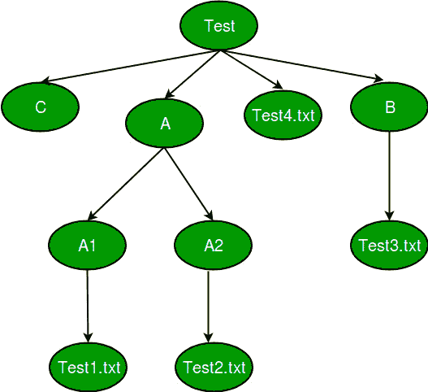

# Python 中的 os.walk()

> 原文:[https://www.geeksforgeeks.org/os-walk-python/](https://www.geeksforgeeks.org/os-walk-python/)

Python 中如何遍历文件系统？假设我们在我们的系统中给出了下面的文件结构，并且我们想要从上到下完全遍历它的所有分支？


### os.walk()在 python 中是如何工作的？

OS.walk()通过自顶向下或自底向上遍历目录树来生成目录树中的文件名。对于树中以目录顶部(包括顶部本身)为根的每个目录，它产生一个三元组(目录路径、目录名、文件名)。

*   **<u>根目录:</u>** 只打印您指定的目录。
*   **<u>目录:</u>** 从根目录打印出子目录。
*   **<u>文件:</u>** 从根目录和目录打印出所有文件。

```py
# Driver function
import os
if __name__ == "__main__":
    for (root,dirs,files) in os.walk('Test', topdown=true):
        print (root)
        print (dirs)
        print (files)
        print ('--------------------------------')
```

输出:

本文由 [**沙莎克·米什拉(古卢)**](https://auth.geeksforgeeks.org/profile.php?user=Shashank Mishra) 供稿。如果你喜欢 GeeksforGeeks 并想投稿，你也可以使用[contribute.geeksforgeeks.org](http://www.contribute.geeksforgeeks.org)写一篇文章或者把你的文章邮寄到 contribute@geeksforgeeks.org。看到你的文章出现在极客博客主页上，帮助其他极客。

如果你发现任何不正确的地方，或者你想分享更多关于上面讨论的话题的信息，请写评论。