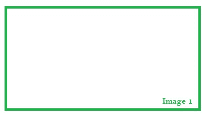
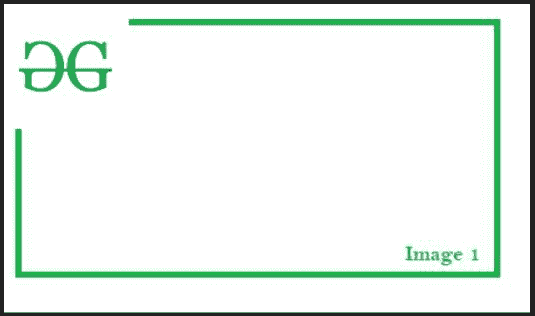

# 用 Python 将一个图像叠加到另一个图像上

> 原文:[https://www . geesforgeks . org/overlay-一个图像叠加在另一个 python 图像上/](https://www.geeksforgeeks.org/overlay-an-image-on-another-image-in-python/)

将一幅图像叠加在另一幅图像上是指将一幅图像的图像数据复制到另一幅图像上的过程。叠加可以指其他类型的图像处理方法，例如叠加相似的图像以降低噪声、混合等。但是现在，我们将专注于前一个。在本文中，我们将学习如何使用图像处理将一幅图像叠加在另一幅图像上。

**所需模块:**

**枕头:** Python 图像库(PIL 的扩展)是Python 语言事实上的图像处理包。它集成了用于编辑、创建、和保存图像的轻量级图像处理工具。

```
pip install pillow
```

出于演示目的，我们将使用以下图像作为主图像。



**示例 1:** 叠加阿尔法图像。

如果我们将包含透明区域的图像叠加在不透明图像上，那么最终图像中只会出现叠加图像的不透明区域。像素可能不是完全不透明的，因此可能具有模拟不透明度(alpha 通道)。这种类型的覆盖是主要的，因为它允许图像无缝地混合在一起。

为了叠加图像，我们将使用枕头库中的 [**【粘贴】(**](https://www.geeksforgeeks.org/python-pil-paste-and-rotate-method/) 功能。

> **语法:**粘贴(自，im，box =无，mask =无)
> 
> 将另一个图像粘贴到该图像中。
> 
> **参数:**
> 
> *   **im:** 源图像或像素值(整数或元组)。
> *   **框:**一个可选的 4 元组，给出要粘贴的区域。如果改为使用二元组，它将被视为左上角。如果省略或无，源将粘贴到左上角。
> *   **遮罩:**可选的遮罩图像。

**为了演示，我们将叠加以下图像:**


**下面是实现:**

## 蟒蛇 3

```
from PIL import Image

# Opening the primary image (used in background)
img1 = Image.open(r"BACKGROUND_IMAGE_PATH")

# Opening the secondary image (overlay image)
img2 = Image.open(r"OVERLAY_IMAGE_PATH")

# Pasting img2 image on top of img1 
# starting at coordinates (0, 0)
img1.paste(img2, (0,0), mask = img2)

# Displaying the image
img1.show()
```

**输出:**



**说明:**

首先我们打开主图像，将其图像对象保存到变量 *img1* 中。然后，我们打开将用作覆盖的图像，并将其图像对象保存到变量 *img2* 中。然后我们调用粘贴方法将传递的图像覆盖/粘贴到 *img1* 上。第一个参数是 *img2* ，它是包含透明文本的图像的图像对象。该图像将用于叠加。第二个参数是一个大小为 2 的元组，表示 *img1* 的坐标，这里应该粘贴 *img2* 。由于它是(0，0)，因此第二个图像将粘贴在 *img1* 的左上角。第三个参数是 *img2* ，传递给掩码参数。它将为 *img2* 指定透明度遮罩。最后我们展示了图像。

**示例 2:** 叠加非阿尔法图像

如果我们在不透明图像上覆盖一个完全不透明的图像，覆盖图像的所有像素值都会保留在最终图像中。在这个过程中，背景图像的像素值在过程中丢失(在被重叠图像占据的区域)。

我们将使用以下图像作为叠加图像:


**下面是实现:**

## 蟒蛇 3

```
from PIL import Image

img1 = Image.open(r"BACKGROUND_IMAGE_PATH")
img2 = Image.open(r"OVERLAY_IMAGE_PATH")

# No transparency mask specified, 
# simulating an raster overlay
img1.paste(img2, (0,0))

img1.show()
```

**输出:**


**说明:**

代码与前一个代码基本相同，因此我们只对更改后的代码感兴趣。在粘贴方法调用中，我们省略了蒙版参数，这不允许透明蒙版用于覆盖。因此，图像被简单地复制粘贴到 *img1* 上。由于 *img2* 的像素值是按原样复制的，因此输出图像中也存在白色背景。它给观众一个线索，即由于在最终图像中发现突然的颜色变化(当覆盖图像包含透明区域时，这种情况得到缓解)，图像被修改而没有太多考虑最终图像的质量。