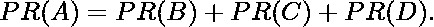
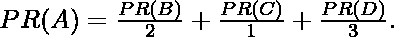
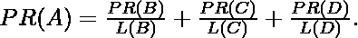
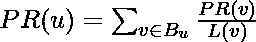

# 页面排名算法及实现

> 原文:[https://www . geesforgeks . org/page-rank-algorithm-implementation/](https://www.geeksforgeeks.org/page-rank-algorithm-implementation/)

PageRank (PR)是谷歌搜索使用的一种算法，用于在搜索引擎结果中对网站进行排名。PageRank 是以谷歌创始人之一拉里·佩奇的名字命名的。PageRank 是衡量网站页面重要性的一种方式。根据谷歌的说法:

> PageRank 的工作原理是计算页面链接的数量和质量，以确定网站重要性的粗略估计。潜在的假设是，更重要的网站可能会从其他网站收到更多链接。

它不是谷歌用来排序搜索引擎结果的唯一算法，但它是该公司使用的第一个算法，也是最知名的。
上述中心性度量不适用于多图。

***算法***
page rank 算法输出一个概率分布，用于表示随机点击链接的人到达任何特定页面的可能性。可以为任何大小的文档集合计算 PageRank。在几篇研究论文中假设，在计算过程开始时，分布在集合中的所有文档中是均匀分布的。PageRank 计算需要多次通过集合，称为“迭代”，以调整近似的 PageRank 值，使其更接近理论真实值。

**简化算法**
假设一个小宇宙有四个网页:A、B、C、d，从一个页面到自身的链接，或者从一个单一页面到另一个单一页面的多个出站链接，都被忽略。对于所有页面，PageRank 被初始化为相同的值。在 PageRank 的原始形式中，所有页面上的 PageRank 之和是当时 web 上的页面总数，因此本例中的每个页面都有一个初始值 1。然而，PageRank 的后续版本以及本节的剩余部分假设概率分布在 0 和 1 之间。因此，本例中每页的初始值为 0.25。
在下一次迭代中，从给定页面转移到其出站链接目标的页面等级在所有出站链接中平均分配。
如果系统中仅有的链接是从 B 页、C 页和 D 页到 A 页，那么在下一次迭代中，每个链接将把 0.25 个 PageRank 转移到 A 页，总计为 0.75 个。

相反，假设页面 B 链接到页面 C 和页面 A，页面 C 链接到页面 A，页面 D 链接到所有三个页面。因此，在第一次迭代时，页面 B 将把其现有值的一半(或 0.125)转移到页面 A，把另一半(或 0.125)转移到页面 C。页面 C 将把其所有现有值(0.25)转移到它链接到的唯一页面 A。由于页面 D 有三个出站链接，它将把其现有值的三分之一(或大约 0.083)转移到页面 A。在这次迭代完成时，页面 A 的页面排名大约为 0.458。

换句话说，出站链接赋予的 PageRank 等于文档自身的 PageRank 分数除以出站链接数 L()。
一般情况下，任意页面 u 的 PageRank 值可以表示为:

，即页面 u 的 PageRank 值取决于集合 Bu(包含链接到页面 u 的所有页面的集合)中包含的每个页面 v 的 PageRank 值，除以来自页面 v 的链接数 L(v)。该算法涉及计算 PageRank 的阻尼因子。这就像政府从一个人身上征收的所得税，尽管它是自己缴纳的。

以下是计算页面等级的代码。

## 计算机编程语言

```py
def pagerank(G, alpha=0.85, personalization=None,
             max_iter=100, tol=1.0e-6, nstart=None, weight='weight',
             dangling=None):
    """Return the PageRank of the nodes in the graph.

    PageRank computes a ranking of the nodes in the graph G based on
    the structure of the incoming links. It was originally designed as
    an algorithm to rank web pages.

    Parameters
    ----------
    G : graph
      A NetworkX graph.  Undirected graphs will be converted to a directed
      graph with two directed edges for each undirected edge.

    alpha : float, optional
      Damping parameter for PageRank, default=0.85.

    personalization: dict, optional
      The "personalization vector" consisting of a dictionary with a
      key for every graph node and nonzero personalization value for each node.
      By default, a uniform distribution is used.

    max_iter : integer, optional
      Maximum number of iterations in power method eigenvalue solver.

    tol : float, optional
      Error tolerance used to check convergence in power method solver.

    nstart : dictionary, optional
      Starting value of PageRank iteration for each node.

    weight : key, optional
      Edge data key to use as weight.  If None weights are set to 1.

    dangling: dict, optional
      The outedges to be assigned to any "dangling" nodes, i.e., nodes without
      any outedges. The dict key is the node the outedge points to and the dict
      value is the weight of that outedge. By default, dangling nodes are given
      outedges according to the personalization vector (uniform if not
      specified). This must be selected to result in an irreducible transition
      matrix (see notes under google_matrix). It may be common to have the
      dangling dict to be the same as the personalization dict.

    Returns
    -------
    pagerank : dictionary
       Dictionary of nodes with PageRank as value

    Notes
    -----
    The eigenvector calculation is done by the power iteration method
    and has no guarantee of convergence.  The iteration will stop
    after max_iter iterations or an error tolerance of
    number_of_nodes(G)*tol has been reached.

    The PageRank algorithm was designed for directed graphs but this
    algorithm does not check if the input graph is directed and will
    execute on undirected graphs by converting each edge in the
    directed graph to two edges.

    """
    if len(G) == 0:
        return {}

    if not G.is_directed():
        D = G.to_directed()
    else:
        D = G

    # Create a copy in (right) stochastic form
    W = nx.stochastic_graph(D, weight=weight)
    N = W.number_of_nodes()

    # Choose fixed starting vector if not given
    if nstart is None:
        x = dict.fromkeys(W, 1.0 / N)
    else:
        # Normalized nstart vector
        s = float(sum(nstart.values()))
        x = dict((k, v / s) for k, v in nstart.items())

    if personalization is None:

        # Assign uniform personalization vector if not given
        p = dict.fromkeys(W, 1.0 / N)
    else:
        missing = set(G) - set(personalization)
        if missing:
            raise NetworkXError('Personalization dictionary '
                                'must have a value for every node. '
                                'Missing nodes %s' % missing)
        s = float(sum(personalization.values()))
        p = dict((k, v / s) for k, v in personalization.items())

    if dangling is None:

        # Use personalization vector if dangling vector not specified
        dangling_weights = p
    else:
        missing = set(G) - set(dangling)
        if missing:
            raise NetworkXError('Dangling node dictionary '
                                'must have a value for every node. '
                                'Missing nodes %s' % missing)
        s = float(sum(dangling.values()))
        dangling_weights = dict((k, v/s) for k, v in dangling.items())
    dangling_nodes = [n for n in W if W.out_degree(n, weight=weight) == 0.0]

    # power iteration: make up to max_iter iterations
    for _ in range(max_iter):
        xlast = x
        x = dict.fromkeys(xlast.keys(), 0)
        danglesum = alpha * sum(xlast[n] for n in dangling_nodes)
        for n in x:

            # this matrix multiply looks odd because it is
            # doing a left multiply x^T=xlast^T*W
            for nbr in W[n]:
                x[nbr] += alpha * xlast[n] * W[n][nbr][weight]
            x[n] += danglesum * dangling_weights[n] + (1.0 - alpha) * p[n]

        # check convergence, l1 norm
        err = sum([abs(x[n] - xlast[n]) for n in x])
        if err < N*tol:
            return x
    raise NetworkXError('pagerank: power iteration failed to converge '
                        'in %d iterations.' % max_iter)
```

上面的代码是在 networkx 库中实现的功能。

要在 networkx 中实现上述功能，您必须执行以下操作:

## 计算机编程语言

```py
>>> import networkx as nx
>>> G=nx.barabasi_albert_graph(60,41)
>>> pr=nx.pagerank(G,0.4)
>>> pr
```

下面是输出，您将在所需的安装后在 IDLE 上获得。

## 计算机编程语言

```py
{0: 0.012774147598875784, 1: 0.013359655345577266, 2: 0.013157355731377924,
3: 0.012142198569313045, 4: 0.013160014506830858, 5: 0.012973342862730735,
 6: 0.012166706783753325, 7: 0.011985935451513014, 8: 0.012973502696061718,
9: 0.013374146193499381, 10: 0.01296354505412387, 11: 0.013163220326063332,
 12: 0.013368514624403237, 13: 0.013169335617283102, 14: 0.012752071800520563,
15: 0.012951601882210992, 16: 0.013776032065400283, 17: 0.012356820581336275,
18: 0.013151652554311779, 19: 0.012551059531065245, 20: 0.012583415756427995,
 21: 0.013574117265891684, 22: 0.013167552803671937, 23: 0.013165528583400423,
 24: 0.012584981049854336, 25: 0.013372989228254582, 26: 0.012569416076848989,
 27: 0.013165322299539031, 28: 0.012954300960607157, 29: 0.012776091973397076,
 30: 0.012771016515779594, 31: 0.012953404860268598, 32: 0.013364947854005844,
33: 0.012370004022947507, 34: 0.012977539153099526, 35: 0.013170376268827118,
 36: 0.012959579020039328, 37: 0.013155319659777197, 38: 0.013567147133137161,
 39: 0.012171548109779459, 40: 0.01296692767996657, 41: 0.028089802328702826,
 42: 0.027646981396639115, 43: 0.027300188191869485, 44: 0.02689771667021551,
 45: 0.02650459107960327, 46: 0.025971186884778535, 47: 0.02585262571331937,
48: 0.02565482923824489, 49: 0.024939722913691394, 50: 0.02458271197701402,
 51: 0.024263128557312528, 52: 0.023505217517258568, 53: 0.023724311872578157,
 54: 0.02312908947188023, 55: 0.02298716954828392, 56: 0.02270220663300396,
 57: 0.022060403216132875, 58: 0.021932442105075004, 59: 0.021643288632623502}
```

上面的代码已经在 IDLE(windows 的 Python IDE)上运行过了。在运行此代码之前，您需要下载 networkx 库。大括号内的部分表示输出。它几乎类似于 Ipython(针对 Ubuntu 用户)。

***参考文献***

*   [https://en . Wikipedia . org/wiki/page rank](https://en.wikipedia.org/wiki/PageRank)
*   [http://networkx . readthedocs . io/en/networkx-1.10/index . html](http://networkx.readthedocs.io/en/networkx-1.10/index.html)
*   [https://www.geeksforgeeks.org/ranking-google-search-works/](https://www.geeksforgeeks.org/ranking-google-search-works/)
*   [https://www.geeksforgeeks.org/google-search-works/](https://www.geeksforgeeks.org/google-search-works/)

因此，这种方式为给定的图计算页面等级的中心性度量。这样，我们已经涵盖了 2 个中心性度量。我想进一步写一下网络分析中使用的各种中心性度量。
本文由 [**贾扬特**](https://in.linkedin.com/in/jayant-bisht-978085114) 供稿。如果你喜欢 GeeksforGeeks 并想投稿，你也可以使用[write.geeksforgeeks.org](https://write.geeksforgeeks.org)写一篇文章或者把你的文章邮寄到 review-team@geeksforgeeks.org。看到你的文章出现在极客博客主页上，帮助其他极客。
如果发现有不正确的地方，或者想分享更多关于上述话题的信息，请写评论。