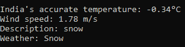

# Python 中的胰腺模块

> 原文:[https://www.geeksforgeeks.org/panclus-module-in-python/](https://www.geeksforgeeks.org/panclus-module-in-python/)

**pancleus**是一个非常有用的模块，程序员可以用几种语言将文本转换成语音，翻译文本并在一行代码中预测日食和月食的日期。但是 pancleus 已经不再使用了，最近发布了名为 PanclusGz 的当前版本，因为 pancleus 这个名字是用来安装它的。Panclus Gz 的全称是 Giga Panclus，它包含许多子模块，比旧版本的 Panclus 有更多的功能。

**安装:**

```py
pip install PanclusGz
pip install countryinfo
```

当您在命令提示符下键入此命令时，两个库都将被安装。PanclusGz 是主库，countryinfo 库用于执行主模块的其他操作。PanclusGz 内部的子模块如下所示:

*   位置
*   属国
*   地面零点
*   安装程序

现在让我们详细讨论一下它们:

## **位置**

位置模块并不意味着寻找任何位置，它主要用于获取关于温度、风速的天气报告，它是一个描述和天气类型。地点还具有更多与国家及其地区和首都的信息相关的属性。

**导入模块:**

## 蟒蛇 3

```py
from PanclusGz import locations as ls
```

**例 1:** 用于查找天气预报。

## 蟒蛇 3

```py
ls.get_weather('India')
```

**输出:**



您的输出将取决于您的位置和当前时间。

**例 2:** 获取任意国家的面积。

## 蟒蛇 3

```py
ls.area('India')
```

**输出:**

```py
3287590
```

该区域将以平方公里显示。

**例 3:** 查找任意国家的主叫代码。

## 蟒蛇 3

```py
ls.country_code('India')
```