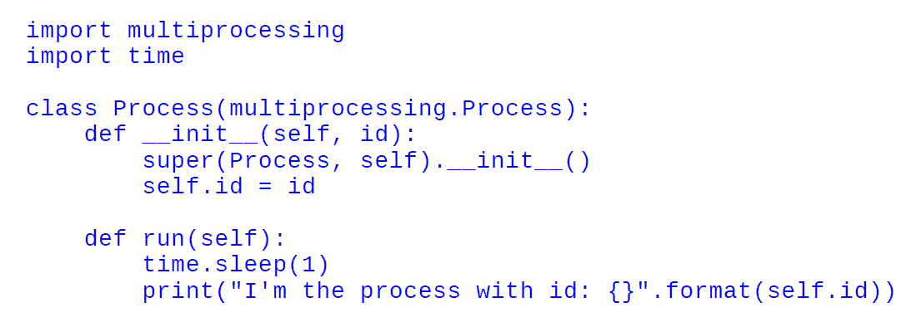
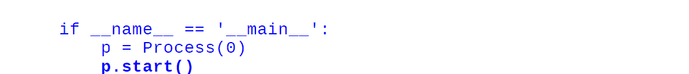
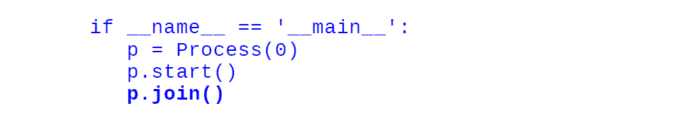
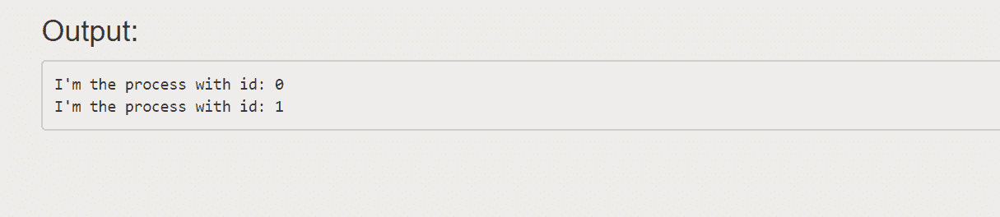
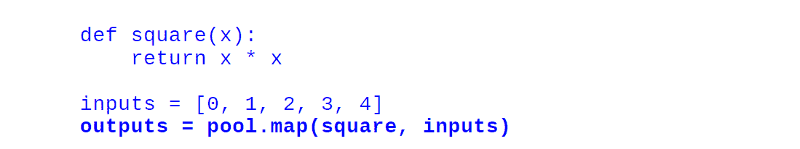
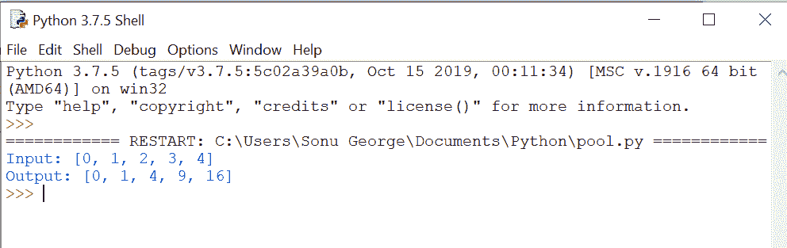
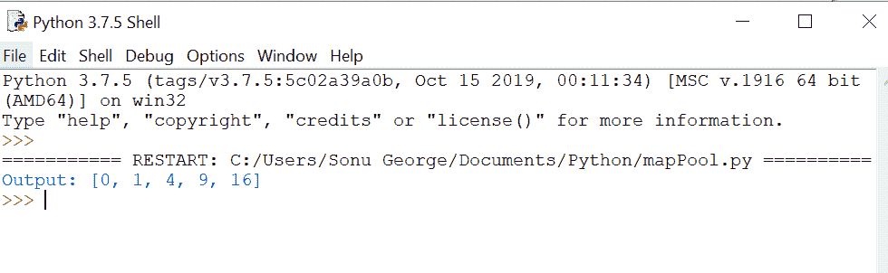
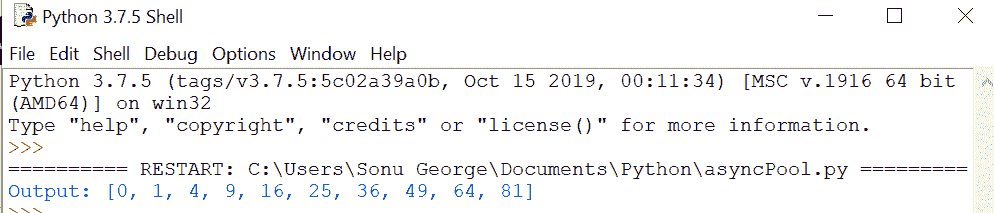

# Python 中的并行处理

> 原文:[https://www . geesforgeks . org/python 中的并行处理/](https://www.geeksforgeeks.org/parallel-processing-in-python/)

并行处理可以增加程序完成的任务数量，从而减少整体处理时间。这些有助于处理大规模问题。

在本节中，我们将涵盖以下主题:

*   并行处理导论
*   用于并行处理的多处理 Python 库
*   IPython 并行框架

## 并行处理导论

对于并行性，将问题划分为不依赖于其他子单元(或依赖程度较低)的子单元非常重要。子单元完全独立于其他子单元的问题被称为**尴尬的平行**。

例如，对数组的逐元素操作。在这种情况下，操作需要知道它当前正在处理的特定元素。

在另一个场景中，被划分为子单元的问题必须**共享一些数据**来执行操作。由于通信成本，这些导致了性能问题。

**处理并行程序主要有两种方式:**

*   **Shared Memory**

    在共享内存中，子单元可以通过相同的内存空间相互通信。优点是不需要显式处理通信，因为这种方法足以从共享内存中读取或写入。但是，当多个进程同时访问和更改同一个内存位置时，问题就出现了。使用同步技术可以避免这种冲突。

*   **Distributed memory**

    在分布式内存中，每个进程都是完全分离的，都有自己的内存空间。在这种情况下，进程之间的通信是显式处理的。由于通信是通过网络接口进行的，因此与共享内存相比成本更高。

**线程**是实现共享内存并行的方式之一。这些独立的子任务源自一个进程并共享内存。由于**全局解释器锁(GIL)** ，线程无法在 Python 中用来提高性能。GIL 是一种机制，其中 Python 解释器设计**一次只允许一条 Python 指令运行**。用**工序**代替螺纹可以完全避免 GIL 限制。使用进程的缺点很少，比如进程间通信不如共享内存有效，但是它更灵活、更明确。

## 并行处理的多处理

使用标准的多处理模块，我们可以通过创建子进程来高效地并行化简单的任务。该模块提供了一个易于使用的界面，并包含一组实用程序来处理任务提交和同步。

#### 进程和池类

**流程**

通过对 multiprocessing.process 进行子类化，您可以创建一个独立运行的进程。通过扩展`__init__`方法，您可以初始化资源，通过实现`Process.run()`方法，您可以为子流程编写代码。在下面的代码中，我们看到了如何创建一个进程来打印分配的 id:



为了产生流程，我们需要初始化我们的流程对象并调用`Process.start()`方法。这里`Process.start()`将创建一个新的流程，并将调用`Process.run()`方法。



`p.start()`后的代码会在进程 p 的任务完成前立即执行，要等待任务完成，可以使用`Process.join()`。



下面是完整的代码:

```
import multiprocessing
import time

class Process(multiprocessing.Process):
    def __init__(self, id):
        super(Process, self).__init__()
        self.id = id

    def run(self):
        time.sleep(1)
        print("I'm the process with id: {}".format(self.id))

if __name__ == '__main__':
    p = Process(0)
    p.start()
    p.join()
    p = Process(1)
    p.start()
    p.join()
```

**输出:**



**池类**

Pool 类可用于并行执行不同输入数据的函数。`multiprocessing.Pool()`类生成一组称为 workers 的流程，可以使用方法`apply/apply_async and map/map_async`提交任务。对于并行映射，您应该首先初始化一个`multiprocessing.Pool()`对象。第一个论点是工人的数量；如果没有给出，这个数字将等于系统中的内核数量。


举个例子看看。在这个例子中，我们将看到如何传递一个计算数字平方的函数。使用`Pool.map()`可以将函数映射到列表，并将函数和输入列表作为参数传递，如下所示:



```
import multiprocessing
import time

def square(x):
    return x * x

if __name__ == '__main__':
    pool = multiprocessing.Pool()
    pool = multiprocessing.Pool(processes=4)
    inputs = [0,1,2,3,4]
    outputs = pool.map(square, inputs)
    print("Input: {}".format(inputs))
    print("Output: {}".format(outputs))
```

**输出:**



当我们使用正常的 map 方法时，程序的执行被停止，直到所有的工作人员完成任务。使用`map_async()`，在不停止主程序的情况下立即返回 AsyncResult 对象，任务在后台完成。可以随时使用`AsyncResult.get()`方法检索结果，如下所示:


```
import multiprocessing
import time

def square(x):
    return x * x

if __name__ == '__main__':
    pool = multiprocessing.Pool()
    inputs = [0,1,2,3,4]
    outputs_async = pool.map_async(square, inputs)
    outputs = outputs_async.get()
    print("Output: {}".format(outputs))
```

**输出:**



`Pool.apply_async`将由单一功能组成的任务分配给其中一名工人。它接受函数及其参数，并返回一个 AsyncResult 对象。


```
import multiprocessing
import time

def square(x):
    return x * x

if __name__ == '__main__':
    pool = multiprocessing.Pool()
    result_async = [pool.apply_async(square, args = (i, )) for i in
                    range(10)]
    results = [r.get() for r in result_async]
    print("Output: {}".format(results))
```

**输出:**



## IPython 并行框架

IPython 并行包提供了一个框架，用于在连接到网络的单核、多核机器和多个节点上设置和执行任务。在 IPython.parallel 中，您必须启动一组由控制器管理的称为引擎的工作程序。控制器是帮助客户端和引擎之间进行通信的实体。在这种方法中，工作进程是单独启动的，它们将无限期地等待来自客户端的命令。

Ipcluster shell 命令用于启动控制器和引擎。

```
$ ipcluster start
```

完成上述过程后，我们可以使用一个 IPython shell 并行执行任务。IPython 带有两个基本接口:

*   直接接口
*   基于任务的界面

#### 直接接口

直接接口允许您显式地向每个计算单元发送命令。这是灵活和易于使用的。要与单元交互，您需要启动引擎，然后在单独的外壳中启动 IPython 会话。您可以通过创建客户端来建立与控制器的连接。在下面的代码中，我们导入 Client 类并创建一个实例:

```
from IPython.parallel import Client
    rc = Client()
    rc.ids

```

这里，`Client.ids`将给出整数列表，给出可用引擎的详细信息。

使用直接视图实例，您可以向引擎发出命令。我们有两种方法可以获得直接视图实例:

*   通过索引客户端实例

    ```
    dview = rc[0]
    ```

*   通过调用 DirectView.direct_view 方法

    ```
    dview = rc.direct_view(‘all’).
    ```

最后一步，您可以使用 DirectView.execute 方法执行命令。

```
dview.execute(‘ a = 1 ’)
```

上述命令将由每个引擎单独执行。使用 get 方法，您可以以 AsyncResult 对象的形式获得结果。

```
dview.pull(‘ a ‘).get()
dview.push({‘ a ’ : 2})

```

如上图，可以使用`DirectView.pull`方法检索数据，使用`DirectView.push`方法发送数据。

#### 基于任务的界面

基于任务的界面提供了一种处理计算任务的智能方式。从用户的角度来看，这有一个不太灵活的界面，但它在引擎上的负载平衡是有效的，并可以重新提交失败的作业，从而提高性能。

LoadBalanceView 类使用 load_balanced_view 方法提供基于任务的接口。

```
from IPython.parallel import Client
    rc = Client()
    tview = rc.load_balanced_view()

```

使用地图和应用方法，我们可以运行一些任务。在负载平衡视图中，任务分配取决于当时发动机上有多少负载。这确保了所有的发动机工作没有停机时间。