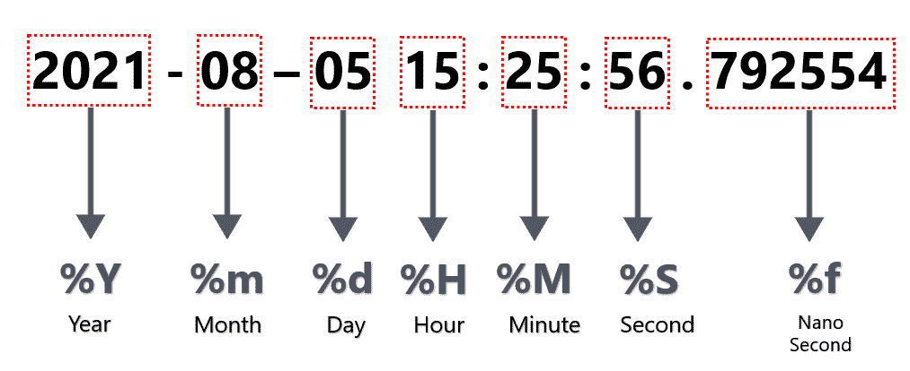

# 解析 Python 中包含纳秒的日期时间字符串

> 原文:[https://www . geesforgeks . org/parsing-datetime-strings-containing-纳秒-in-python/](https://www.geeksforgeeks.org/parsing-datetime-strings-containing-nanoseconds-in-python/)

大多数应用需要高达秒的精度，但也有一些关键应用需要纳秒精度，尤其是那些可以执行极快计算的应用。它有助于为应用程序提供与时间空间相关的某些因素的见解。让我们看看如何解析包含纳秒的日期时间字符串。Python 有一个指令列表，可以用来将字符串解析为日期时间对象。让我们看一下我们将在代码中使用的一些方法。

<figure class="table">

| **指令** | **描述** | **例** |
| --- | --- | --- |
| %Y | 年 | Two thousand and twenty-one |
| %m | 月号 | seven |
| %d | 月份日期 | five |
| %H | 24 小时格式 | Sixteen |
| %M | 分钟 | Fifty-one |
| %f | 微秒 | Two hundred and thirty-four thousand five hundred and sixty-seven |

</figure>

#### 日期时间对象的图像演示:



解析的图像表示

让我们以默认的 Python 时间戳格式:“2021-08-05 15:25:56.792554”为例进行研究。

### 方法一:使用[日期时间模块](https://www.geeksforgeeks.org/python-datetime-module/)

在这个例子中，我们会看到纳秒值为 **792554** 。” ***%f*** ”指令是用来解析纳秒的。使用***str time()***方法，通过将“ ***%f*** ”指令转换为日期时间对象的字符串值来交叉验证同样的事情。

## 计算机编程语言

```
from datetime import datetime

# Parse the default python timestamp format
dt_obj = datetime.strptime("2021-08-05 15:25:56.792554",
                           "%Y-%m-%d %H:%M:%S.%f")

# Verify the value for nano seconds
nano_secs = dt_obj.strftime("%f")

# Print the value of nano seconds
print(nano_secs)
```

**输出**

```
792554
```

### 方法二:使用[熊猫库](https://www.geeksforgeeks.org/introduction-to-pandas-in-python/)

这里我们将使用 pandas.to_datetime()方法来解析包含纳秒的 datetime 字符串。

> ***语法:***
> 
> ***pandas . to _ datetime**(arg，errors='raise '，dayfirst=False，yearfirst=False，utc=None，box=True，format=None，exact=True，unit=None，infer _ datetime _ format = False，origin='unix '，cache=False)*
> 
> ***参数:***
> 
> ***参数:**要转换为日期时间对象的整数、字符串、浮点、列表或字典对象。*
> ***dayfirst:** 布尔值，如果为 True，则排名第一。*
> ***yearfirst:**布尔值，如果为 True，则放置 year first。*
> ***utc:** 布尔值，如果为真，则返回以 utc 为单位的时间。*
> ***格式:**字符串输入告诉日、月、年的位置。*

## 计算机编程语言

```
import pandas as pd

# Parse the timestamp string by
# providing the format of timestamp string
dt_obj = pd.to_datetime("2021-08-05 15:25:56.792554", 
                        format="%Y-%m-%d %H:%M:%S.%f")

# Verify the value for nano seconds
nano_secs = dt_obj.strftime("%f")

# Print the value of nano seconds
print(nano_secs)
```

**输出:**

```
792554
```

除了我们使用了**熊猫**库而不是**日期时间**模块之外，上面的例子与前面的例子相似。当我们使用**熊猫数据帧**时，这可以证明是很方便的。这个库的一个优点是我们可能不需要手动提供格式。参数 ***在***pandas . to _ datetime()***方法中推断 _datetime_format*** 可以自动处理，如果提供为 ***True*** 。在某些情况下，可以 ***将解析速度提高~5-10x*** 。下面是同样的例子。

## 计算机编程语言

```
import pandas as pd

# Parse the timestamp string by
# providing infer_datetime_format as True
dt_obj = pd.to_datetime("2021-08-05 15:25:56.792554", 
                        infer_datetime_format=True)

# Verify the value for nano seconds
nano_secs = dt_obj.strftime("%f")

# Print the value of nano seconds
print(nano_secs)
```

**输出:**

```
792554
```