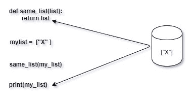
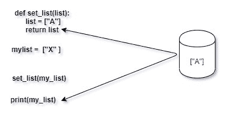
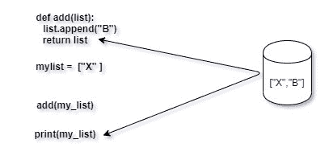
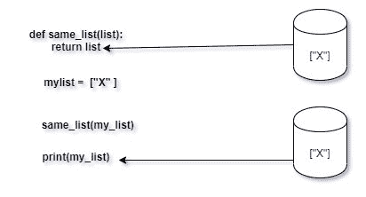
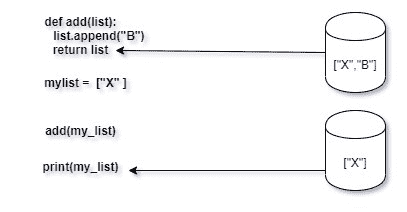
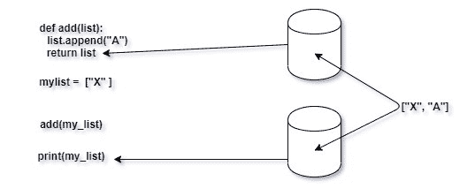

# 通过引用与 Python 中的值进行比较

> 原文:[https://www . geesforgeks . org/通过引用传递 vs-python 中的值/](https://www.geeksforgeeks.org/pass-by-reference-vs-value-in-python/)

从 C++和 Java 等其他语言跳到 Python 编程的开发人员经常被 Python 中传递参数的过程所迷惑。以对象为中心的数据模型及其对赋值的处理是导致基础层混乱的原因。在下面的文章中，我们将讨论 Python 中传递参数的概念，并尝试借助示例来理解它。

### Python 参数传递模型是“按值传递”还是“按引用传递”？

读完之后，你可能想打一些东西，所以振作起来。Python 的参数传递模型是**既不是“按值传递”，也不是“按引用传递”，而是“按对象引用传递”。**

“按值传递”、“按引用传递”和“按对象引用传递”的范例可以通过探索下面的示例函数来理解。
查看下面定义的两个函数:

```py
def set_list(list):
    list = ["A", "B", "C"]
    return list

def add(list):
    list.append("D")
    return list

my_list = ["E"]

print(set_list(my_list))

print(add(my_list))
```

**输出:**

```py
['A', 'B', 'C']
['E', 'D']
```

现在，让我们研究一下上面的代码，

**变量不是传递的对象:**
如果我告诉你《罗摩衍那》不是图西达斯写的，而是一个叫图西达斯的人写的呢。这种区别有意义吗？没有吧？！。但是根据 Python，它做到了，并且做出了至关重要的区分。所以，在 Python 和它的 PKD 中，事物和我们用来指代事物的标签之间有很大的区别。“一个叫塔尔西达斯的人”只是一个人，“塔尔西达斯”是用来指那个人的名字。
所以，考虑一个列表

```py
 a = ["X", "Y"]
```

这里的“a”是一个指向包含元素“X”和“Y”的列表的变量。但是“a”本身并不在列表中。将“a”视为包含对象“X”和“Y”的桶。


**通过参考:**

在通过引用传递中，变量(桶)被直接传递给函数。该变量充当一个包，该包带有它的内容(对象)。


在上面的代码图像中，“list”和“my_list”是同一个容器变量，因此引用了内存中完全相同的对象。函数对变量或对象执行的任何操作都将直接反映给函数调用方。例如，函数可以完全改变变量的内容，并将其指向一个完全不同的对象:


另外，该函数可以重新分配变量的内容，效果如下:


总而言之，通过引用传递函数和调用方使用相同的变量和对象。

**通过值:**

在按值传递中，函数会获得调用者传递给它的参数对象的副本。这意味着原始对象保持不变，所做的所有更改都是相同对象的副本，并存储在不同的内存位置。


函数对变量或对象执行的任何操作
也是如此

总而言之，函数调用方上下文中的变量和对象的副本是完全隔离的。

**通过引用传递对象:**

在这种情况下，python 是不同的，python 中的函数接收内存中由调用者引用的同一对象的引用。但是，该函数不接收调用者存储相同对象的变量(桶)；像在传递值中一样，函数提供自己的桶，并为自己创建一个全新的变量。


调用者和函数都引用内存中的同一个对象，所以当 append 函数向列表中添加一个额外的元素时，调用者对象也会被更新。它们有不同的名字，但却是一样的东西。两个变量包含相同的对象。这就是传递对象引用背后的含义。函数和调用者在内存中使用相同的对象，但是通过不同的变量来获取它们。对函数变量(桶)所做的任何更改都不会改变调用者变量(桶)的性质，只会更新内容。

**引用:**[Python 是按引用传递还是按值传递？罗伯特·希顿](https://robertheaton.com/2014/02/09/pythons-pass-by-object-reference-as-explained-by-philip-k-dick/)