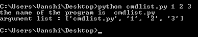
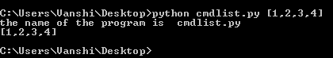
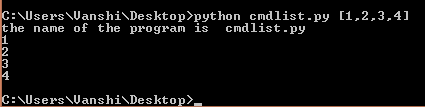
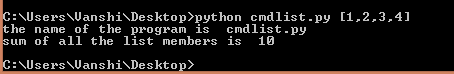
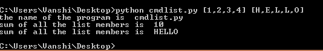

# 在 Python 中将列表作为命令行参数传递

> 原文:[https://www . geesforgeks . org/pass-list-as-命令行参数-in-python/](https://www.geeksforgeeks.org/pass-list-as-command-line-argument-in-python/)

在操作系统命令行外壳中程序名称后面给出的参数称为[命令行参数](https://www.geeksforgeeks.org/command-line-arguments-in-python/)。Python 提供了各种方法来处理这些类型的参数。其中之一就是`sys`模块。

## 系统模块

一个[模块](https://www.geeksforgeeks.org/python-modules/)是一个包含 Python 定义和语句的文件。sys 模块提供了用于操作 Python 运行时环境不同部分的函数和变量。该模块提供对解释器使用或维护的一些变量以及与解释器强交互的函数的访问。

#### sys.argv

`sys.argv`在 python 中用于在运行时检索命令行参数。为了让程序能够使用它，它必须从“sys”模块导入。如此获得的参数是一个名为`sys.argv`的数组。

**注意:** `sys.argv[0]`给出了程序的名称，下面的索引像数组的成员一样工作。

**进场:**
节目名称为“cmdlist.py”。

1.  **Working with command line:** Consider the below code written in cmdlis.py

    ```py
    import sys

    print("the name of the program is ", sys.argv[0])
    print("argument list :", sys.argv)
    ```

    **输出:**

    

2.  **Calling a list using the command line**

    ```py
    import sys

    print ("the name of the program is ", sys.argv[0])

    a = sys.argv[1]
    print (a)
    ```

    **输出:**

    

3.  **使用命令行调用的列表。**
    sys.argv 是一个字符串数组。因此，传递给它的任何参数都是一个字符串，所以为了正确使用，我们必须将其转换为适当的列表形式。
    *   **Program to take list as command line argument and convert it to a proper list form**

        ```py
        import sys

        print("the name of the program is ", sys.argv[0])

        n = len(sys.argv[1])
        a = sys.argv[1][1:n-1]
        a = a.split(', ')

        for i in a:
            print(i)
        ```

        **输出:**
        

    *   **Program to find the sum of all the members of the list**
        Also, keep in find to change the members to the required data type if not string.

        ```py
        import sys

        print ("the name of the program is", sys.argv[0])

        n=len(sys.argv[1])
        a=sys.argv[1][1:n-1]
        a=a.split(',')

        A = [int(i) for i in a]

        b = 0

        for i in A:
            b += i
        print("sum of all the list members is ", b)
        ```

        **输出:**

        

4.  **Working with multiple list retrieved through command line.**

    ```py
    import sys

    print ("the name of the program is ", sys.argv[0])

    n = len(sys.argv[1])
    a = sys.argv[1][1:n-1]
    a = a.split(', ')

    A = [int(i) for i in a]
    b = 0

    for i in A:
        b += i
    print("sum of all the list members is ", b)

    n = len(sys.argv[2])
    c = sys.argv[2][1:n-1]
    c = c.split(', ')

    d = ""

    for i in c:
        d = d+i

    print ("sum of all the list members is ", d)
    ```

    **输出:**
    