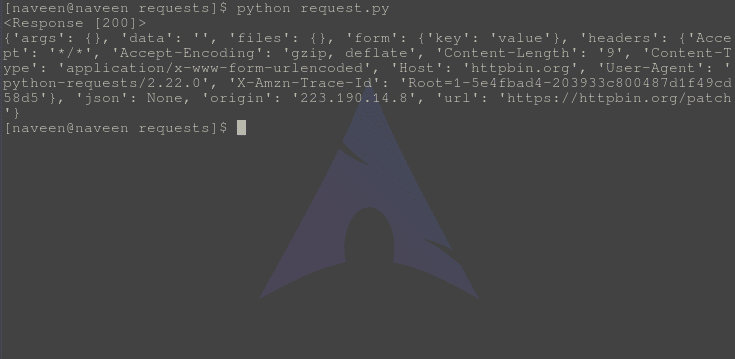

# 补丁方法–Python 请求

> 原文:[https://www.geeksforgeeks.org/patch-method-python-requests/](https://www.geeksforgeeks.org/patch-method-python-requests/)

请求库是 Python 向指定网址发出 HTTP 请求的重要方面之一。本文围绕如何使用 **requests.patch()** 方法向指定的网址发出补丁请求展开。在检查 PATCH 方法之前，让我们弄清楚什么是 Http PATCH 请求–

#### 补丁 Http 方法

PATCH 是万维网使用的 HTTP 支持的请求方法。它用于修改功能。PATCH 请求只需要包含对资源的更改，而不是完整的资源。这类似于 PUT，但是主体包含一组说明，描述了应该如何修改当前驻留在服务器上的资源以产生新版本。这意味着 PATCH 主体不应该只是资源的修改部分，而应该是某种修补语言，如 JSON Patch 或 XML Patch。PATCH 既不安全也不是幂等的。

#### 如何通过 Python 请求进行补丁请求

Python 的请求模块提供了名为 **patch()** 的内置方法，用于向指定的 URI 发出 patch 请求。
**语法–**

```py
requests.patch(url, params={key: value}, args)
```

**示例–**
为了示例目的，让我们尝试向 httpbin 的 API 发出请求。

## 蟒蛇 3

```py
import requests

# Making a PATCH request
r = requests.patch('https://httpbin.org / patch', data ={'key':'value'})

# check status code for response received
# success code - 200
print(r)

# print content of request
print(r.content)
```

将此文件保存为 request.py 并通过终端运行，

```py
python request.py
```

**输出–**



#### 何时使用 PATCH 方法？

PATCH 方法是 HTTP 协议支持的请求方法，用于对现有资源进行部分更改。PATCH 方法提供了一个实体，该实体包含一个要应用于使用 HTTP URI 请求的资源的更改列表。变更列表以 PATCH 文档的形式提供。如果请求的资源不存在，则服务器可以根据 PATCH 文档媒体类型和权限创建资源。PATCH 文档中描述的更改必须在语义上得到很好的定义，但是可以具有与被修补的资源不同的媒体类型。诸如 XML、JSON 之类的框架可以用来描述 PATCH 文档中的变化。

#### PUT vs PATCH

PUT 和 PATCH 方法之间的主要区别在于 PUT 方法使用请求 URI 来提供所请求资源的修改版本，该版本将替换资源的原始版本，而 PATCH 方法提供一组指令来修改资源。如果 PATCH 文档大于 PUT 方法发送的资源的新版本的大小，那么 PUT 方法是首选的。