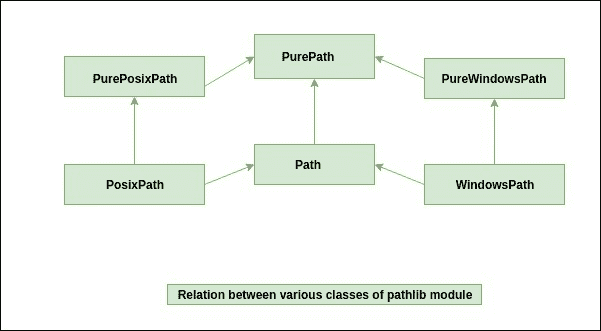

# Python 中的路径库模块

> 原文:[https://www.geeksforgeeks.org/pathlib-module-in-python/](https://www.geeksforgeeks.org/pathlib-module-in-python/)

Python 中的 ***Pathlib 模块*** 提供了各种表示文件系统路径的类，其语义适合不同的操作系统。该模块属于 Python 的标准实用程序模块。

`Path classes`在**中*路径库模块*中**分为 ***纯路径*** 和 ***具体路径*** 。纯路径仅提供计算操作，但不提供输入/输出操作，而从纯路径继承的具体路径提供计算和输入/输出操作。



***纯路径–***
如上所述，纯路径提供纯计算操作。纯路径类的对象为路径处理操作提供了各种方法。纯路径对象在不实际访问文件系统的情况下运行。
当我们只想操纵一条路径，而不实际访问操作系统时，Pure Path 非常有用。通过实例化其中一个纯类，我们可以在 Unix 机器上操作一个 Windows 文件系统路径，反之亦然。

**类 pathlib。pure path(* path segments)–**
这是一个代表系统路径风格的通用类。在实例化这个类时，将创建 ***路径库。purepispath***或 ***pathlib。*PureWindowSpath**

```
# Import PurePath class
# from pathlib module
from pathlib import PurePath

# Instantiate the PurePath class
obj = PurePath('foo/baar')

# print the instance of PurePath class
print(obj)
```

**Output:**

```
PurePosixPath('foo/baar')

```

**类路径库。purepispath(* path segments)–**
这是*purepispath*类的子类。它代表非 Windows 文件系统路径。

```
# Import PurePosixPath class
# from pathlib module
from pathlib import PurePosixPath

# Instantiate the PurePosixPath class
obj = PurePosixPath('foo / baar')

# print the instance of PurePosixPath class
print(obj)
```

**Output:**

```
PurePosixPath('foo/baar')

```

**类路径库。purewortspath(* path segments)–**
这也是 *patlib 的一个子类。PurePath* 类。它表示 Windows 文件系统路径。

```
# Import PureWindowsPath class
# from pathlib module
from pathlib import PureWindowsPath

# Instantiate the PureWindowsPath class
obj = PureWindowsPath('foo / baar')

# print the instance of PureWindowsPath class
print(obj)
```

**Output:**

```
PureWindowsPath('foo/baar')

```

下面是纯路径类提供的一些方法:

**PurePath.is_absolute()方法–**
这个方法是用来检查路径是否是绝对的。如果路径是绝对的，此方法返回真，否则返回假。

```
# Python program to explain PurePath.is_absolute() method

# Import PurePath class from pathlib module
from pathlib import PurePath

# Path
path = '/usr / local / bin'

# Instantiate the PurePath class
obj = PurePath(path)

# Check whether the given path is 
# absolute or not
isAbs = obj.is_absolute()

print(isAbs)
```

**Output:**

```
True

```

**PurePath.name 属性–**

此纯路径属性返回排除驱动器和根组件(如果有)后的最终路径组件。

```
# Python program to explain PurePath.name property

# Import PurePath class from pathlib module
from pathlib import PurePath

# Path
path = '/Desktop / file.txt'

# Instantiate the PurePath class
obj = PurePath(path)

# Get the final path component
comp = obj.name

print(comp)
```

**Output:**

```
file.txt

```

### 具体路径:

具体路径是纯路径类的子类。正如我们所知，纯路径类只提供计算操作，但它也提供各种方法来对路径对象执行系统调用。

我们可以通过以下三种方式来实例化具体的路径:

**类 pathlib。路径(*路径段)–**
这是`pathlib.PurePath`类的子类。它代表了系统路径风格的具体路径。实例化后，这个类将创建`pathlib.PosixPath`或`pathlib.WindowsPath`。

```
# Import the Path class
from pathlib import Path

# Instantiate the Path class
obj = Path('/usr/local/bin)

print(obj)
```

**Output:**

```
PosixPath('/usr/local/bin')

```

**类路径库。posxpath(* path segments)–**
这个类是 *pathlib 的子类。路径*和*路径库。purposxpath*类。这个类表示具体的非 Windows 文件系统路径。

**注意:**不能实例化*路径库。Windows 操作系统上的 posxpath*类。

```
# Import PosixPath class
# from pathlib module
from pathlib import PosixPath

# Instantiate the PosixPath class
obj = PosixPath('/usr/local/bin')

# Print the instance of PosixPath class
print(obj)
```

**Output:**

```
PosixPath('/usr/local/bin')

```

**类路径库。窗口空间(*路径段)–**

这个类是 *pathlib 的子类。路径*和*路径库。pureworspath*。这个类表示具体的窗口文件系统路径。

```
# Import WindowsPath class
# from pathlib module
from pathlib import WindowsPath

# Instantiate the WindowsPath class
obj = WindowsPath('c:/Program Files/')

# print the instance of WindowsPath class
print(obj)
```

**Output:**

```
WindowsPath('c:/Program Files/')

```

下面是 *Path* 类提供的几个方法:
`***Path.cwd() method***`:这个方法返回一个新的 Path 对象，代表当前的工作目录。

```
# Import Path class
from pathlib import Path

# Get the current working directory name
cur_dir = Path.cwd()

print(cur_dir)
```

**Output:**

```
/home/ihritik

```

`***Path.exists() method***`:该方法用于检查给定路径是否指向已有文件或目录。

```
# Import Path class
from pathlib import Path

# Path
path = '/home/ihritik/Desktop'

# Instantiate the Path class
obj = Path(path)

# Check if path points to 
# an existing file or directory 
print(obj.exists())
```

**Output:**

```
True

```

`***Path.is_dir() method***`:该方法用于检查给定路径是否为目录。

```
# Import Path class
from pathlib import Path

# Path
path = '/home/ihritik/Desktop'

# Instantiate the Path class
obj = Path(path)

# Check if path refers to 
# directory or not 
print(obj.is_dir())
```

**Output:**

```
True

```

**参考–**[https://docs.python.org/3/library/pathlib.html](https://docs.python.org/3/library/pathlib.html)