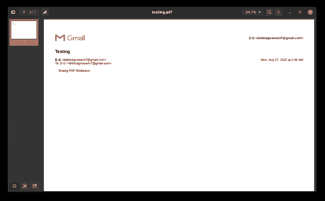
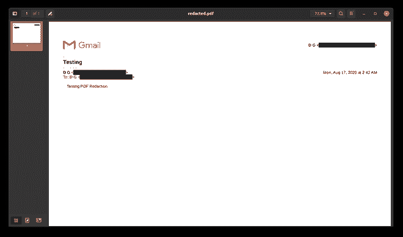

# 使用 Python 编辑 PDF

> 原文:[https://www.geeksforgeeks.org/pdf-redaction-using-python/](https://www.geeksforgeeks.org/pdf-redaction-using-python/)

所以，让我们从**密文**的确切含义开始。因此，编校是一种编辑形式，在这种形式中，多个文本源被组合在一起，并被稍微修改以形成一个文档。简而言之，每当你看到任何文档中的任何部分被涂黑以隐藏一些信息，这就是所谓的密文。在 PDF 上执行相同的任务被称为 **PDF 编辑**。

如果有人在 PDF 上处理过任何类型的数据提取，那么他们知道处理 PDF 有多痛苦。考虑这样一个场景，您想与某人共享一个 PDF，但是 PDF 中有某些部分您不想被泄露。所以，你能做的是，你能编辑文本。使用 Adobe Acrobat 之类的工具编辑文本非常容易，但是如果您希望这是一个自动化的过程，该怎么办呢？假设您在一家公司工作，该公司在其网站上与所得税部门共享其用户的购买，但由于严格的隐私政策，用户的安全**个人可识别信息(PII)** 他们希望从交易收据中删除这些信息。如果用户基数很大，那么就不能手动完成，所以你需要某种自动化来完成。这就是 Python 的用武之地。有一个很神奇的库叫做 **PyMuPDF** ，这是一个处理 PDF 并对其执行各种操作的库。所以，让我们看看我们将如何做。

首先，您需要安装 Python3 和 PyMuPDF。要安装 PyMuPDF，只需打开您的终端并在其中键入以下内容

```
pip3 install PyMuPDF
```

在这个演示中，我们将只从一个 PDF 中编辑电子邮件标识。你可以把同样的逻辑应用到任何其他 PII

**进场:**

1.  阅读 PDF 文件
2.  逐行遍历 pdf，查找每一个出现的电子邮件 id。电子邮件识别码有一个模式，所以我们将使用 **Regex** 来识别电子邮件
3.  一旦我们遇到电子邮件，我们会将其添加到列表中，然后在最后一行的末尾返回列表
4.  现在，我们只需要在 pdf 中搜索提取的电子邮件 id。PyMuPDF 使得在 PDF 中查找任何文本变得非常容易。它返回一个矩形的四个坐标，文本将出现在该矩形内。
5.  一旦我们有了所有的文本框，我们就可以简单地遍历这些框，并从 PDF 中编辑每个框

下面是上述方法的实现，为了更好地理解代码，我添加了内联注释。

**使用的 PDF 文件:**



以前

## 蟒蛇 3

```
# imports
import fitz
import re

class Redactor:

    # static methods work independent of class object
    @staticmethod
    def get_sensitive_data(lines):

        """ Function to get all the lines """

        # email regex
        EMAIL_REG = r"([\w\.\d]+\@[\w\d]+\.[\w\d]+)"
        for line in lines:

            # matching the regex to each line
            if re.search(EMAIL_REG, line, re.IGNORECASE):
                search = re.search(EMAIL_REG, line, re.IGNORECASE)

                # yields creates a generator
                # generator is used to return
                # values in between function iterations
                yield search.group(1)

    # constructor
    def __init__(self, path):
        self.path = path

    def redaction(self):

        """ main redactor code """

        # opening the pdf
        doc = fitz.open(self.path)

        # iterating through pages
        for page in doc:

            # _wrapContents is needed for fixing
            # alignment issues with rect boxes in some
            # cases where there is alignment issue
            page._wrapContents()

            # getting the rect boxes which consists the matching email regex
            sensitive = self.get_sensitive_data(page.getText("text")
                                                .split('\n'))
            for data in sensitive:
                areas = page.searchFor(data)

                # drawing outline over sensitive datas
                [page.addRedactAnnot(area, fill = (0, 0, 0)) for area in areas]

            # applying the redaction
            page.apply_redactions()

        # saving it to a new pdf
        doc.save('redacted.pdf')
        print("Successfully redacted")

# driver code for testing
if __name__ == "__main__":

    # replace it with name of the pdf file
    path = 'testing.pdf'
    redactor = Redactor(path)
    redactor.redaction()
```

**输出:**



在...之后