# 3 位二进制输入逻辑门的感知器算法

> 原文:[https://www . geeksforgeeks . org/感知器-3 位二进制输入逻辑门算法/](https://www.geeksforgeeks.org/perceptron-algorithm-for-logic-gate-with-3-bit-binary-input/)

在机器学习领域，感知器是一种用于二进制分类器的监督学习算法。感知器模型实现以下功能:

![\[\begin{array}{c}\hat{y}=\Theta\left(w_{1} x_{1}+w_{2} x_{2}+\ldots+w_{n} x_{n}+b\right) \\ =\Theta(\mathbf{w} \cdot \mathbf{x}+b) \\  \text { where } \Theta(v)=\left\{\begin{array}{cc} 1 & \text { if } v \geqslant 0 \\ 0 & \text { otherwise } \end{array}\right. \end{array}\]](img/e1ad3d8b1c7d22a1ab7a34d6f104a5cd.png "Rendered by QuickLaTeX.com")

对于权重向量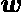和偏差参数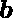的特定选择，模型预测相应输入向量的输出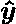。
3 位二进制变量**的 **AND、OR、NAND、NOR** 门的逻辑函数真值表，即输入向量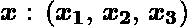和相应的输出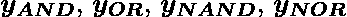–**

|  |  | 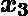 | 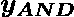 | 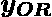 | 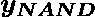 | 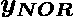 |
| --- | --- | --- | --- | --- | --- | --- |
| Zero | Zero | Zero | Zero | Zero | one | one |
| Zero | Zero | one | Zero | one | one | Zero |
| Zero | one | Zero | Zero | one | one | Zero |
| Zero | one | one | Zero | one | one | Zero |
| one | Zero | Zero | Zero | one | one | Zero |
| one | Zero | one | Zero | one | one | Zero |
| one | one | Zero | Zero | one | one | Zero |
| one | one | one | one | one | Zero | Zero |

**现在对于输入向量的相应权重向量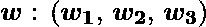，关联的感知器函数可以定义为:**

**![\[$\boldsymbol{\hat{y}} = \Theta\left(w_{1} x_{1}+w_{2} x_{2}+w_{3} x_{3}+b\right)$\]](img/ee9114005c5984195c61d2cbd8f7901c.png "Rendered by QuickLaTeX.com")**

**
为了实现，对于每个逻辑门，考虑的权重参数是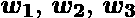，偏置参数是**

| 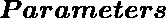 | 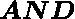 | 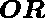 | 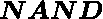 | 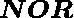 |
| --- | --- | --- | --- | --- |
| 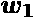 | one | one | -1 | -1 |
|  | one | one | -1 | -1 |
|  | one | one | -1 | -1 |
|  | -2 | -0.9 | three | one |

****Python 实现:****

```
# importing python library
import numpy as np

# sigmoid activation function
def activationFunction(model, type ="sigmoid"):
   return {
       "sigmoid": 1 / (1 + np.exp(-model))
   }[type]

# designing perceptron model
def perceptronModel(weights, inputs, bias):
   model = np.add(np.dot(inputs, weights), bias)
   logic = activationFunction(model, type ="sigmoid")
   return np.round(logic)

# computation model
def compute(data, logicGate, weights, bias):
   weights = np.array(weights)
   output = np.array([ perceptronModel(weights,  
            datum, bias) for datum in data ])
   return output

# Print Output
def printOutput(dataset, name, data):
   print("Logic Function: {}".format(name.upper()))
   print("X1\tX2\tX3\tY")
   toPrint = ["{1}\t{2}\t{3}\t{0}".format(output, *datas)  
              for datas, output in zip(dataset, data)]
   for i in toPrint:
       print(i)

# main function
def main():
   # 3 bit binary data
   dataset = np.array([
     [0, 0, 0],
     [0, 0, 1],
     [0, 1, 0],
     [0, 1, 1],
     [1, 0, 0],
     [1, 0, 1],
     [1, 1, 0],
     [1, 1, 1]
   ])

   # Parameters of every Logic Gates
   # weight parameters: w1, w2, w3
   # bias parameter: b
   logicGate = {
       "and": compute(dataset, "and", [1, 1, 1], -2),
       "or": compute(dataset, "or", [1, 1, 1], -0.9),
       "nand": compute(dataset, "nand", [-1, -1, -1], 3),
       "nor": compute(dataset, "nor", [-1, -1, -1], 1)
   }
   for gate in logicGate:
       printOutput(dataset, gate, logicGate[gate])

if __name__ == '__main__':
   main()
```

****Output:**

```
Logic Function: AND
X1    X2    X3    Y
0    0    0    0.0
0    0    1    0.0
0    1    0    0.0
0    1    1    0.0
1    0    0    0.0
1    0    1    0.0
1    1    0    0.0
1    1    1    1.0
Logic Function: OR
X1    X2    X3    Y
0    0    0    0.0
0    0    1    1.0
0    1    0    1.0
0    1    1    1.0
1    0    0    1.0
1    0    1    1.0
1    1    0    1.0
1    1    1    1.0
Logic Function: NAND
X1    X2    X3    Y
0    0    0    1.0
0    0    1    1.0
0    1    0    1.0
0    1    1    1.0
1    0    0    1.0
1    0    1    1.0
1    1    0    1.0
1    1    1    0.0
Logic Function: NOR
X1    X2    X3    Y
0    0    0    1.0
0    0    1    0.0
0    1    0    0.0
0    1    1    0.0
1    0    0    0.0
1    0    1    0.0
1    1    0    0.0
1    1    1    0.0

```** 

**这里，根据 3 位二进制输入的真值表，每个测试输入的模型预测输出()与与门、或门、与非门和或非门常规输出()完全匹配。
因此，验证了所有这些逻辑门的感知器算法是正确实现的。**