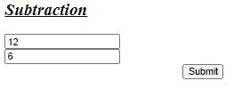

# 使用 CherryPy

进行加减运算

> 原文:[https://www . geeksforgeeks . org/使用-cherrypy 执行加减运算/](https://www.geeksforgeeks.org/perform-addition-and-subtraction-using-cherrypy/)

**CherryPy** 也称为 web 应用程序库，是一个 Python web 框架，为 Python 开发人员提供了一个友好的 HTTP 协议接口。它允许开发人员以与传统的面向对象 Python 程序相同的方式构建网络应用程序。因此，导致更小的源代码开发没有时间。

该框架主要面向希望使用 Python 创建可移植的数据库驱动的 web 应用程序的开发人员，因为它提供了创建、检索、更新和删除功能。

安装奇瑞的基本要求包括:

*   python 2.4 或更高版本
*   Cherrypy 3.0

### **安装**

要安装 cherrypy，请在终端中运行以下命令:

```py
pip install cherrypy

```

**进场:**

1.  创建用户界面以接受用户的输入。
2.  编写 cherrypy 程序来执行所需的操作

**接受用户输入的 HTML 代码-**

## 超文本标记语言

```py
<html>
<head>

  </head>
<body>

  <div class="container">  
    <h2><u><i>Operation</i></u></h2>
    <form action="store" id="form" method="GET">
    <input type="number" name="number1" /><br />
    <input type="number" name="number2" /><br />

    <input style="margin-left: 250px;" id=" submit" type="submit"/></div>
  </div>    
    </form>
  </div>

</body>
</html>
```

**用于加法的奇瑞码**

## 蟒蛇 3

```py
import cherrypy

class Root(object):

    @cherrypy.expose
    def index(self):
        return """<html>
<head>

  </head>
<body>

  <div class="container">  
    <h2><u><i>Addition</i></u></h2>
    <form action="store" id="form" method="GET">
    <input type="number" name="number1" /><br />
    <input type="number" name="number2" /><br />

    <input style="margin-left: 250px;" id=" submit" type="submit"/></div>
  </div>    
    </form>
  </div>

</body>
</html>"""

    @cherrypy.expose
    def store(self, number1, number2):
        num1=int(number1)
        num2=int(number2)
        answer=num1+num2

        out= """<html>
        <body>

<p> Sum: %s</p>

        <a style="color:red; font-size:35px;" id="shutdown"; href="./shutdown"><i>Shutdown Server</i></a>
        </body>
        </html>

        """

        return out % (str(answer))

    @cherrypy.expose
    def shutdown(self):
        cherrypy.engine.exit()

if __name__=="__main__":
    cherrypy.config.update({'server.socket_port': 8087})

    cherrypy.quickstart(Root())
```

**输出:**

 

**减法代码**

## 蟒蛇 3

```py
import cherrypy

class Root(object):

    @cherrypy.expose
    def index(self):
        return """<html>
<head>

  </head>
<body>

  <div class="container">  
    <h2><u><i>Subtraction</i></u></h2>
    <form action="store" id="form" method="GET">
    <input type="number" name="number1" /><br />
    <input type="number" name="number2" /><br />

    <input style="margin-left: 250px;" id=" submit" type="submit"/></div>
  </div>    
    </form>
  </div>

</body>
</html>"""

    @cherrypy.expose
    def store(self, number1, number2):
        num1=int(number1)
        num2=int(number2)
        answer=num1-num2

        out= """<html>
        <body>

<p> Result: %s</p>

        <a style="color:red; font-size:35px;" id="shutdown"; href="./shutdown"><i>Shutdown Server</i></a>
        </body>
        </html>

        """

        return out % (str(answer))

    @cherrypy.expose
    def shutdown(self):
        cherrypy.engine.exit()

if __name__=="__main__":
    cherrypy.config.update({'server.socket_port': 8087})

    cherrypy.quickstart(Root())
```

**输出:**

 