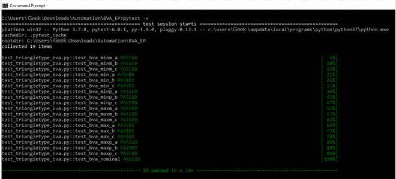
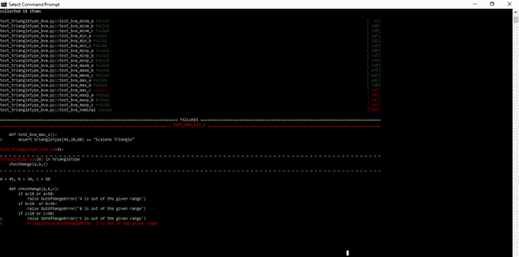

# 使用 Pytest

执行 BVA 测试

> 原文:[https://www . geeksforgeeks . org/performing-bva-testing-use-pytest/](https://www.geeksforgeeks.org/performing-bva-testing-using-pytest/)

**先决条件–**[BVA 测试](https://www.geeksforgeeks.org/boundary-value-analysis-triangle-problem/)

为了执行自动化的 BVA(边界值分析)测试，我们可以使用 Python 中的 Pytest 或 Unittest 库。这里，我们将使用 Pytest 库来执行为一个简单程序编写的测试用例。

我们将对一个程序进行 BVA 测试，该程序在给定边 A、B 和 C 的长度时确定三角形的类型(即等边三角形、等腰三角形、不等边三角形或如果三角形不可能形成)。此外，长度范围在 10 到 50 之间(包括 10 和 50)。

*triangletype.py* 文件中的代码:

## 蟒蛇 3

```
# import math
class Error(BaseException):
    pass

class OutOfRangeError(Error):
    def __init__(self, message):
        self.message = message

class TriangleError(Error):
    def __init__(self, message):
        self.message = message

def checkRange(a, b, c):
    if a<10 or a>50:
        raise OutOfRangeError('A is out of the given range')
    if b<10  or b>50:
        raise OutOfRangeError('B is out of the given range') 
    if c<10 or c>50:
        raise OutOfRangeError('C is out of the given range')

def checkTriangle(a, b, c):
    if a + b<= c or b + c<= a or c + a<= b:
        raise TriangleError('Triangle cannot be formed with these sides')

def triangleType(a, b, c):
    checkRange(a, b, c)
    checkTriangle(a, b, c)
    # s = (a + b+c)/2
    # ar = math.sqrt(s*(s-a)*(s-b)*(s-c))
    # inradius = ar / s
    if(a == b and b == c):   
        return "Equilateral Triangle"
    elif(a == b or a == c or b == c):
        return "Isosceles Triangle"
    else:
        return "Scalene Triangle"

def main():
    try:
        print("Enter the sides of the triangle in range [10-50]")

        a = int(input('Enter Side A:'))
        b = int(input('Enter Side B:'))
        c = int(input('Enter Side C:'))
    except ValueError as v:
        print(v + " Raised :Input is not an integer.")
        exit(0)
    try:
        checkRange(a, b, c)
    except OutOfRangeError as e:
        print("OutOfRangeError:" + e.message)

    try:
        checkTriangle(a, b, c)
    except TriangleError as e:
        print('TriangleError:' + e.message)

    typeOfTriangle = triangleType(a, b, c)

    print("The triangle is: " + typeOfTriangle)

if __name__ == "__main__":
    main()
```

现在，我们需要使用 Pytest 库为上述程序编写测试用例。每个测试用例都写在一个单独的函数中，我们使用*pytest . rails*函数来检查给定的输入是有效还是无效。在 BVA，使用了 3 种技术:边界值检查(BVC)、健壮性测试和最坏情况测试。在这里，我们将执行健壮性测试，其中对于输入变量的数量 *n* ，可以编写 *6n + 1* 测试用例。

**注意:**函数名和测试文件名应该总是以‘test’这个词开头。

```
In the above program,

n = 3
Since number of test cases = 6n + 1
Therefore, 
Number of test cases = 6 * 3 + 1 
             = 19 test cases  

```

因此，我们为上述程序编写了以下值的 19 个测试用例: *min，min-1，min + 1，max，max-1，max + 1* 和*标称值*

代码位于*test _ triangle type _ bv . py*文件中:

## 蟒蛇 3

```
import pytest
from triangletype import triangleType
from triangletype import OutOfRangeError

def test_bva_minm_a():
    with pytest.raises(OutOfRangeError):
        triangleType(9, 20, 15)
def test_bva_minm_b():
    with pytest.raises(OutOfRangeError):
        triangleType(20, 9, 15)
def test_bva_minm_c():
    with pytest.raises(OutOfRangeError):
        triangleType(20, 15, 9)

def test_bva_min_a():
    assert triangleType(10, 20, 15) == "Scalene Triangle" 
def test_bva_min_b():
    assert triangleType(20, 10, 15) == "Scalene Triangle" 
def test_bva_min_c():
    assert triangleType(15, 20, 10) == "Scalene Triangle" 

def test_bva_minp_a():
    assert triangleType(11, 20, 15) == "Scalene Triangle" 
def test_bva_minp_b():
    assert triangleType(20, 11, 15) == "Scalene Triangle"  
def test_bva_minp_c():
    assert triangleType(15, 20, 11) == "Scalene Triangle"  

def test_bva_maxm_a():
    assert triangleType(49, 30, 45) == "Scalene Triangle"
def test_bva_maxm_b():
    assert triangleType(30, 49, 45) == "Scalene Triangle"        
def test_bva_maxm_c():
    assert triangleType(45, 30, 49) == "Scalene Triangle"    

def test_bva_max_a():
    assert triangleType(50, 30, 45) == "Scalene Triangle"
def test_bva_max_b():
    assert triangleType(30, 50, 45) == "Scalene Triangle" 
def test_bva_max_c():
    assert triangleType(45, 30, 50) == "Scalene Triangle" 

def test_bva_maxp_a():
    with pytest.raises(OutOfRangeError):
        triangleType(51, 30, 45)
def test_bva_maxp_b():
    with pytest.raises(OutOfRangeError):
        triangleType(30, 51, 45)
def test_bva_maxp_c():
    with pytest.raises(OutOfRangeError):
        triangleType(30, 45, 51)

def test_bva_nominal():
    assert triangleType(12, 12, 12) == "Equilateral Triangle"
```

要执行上述测试用例，在一个文件夹中创建两个单独的文件 *triangletype.py* 和 *test_triangletype_bva.py* 。要执行写入以下命令:

```
pytest 

```

运筹学

```
pytest -v

```

*pytest -v* 显示详细输出。

输出如下所示:



正如我们在输出中看到的，所有 19 个测试用例都通过了。然而，如果我们以输入无效的方式编辑测试用例，那么测试用例将会失败。例如，如果我们在 *test_triangletype_bva.py* 文件的 *test_bva_max_c()* 测试用例中更改 *c* 变量的值，那么输出结果如下:

