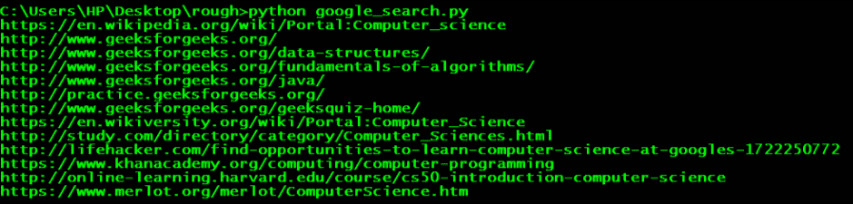

# 使用 Python 代码执行谷歌搜索

> 原文:[https://www . geeksforgeeks . org/performing-Google-search-use-python-code/](https://www.geeksforgeeks.org/performing-google-search-using-python-code/)

假设你正在做一个需要进行网页抓取的项目，但是你不知道哪些网站需要预先进行抓取，相反，你需要进行谷歌搜索，然后根据谷歌搜索结果对一些网站进行抓取。在这种情况下，你需要谷歌搜索不同的查询结果。

*   实现这一点的一种方法是使用请求和漂亮的汤，这已经在[中讨论过了，用漂亮的包](https://www.geeksforgeeks.org/implementing-web-scraping-python-beautiful-soup/)在 Python 中实现网页抓取。
*   谷歌包并没有在一个琐碎的任务上花费太多精力。直接找到所有谷歌搜索结果的链接几乎是一个**单行解决方案**。
*   使用 python 包**谷歌**我们可以从 python 脚本中获取谷歌搜索的结果。我们可以获得前 n 个搜索结果的链接。

**安装**
谷歌包对需要先安装的 beautifulsoup 有一个依赖。

```py
pip install beautifulsoup4
```

然后安装谷歌软件包

```py
pip install google
```

所需函数及其参数

*   **查询:**我们要搜索的查询字符串。
*   **TLD:** TLD 代表顶级域名，这意味着我们想在 google.com 或谷歌上搜索我们的结果。在或其他领域。
*   **郎:**郎代表语言。
*   **num:** 我们想要的结果数。
*   **开始:**要检索的第一个结果。
*   **停止:**最后检索的结果。使用“无”来永远保持搜索。
*   **暂停:**在 HTTP 请求之间等待。时间过短可能会导致谷歌屏蔽你的知识产权。保持重大失误会让你的程序变慢，但这是一个安全且更好的选择。
*   **返回:**生成找到的网址的生成器(迭代器)。如果停止参数为无，迭代器将永远循环。

**关于如何使用 python 脚本进行谷歌搜索的 Python 代码**

**示例 1: google_search.py**

## 计算机编程语言

```py
try:
    from googlesearch import search
except ImportError:
    print("No module named 'google' found")

# to search
query = "Geeksforgeeks"

for j in search(query, tld="co.in", num=10, stop=10, pause=2):
    print(j)
```

输出:


让我们手动执行谷歌搜索，并验证我们的结果


**示例 2: google_search.py**

## 计算机编程语言

```py
try:
    from googlesearch import search
except ImportError:
    print("No module named 'google' found")

# to search
query = "A computer science portal"

for j in search(query, tld="co.in", num=10, stop=10, pause=2):
    print(j)
```

输出:



让我们手动执行谷歌搜索，并验证我们的结果


**参考:** [谷歌 python 包](http://pythonhosted.org/google/)

本文由 [**普拉蒂克·查哈尔**](https://www.codechef.com/users/pk_tautolo) 供稿。如果你喜欢 GeeksforGeeks 并想投稿，你也可以使用[write.geeksforgeeks.org](http://write.geeksforgeeks.org)写一篇文章或者把你的文章邮寄到 review-team@geeksforgeeks.org。看到你的文章出现在极客博客主页上，帮助其他极客。
如果发现有不正确的地方，或者想分享更多关于上述话题的信息，请写评论。