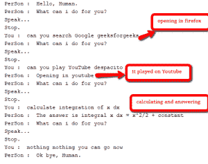
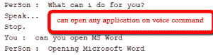

# Python 个人语音助手

> 原文:[https://www . geesforgeks . org/personal-voice-assistant-in-python/](https://www.geeksforgeeks.org/personal-voice-assistant-in-python/)

众所周知，Python 是一种适合脚本作者和开发人员的语言。让我们使用 Python 为个人语音助手编写一个脚本。助手的查询可以根据用户的需要进行操作。

实现的助手只需给出**语音命令**，就可以打开应用程序(如果系统中安装了)，搜索谷歌、维基百科和 YouTube 关于查询的内容，计算任何数学问题等。我们可以根据需要处理数据，也可以添加功能，这取决于我们如何编码。

我们正在使用**谷歌语音识别 API** 和谷歌文本转语音分别进行语音输入和输出。
同样，对于计算数学表达式**可以使用 WolframAlpha API** 。
**Playsound Package** 用于播放系统保存的 mp3 声音。

**Python 外包装要求:**

> ->**gTTS**–Google Text To Speech，用于将给定文本转换为语音
> ->**Speech _ recognition**–用于识别语音命令并转换为文本
> ->**selenium**–用于从浏览器进行基于 web 的工作
> ->**wolframalpha**–用于用户给出的计算
> ->**play sound**–用于播放保存的音频文件。
> ->**pyaudio**-python 中的语音引擎

好吧，让我们从代码开始。为了便于理解，我们将把每个函数划分为一个单独的代码。

这里是主要功能，有`get_audio()`和`assistant_speaks` 功能。`get_audio()`功能的创建是为了从使用麦克风的用户那里获取音频，短语限制设置为 5 秒(您可以更改它)。助手说话功能是根据处理后的数据提供输出。

```py
# importing speech recognition package from google api
import speech_recognition as sr 
import playsound # to play saved mp3 file
from gtts import gTTS # google text to speech
import os # to save/open files
import wolframalpha # to calculate strings into formula
from selenium import webdriver # to control browser operations

num = 1
def assistant_speaks(output):
    global num

    # num to rename every audio file 
    # with different name to remove ambiguity
    num += 1
    print("PerSon : ", output)

    toSpeak = gTTS(text = output, lang ='en', slow = False)
    # saving the audio file given by google text to speech
    file = str(num)+".mp3 
    toSpeak.save(file)

    # playsound package is used to play the same file.
    playsound.playsound(file, True) 
    os.remove(file)

def get_audio():

    rObject = sr.Recognizer()
    audio = ''

    with sr.Microphone() as source:
        print("Speak...")

        # recording the audio using speech recognition
        audio = rObject.listen(source, phrase_time_limit = 5) 
    print("Stop.") # limit 5 secs

    try:

        text = rObject.recognize_google(audio, language ='en-US')
        print("You : ", text)
        return text

    except:

        assistant_speaks("Could not understand your audio, PLease try again !")
        return 0

# Driver Code
if __name__ == "__main__":
    assistant_speaks("What's your name, Human?")
    name ='Human'
    name = get_audio()
    assistant_speaks("Hello, " + name + '.')

    while(1):

        assistant_speaks("What can i do for you?")
        text = get_audio().lower()

        if text == 0:
            continue

        if "exit" in str(text) or "bye" in str(text) or "sleep" in str(text):
            assistant_speaks("Ok bye, "+ name+'.')
            break

        # calling process text to process the query
        process_text(text)
```

因此，我们在这里有一个想法，我们如何给机器提供声音，并从用户那里获取输入。下一步也是最主要的一步是你想如何处理你的输入。这只是基本代码，还有很多其他算法(NLP)可以用来以适当的方式处理文本。我们让它静止了。

此外，`Wolframalpha api`已用于计算计算部分。

```py
def process_text(input):
    try:
        if 'search' in input or 'play' in input:
            # a basic web crawler using selenium
            search_web(input)
            return

        elif "who are you" in input or "define yourself" in input:
            speak = '''Hello, I am Person. Your personal Assistant.
            I am here to make your life easier. You can command me to perform
            various tasks such as calculating sums or opening applications etcetra'''
            assistant_speaks(speak)
            return

        elif "who made you" in input or "created you" in input:
            speak = "I have been created by Sheetansh Kumar."
            assistant_speaks(speak)
            return

        elif "geeksforgeeks" in input:# just
            speak = """Geeks for Geeks is the Best Online Coding Platform for learning."""
            assistant_speaks(speak)
            return

        elif "calculate" in input.lower():

            # write your wolframalpha app_id here
            app_id = "WOLFRAMALPHA_APP_ID" 
            client = wolframalpha.Client(app_id)

            indx = input.lower().split().index('calculate')
            query = input.split()[indx + 1:]
            res = client.query(' '.join(query))
            answer = next(res.results).text
            assistant_speaks("The answer is " + answer)
            return

        elif 'open' in input:

            # another function to open 
            # different application availaible
            open_application(input.lower()) 
            return

        else:

            assistant_speaks("I can search the web for you, Do you want to continue?")
            ans = get_audio()
            if 'yes' in str(ans) or 'yeah' in str(ans):
                search_web(input)
            else:
                return
    except :

        assistant_speaks("I don't understand, I can search the web for you, Do you want to continue?")
        ans = get_audio()
        if 'yes' in str(ans) or 'yeah' in str(ans):
            search_web(input)
```

现在我们已经处理了输入，是时候采取行动了！

包括两个功能，即`search_web` 和`open_application`。

**search_web** 只是一个用硒包处理的网络爬虫。它可以搜索**谷歌**、**维基百科**，还可以打开 **YouTube** 。你只需要说包括名字，它就会在火狐浏览器中打开它。对于其他浏览器，您需要在 selenium 中安装适当的浏览器包。这里我们使用火狐的网络驱动程序。

**open_application** 只是一个使用 *os package* 打开系统中存在的应用程序的功能。

```py
def search_web(input):

    driver = webdriver.Firefox()
    driver.implicitly_wait(1)
    driver.maximize_window()

    if 'youtube' in input.lower():

        assistant_speaks("Opening in youtube")
        indx = input.lower().split().index('youtube')
        query = input.split()[indx + 1:]
        driver.get("http://www.youtube.com/results?search_query =" + '+'.join(query))
        return

    elif 'wikipedia' in input.lower():

        assistant_speaks("Opening Wikipedia")
        indx = input.lower().split().index('wikipedia')
        query = input.split()[indx + 1:]
        driver.get("https://en.wikipedia.org/wiki/" + '_'.join(query))
        return

    else:

        if 'google' in input:

            indx = input.lower().split().index('google')
            query = input.split()[indx + 1:]
            driver.get("https://www.google.com/search?q =" + '+'.join(query))

        elif 'search' in input:

            indx = input.lower().split().index('google')
            query = input.split()[indx + 1:]
            driver.get("https://www.google.com/search?q =" + '+'.join(query))

        else:

            driver.get("https://www.google.com/search?q =" + '+'.join(input.split()))

        return

# function used to open application
# present inside the system.
def open_application(input):

    if "chrome" in input:
        assistant_speaks("Google Chrome")
        os.startfile('C:\Program Files (x86)\Google\Chrome\Application\chrome.exe')
        return

    elif "firefox" in input or "mozilla" in input:
        assistant_speaks("Opening Mozilla Firefox")
        os.startfile('C:\Program Files\Mozilla Firefox\\firefox.exe')
        return

    elif "word" in input:
        assistant_speaks("Opening Microsoft Word")
        os.startfile('C:\ProgramData\Microsoft\Windows\Start Menu\Programs\Microsoft Office 2013\\Word 2013.lnk')
        return

    elif "excel" in input:
        assistant_speaks("Opening Microsoft Excel")
        os.startfile('C:\ProgramData\Microsoft\Windows\Start Menu\Programs\Microsoft Office 2013\\Excel 2013.lnk')
        return

    else:

        assistant_speaks("Application not available")
        return
```

下面是一些例子和输出，可以帮助你理解上面的处理是如何工作的。

```py
1\. Say "Search google Geeks for Geeks"
2\. Say "Play Youtube your favourite song"
3\. Say "Wikipedia Dhoni"
4\. Say "Open Microsoft Word"
5\. Say "Calculate anything you want"
```

在上述所有情况下，它都会按吩咐去做。如果助手不能理解被告知的内容，它会要求你用谷歌搜索它。因为助理做不到的事情就由这个助理来处理。

下面是一些人类和助手对话的截图。




嗯，就是这样。上面的功能可以用很多方式编码，这是一个基本的实现。确保您拥有上述所有软件包的最新版本，以便顺利工作。要运行上述代码，请将所有函数合并到同一个文件中。

请在下面找到一个短视频来编译上述代码。