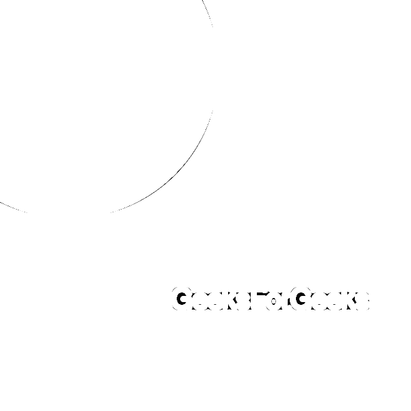

# Pmagick 木炭()方法–Python

> 原文:[https://www . geesforgeks . org/pgmagick-carbon-method-python/](https://www.geeksforgeeks.org/pgmagick-charcoal-method-python/)

**木炭()**函数是 Pgmagick 库中的一个内置函数，用于向图像添加木炭滤镜。该函数在成功时返回真值。

> **语法:**
> 
> ```py
> charcoal(factor)
> ```
> 
> **参数:**该功能接受如上所述的单个参数，如下所述:
> 
> *   **因子:**该参数存储要应用于图像的木炭因子的值。
> 
> **返回值:**该函数返回添加了图像的 Pgmagick 对象。

**输入图像:**


**例 1:**

```py
from pgmagick import Image, DrawableCircle, DrawableText
from pgmagick import Geometry, Color

# draw the image of dimension 600 * 600
img = Image('input.png')

# invoke charcoal function with factor 8
img.charcoal(8)

# invoke write function along with filename
img.write('2_a.png')
```

**输出:**

**例 2:**

```py
# import library
from pgmagick import Image, DrawableCircle, DrawableText
from pgmagick import Geometry, Color

# Draw image of dimension 600 * 600 having background green
im = Image(Geometry(600, 600), Color("# 32CD32"))

# invoke DrawableCircle() function
circle = DrawableCircle(100, 100, 300, 20)

# invoke draw() function
im.draw(circle)

# set font size to 40px
im.fontPointsize(40)

# invoke DrawableText() function
text = DrawableText(250, 450, "GeeksForGeeks")

# invoke draw() function
im.draw(text)

# invoke charcoal function with factor 5
im.charcoal(5)

# invoke write function along with filename
im.write('1_b.png')
```

**输出:**
