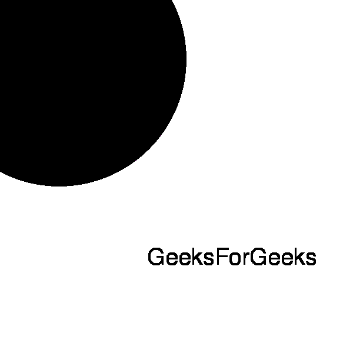

# Pmagick 均衡器()方法–Python

> 原文:[https://www . geesforgeks . org/pgmagick-equal-method-python/](https://www.geeksforgeeks.org/pgmagick-equalize-method-python/)

**均衡器()**功能是 Pgmagick 库中的一个内置功能，用于对图像执行直方图均衡化。

> **语法:**
> 
> ```py
> equalize()
> ```
> 
> **参数:**此功能不接受任何参数。
> **返回值:**该函数返回添加了图像的 Pgmagick 对象。

**输入图像:**


**例 1:**

## 蟒蛇 3

```py
# import library
from pgmagick import Image, DrawableCircle, DrawableText
from pgmagick import  Geometry, Color

# draw the image of dimension 600 * 600
img = Image('input.png')

# invoke equalize() function
img.equalize()

# invoke write function along with filename
img.write('2_a.png')
```

**输出:**


**例 2:**

## 蟒蛇 3

```py
# import library
from pgmagick import Image, DrawableCircle, DrawableText
from pgmagick import  Geometry, Color

# Draw image of dimension 600 * 600 having background green
im = Image(Geometry(600, 600), Color("# 32CD32"))

# invoke DrawableCircle() function
circle = DrawableCircle(100, 100, 300, 20)

# invoke draw() function
im.draw(circle)

# set font size to 40px
im.fontPointsize(40)

# invoke DrawableText() function
text = DrawableText(250, 450, "GeeksForGeeks")

# invoke draw() function
im.draw(text)

# invoke equalize() function
im.equalize()

# invoke write function along with filename
im.write('1_b.png')
```

**输出:**

