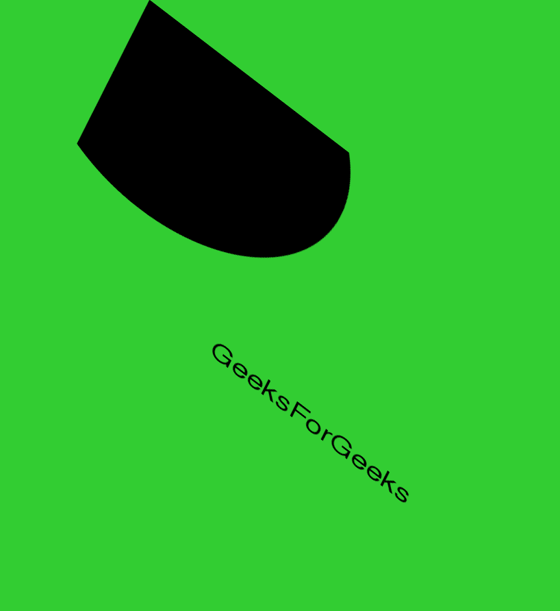

# Pmagick 剪切()方法–Python

> 原文:[https://www.geeksforgeeks.org/pgmagick-shear-method-python/](https://www.geeksforgeeks.org/pgmagick-shear-method-python/)

**shear()** 函数是 Pgmagick 库中的一个内置函数，用于沿着 X 轴或 Y 轴滑动图像的一条边以创建平行四边形。X 方向的剪切沿着 X 轴滑动一条边，而 Y 方向的剪切沿着 Y 轴滑动一条边。剪切角度用于设置图像的剪切。

> **语法:**
> 
> ```py
> shear(x, y)
> ```
> 
> **参数:**该函数接受两个参数，如上所述，如下所述:
> 
> *   **x:** 此参数用于设置图像的 x 剪切度。
> *   **y:** 此参数用于设置图像的 y 剪切度。
> 
> **返回值:**该函数返回添加了图像的 Pgmagick 对象。

**输入图像:**


```py
from pgmagick import Image, DrawableCircle, DrawableText
from pgmagick import Geometry, Color

# draw the image of dimension 600 * 600
img = Image('input.png')

# invoke shear function with width as 30, height as 40 and Percentage as True
img.shear(30, 40)

# invoke write function along with filename
img.write('2_a.png')
```

**输出:**

**例 2:**

```py
# import library
from pgmagick import Image, DrawableCircle, DrawableText
from pgmagick import Geometry, Color

# Draw image of dimension 600 * 600 having background green
im = Image(Geometry(600, 600), Color("# 32CD32"))

# invoke DrawableCircle() function
circle = DrawableCircle(100, 100, 300, 20)

# invoke draw() function
im.draw(circle)

# set font size to 40px
im.fontPointsize(40)

# invoke DrawableText() function
text = DrawableText(250, 450, "GeeksForGeeks")

# invoke draw() function
im.draw(text)

# invoke shave function with width as 40 and height as 50
im.shear(40, 50)

# invoke write function along with filename
im.write('1_b.png')
```

**输出:**
