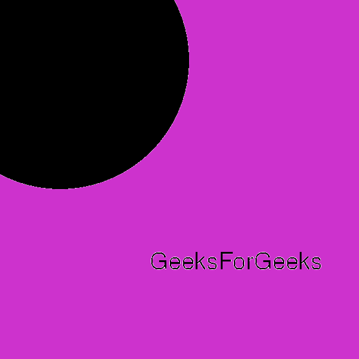

# Pmagick solarize()方法–Python

> 原文:[https://www . geesforgeks . org/pgmagick-solarize-method-python/](https://www.geeksforgeeks.org/pgmagick-solarize-method-python/)

**solarize()** 函数是 Pgmagick 库中的一个内置函数，用于否定阈值以上的所有像素。该函数在成功时返回真值。

> **语法:**
> 
> ```
> solarize(thresholdLevel)
> ```
> 
> **参数:**该函数接受单个参数阈值水平，用于指定 0 到 100 之间的阈值水平。
> **返回值:**该函数返回添加了图像的 Pgmagick 对象。

**输入图像:**


**例 1:**

## 蟒蛇 3

```
from pgmagick import Image, DrawableCircle, DrawableText
from pgmagick import Geometry, Color

# draw the image of dimension 600 * 600
img = Image('input.png')

# invoke solarize function with factor as 60
img.solarize(60)

# invoke write function along with filename
img.write('2_a.png')
```

**输出:**


**例 2:**

## 蟒蛇 3

```
# import library
from pgmagick import Image, DrawableCircle, DrawableText
from pgmagick import Geometry, Color

# Draw image of dimension 600 * 600 having background green
im = Image(Geometry(600, 600), Color("# 32CD32"))

# invoke DrawableCircle() function
circle = DrawableCircle(100, 100, 300, 20)

# invoke draw() function
im.draw(circle)

# set font size to 40px
im.fontPointsize(40)

# invoke DrawableText() function
text = DrawableText(250, 450, "GeeksForGeeks")

# invoke draw() function
im.draw(text)

# invoke size function with factor as 10
im.solarize(10)

# invoke write function along with filename
im.write('1_b.png')
```

**输出:**

