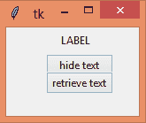
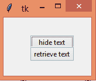
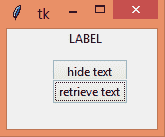

# Python 中使用 Tkinter 的 Place _ 忘形()方法

> 原文:[https://www . geesforgeks . org/place _ 忘年交-method-use-tkinter-in-python/](https://www.geeksforgeeks.org/place_forget-method-using-tkinter-in-python/)

要在 [**tkinter**](https://www.geeksforgeeks.org/python-gui-tkinter/) 中从父小部件或屏幕隐藏或忘记小部件，基于位置几何管理在该小部件上使用**place _ 忘形(**)方法。

> **语法**:widget . place _ 忘本()
> 
> **参数:**无
> T3】返回:无

下面是实现:

## 蟒蛇 3

```
# Imports everything from tkinter
# and ttk module
from tkinter import *
from tkinter.ttk import *

# toplevel window
root = Tk()

# setting window size
root.geometry("150x100")

# label widget
label = Label(root, text="LABEL")

# place in the window
label.place(relx=0.4, y=5)

# button widgets
# In command attribute of Button,
# place_forget() method is passed
# in the lambda function to temporarily
# hide the label
b1 = Button(root, text = "hide text",
            command = lambda: label.place_forget())

b1.place(relx = 0.3, y = 30)

# the label is placed again
b2 = Button(root, text = "retrieve text",
            command = lambda: label.place(
              relx = 0.4))

b2.place(relx = 0.3, y = 50)

# Start the GUI
root.mainloop()
```

**输出:**



**躲藏后:**



**取回后:**



**注意:**还有其他方法**pack _ 忘我()**和**grid _ 忘我()**的工作方式与[忘我 _pack()和忘我 _grid()相同。](https://www.geeksforgeeks.org/python-forget_pack-and-forget_grid-method-in-tkinter/)