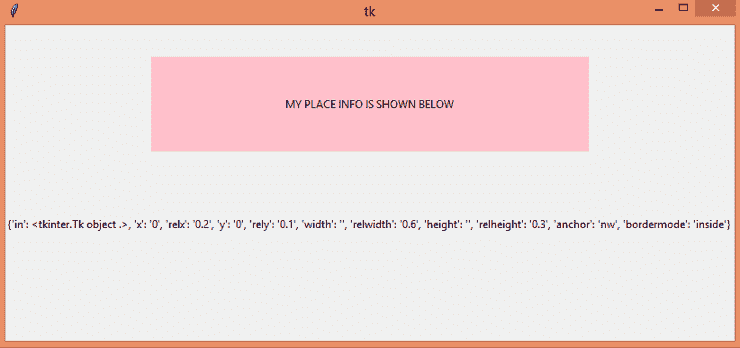
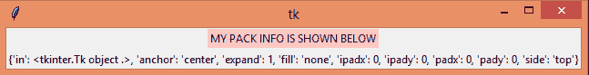
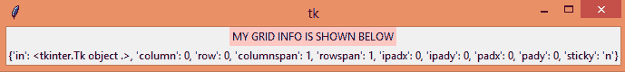

# 将 _info()、pack_info()和 grid_info()方法放入 Tinter

> 原文:[https://www . geesforgeks . org/place _ info-pack _ info-and-grid _ info-methods-in-tkinter/](https://www.geeksforgeeks.org/place_info-pack_info-and-grid_info-methods-in-tkinter/)

要获取小部件几何管理选项的所有信息 **place_info()** 、 **pack_info()** 和 **grid_info()** 相应地使用 [**tkinter**](https://www.geeksforgeeks.org/python-introduction-to-pyqt5/) 中的方法。

**place_info() method**

这种方法用于获取关于小部件几何管理的信息，如窗口的位置和大小，无论是绝对的，还是相对于另一个窗口的。

> **语法:** widget.place_info()
> 
> **参数:**无
> 
> **返回:**返回当前小部件
> 的地点选项信息字典

**代码 1:**

## 蟒蛇 3

```py
# Importing all functions/classes
# from tkinter module 
from tkinter import *

# toplevel window 
root = Tk() 

# setting window size
root.geometry("810x350")

# create a Label widget whose
# place info is to be obtained
rect = Label(root, 
             text = "MY PLACE INFO IS SHOWN BELOW", 
             bg = "pink")

# place a widget in a specific 
# position in the parent widget.
rect.place(rely = 0.1, relx = 0.2,
           relwidth = 0.6, 
           relheight = 0.3)

# widget displaying place info of rect
label = Label(root)

# place a widget in a specific
# position in the parent widget.
label.place(rely = 0.6)

# get a info of the place
label['text'] = rect.place_info()

# start the GUI
root.mainloop() 
```

**输出:**



**pack_info() method**

这种方法用于获取关于小部件几何管理的信息，如展开、边、填充、填充值等。

> **语法:** widget.pack_info()
> 
> **参数:**无
> 
> **返回:**返回当前小部件
> 的包装选项信息字典

**代码 2:**

## 蟒蛇 3

```py
# Importing all functions/classes
# from tkinter module 
from tkinter import *

# toplevel window 
root = Tk() 

# create a Label widget whose 
# pack info is to be obtained
rect = Label(root, 
             text = "MY PACK INFO IS SHOWN BELOW",
             bg = "pink")

# placing them in a specific position
# in the parent widget.
rect.pack(expand = True)

# create a Label
label = Label(root)

label.pack()

label['text'] = rect.pack_info()

# start the GUI 
root.mainloop() 
```

**输出:**



**grid_info() method**

该方法用于获取关于小部件的几何管理的信息，如行号、列号、rowsapn、列跨度、填充值等。

> **语法:** widget.grid_info()
> 
> **参数:**无
> 
> **返回:**返回当前小部件
> 网格选项信息的字典

**代码 3:**

## 蟒蛇 3

```py
# Importing all functions/classes 
# from tkinter module 
from tkinter import *

# toplevel window 
root = Tk() 

# widget whose grid info is to be obtained
rect = Label(root, 
             text = "MY GRID INFO IS SHOWN BELOW", 
             bg = "pink")

# grid method is used for placing
# the widgets at respective positions
# in table like structure .
rect.grid(stick = N)

# create a label
label = Label(root)

label.grid()

label['text'] = rect.grid_info()

# start the GUI
root.mainloop() 
```

**输出:**

