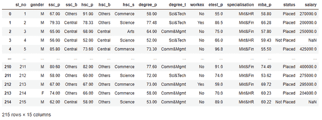
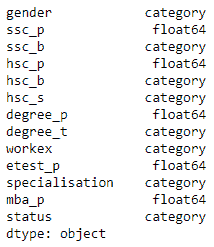
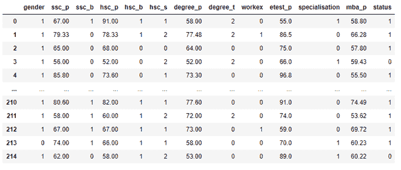
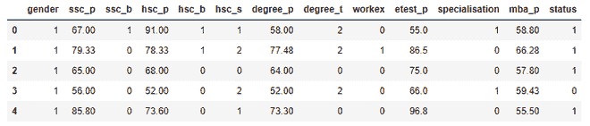
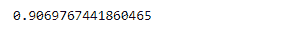
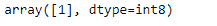
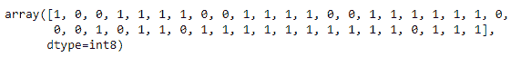
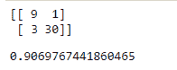

# 使用逻辑回归的位置预测

> 原文:[https://www . geeksforgeeks . org/placement-prediction-use-logistic-revolution/](https://www.geeksforgeeks.org/placement-prediction-using-logistic-regression/)

**先决条件:** [使用 Python 理解逻辑回归](https://www.geeksforgeeks.org/understanding-logistic-regression/)、[逻辑回归](https://www.geeksforgeeks.org/ml-logistic-regression-using-python/)

在本文中，我们将讨论如何使用逻辑回归算法基于各种学生属性预测学生的安置状态。

实习对学生和教育机构来说非常重要。它有助于学生为未来的职业生涯打下坚实的基础，良好的就业记录也使学院/大学在教育市场上具有竞争优势。

这项研究集中在一个系统上，该系统根据学生的资格、历史数据和经验来预测学生是否会被录取。这个预测器使用机器学习算法给出结果。

使用的算法是逻辑回归。逻辑回归基本上是一种监督分类算法。在分类问题中，目标变量(或输出)y 只能取给定特征集(或输入)x 的离散值。说到数据集，它包含学生的中学百分比、高中百分比、学位百分比、学位和工作经验。在预测结果之后，还基于数据集计算其效率。这里使用的[数据集](https://onedrive.live.com/view.aspx?resid=FC7383F89FE9A4AF!627&ithint=file%2cxlsx&authkey=!APYhgQTGZ48Nb2k)是在*的。csv* 格式。

### **下面是分步方法:**

**步骤 1:** 导入所需模块。

## 计算机编程语言

```
# import modules
import pandas as pd
import numpy as np
import matplotlib.pyplot as plt
```

**步骤 2:** 现在读取我们将要用于分析的数据集，然后检查数据集。

## 计算机编程语言

```
# reading the file
dataset = pd.read_csv('Placement_Data_Full_Class.csv')
dataset
```

**输出:**



**步骤 3:** 现在我们将删除不需要的列。

## 计算机编程语言

```
# dropping the serial no and salary col
dataset = dataset.drop('sl_no', axis=1)
dataset = dataset.drop('salary', axis=1)
```

**步骤 4:** 现在，在继续之前，我们需要对数据进行预处理和转换。为此，我们将在一些列上使用 *astype()* 方法，并将数据类型更改为*类别*。

## 计算机编程语言

```
# catgorising col for further labelling
dataset["gender"] = dataset["gender"].astype('category')
dataset["ssc_b"] = dataset["ssc_b"].astype('category')
dataset["hsc_b"] = dataset["hsc_b"].astype('category')
dataset["degree_t"] = dataset["degree_t"].astype('category')
dataset["workex"] = dataset["workex"].astype('category')
dataset["specialisation"] = dataset["specialisation"].astype('category')
dataset["status"] = dataset["status"].astype('category')
dataset["hsc_s"] = dataset["hsc_s"].astype('category')
dataset.dtypes
```

**输出:**



**第 5 步:**现在我们将在其中一些列上应用代码，将它们的文本值转换为数值。

## 计算机编程语言

```
# labelling the columns
dataset["gender"] = dataset["gender"].cat.codes
dataset["ssc_b"] = dataset["ssc_b"].cat.codes
dataset["hsc_b"] = dataset["hsc_b"].cat.codes
dataset["degree_t"] = dataset["degree_t"].cat.codes
dataset["workex"] = dataset["workex"].cat.codes
dataset["specialisation"] = dataset["specialisation"].cat.codes
dataset["status"] = dataset["status"].cat.codes
dataset["hsc_s"] = dataset["hsc_s"].cat.codes

# display dataset
dataset
```

**输出:**



**步骤 6:** 现在使用 *iloc()* 函数将数据集分割为要素和值:

## 计算机编程语言

```
# selecting the features and labels
X = dataset.iloc[:, :-1].values
Y = dataset.iloc[:, -1].values

# display dependent variables
Y
```

**输出:**

**第七步:**现在我们将数据集拆分为训练和测试数据，这些数据将用于以后检查效率。

## 计算机编程语言

```
# dividing the data into train and test
from sklearn.model_selection import train_test_split
X_train, X_test, Y_train, Y_test = train_test_split(X, Y,
                                                    test_size=0.2)

# display dataset
dataset.head()
```

**输出:**



**第 8 步:**现在我们需要训练我们的模型，为此我们需要导入一个文件，然后我们将使用 *sklearn* 模块创建一个分类器。然后我们会检查模型的准确性。

## 计算机编程语言

```
# creating a classifier using sklearn
from sklearn.linear_model import LogisticRegression

clf = LogisticRegression(random_state=0, solver='lbfgs',
                         max_iter=1000).fit(X_train,
                                            Y_train)
# printing the acc
clf.score(X_test, Y_test)
```

**输出:**



**第 9 步:**一旦我们训练好模型，我们将检查它给出一些随机值:

## 计算机编程语言

```
# predicting for random value
clf.predict([[0, 87, 0, 95, 0, 2, 78, 2, 0, 0, 1, 0]])
```

**输出:**



**步骤 10:** 为了更细致地了解我们模型的性能，我们需要制作一个混淆矩阵。混淆矩阵是一个有两行两列的表，它报告假阳性、假阴性、真阳性和真阴性的数量。

为了得到混淆矩阵，它需要两个参数:你的测试集的实际标签 *y_test* 和预测标签。分类器的预测标签存储在 *y_pred* 中，如下所示:

## 计算机编程语言

```
# creating a Y_pred for test data
Y_pred = clf.predict(X_test)

# display predicted values
Y_pred
```

**输出:**



**第 11 步:**最后，我们有 *y_pred，*所以我们可以生成混淆矩阵:

## 计算机编程语言

```
# evaluation of the classifier
from sklearn.metrics import confusion_matrix, accuracy_score

# display confusion matrix
print(confusion_matrix(Y_test, Y_pred))

# display accuracy
print(accuracy_score(Y_test, Y_pred))
```

**输出:**

