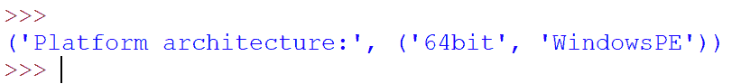
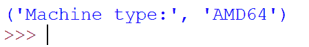
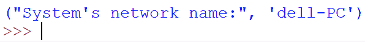
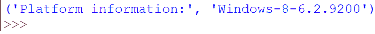
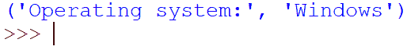
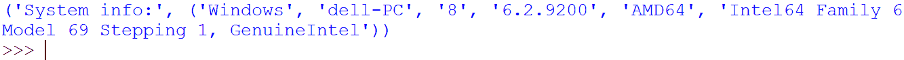
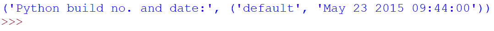
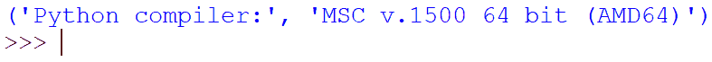
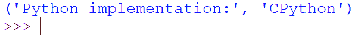
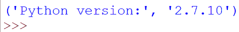

# Python 中的平台模块

> 原文:[https://www.geeksforgeeks.org/platform-module-in-python/](https://www.geeksforgeeks.org/platform-module-in-python/)

[Python](https://www.geeksforgeeks.org/python-programming-language/) 定义了一个提供系统信息的内置模块**平台**。

**平台模块**用于检索尽可能多的关于程序当前正在其上执行的平台的信息。现在所说的平台信息，是指关于设备的信息，包括操作系统、节点、操作系统版本、Python 版本等。当您想要检查您的程序是否与安装在特定系统上的 python 版本兼容，或者硬件规格是否满足您的程序要求时，该模块起着至关重要的作用。
这个模块已经存在于 python 库中，不需要使用 **pip** 进行任何安装。

可以使用以下语法导入它:

```
import platform
```

**示例 1:显示平台处理器**

```
# Python program to display platform processor

# import module
import platform

# displaying platform processor
print('Platform processor:', platform.processor())
```

**输出:**


## 平台功能

#### 平台.架构()

该函数返回一个元组，该元组存储关于**位架构**(平台处理器中的位数)和**链接格式**(定义名称在整个程序或单个翻译单元中如何引用或不能引用同一实体)的信息。

**示例 2:展示平台架构**

```
# Python program to display platform architecture

# import module
import platform

# displaying platform architecture
print('Platform architecture:', platform.architecture())
```

**输出:**



#### platform.machine()

这个函数返回一个显示机器类型的字符串，这里的机器类型是指告诉内核中可用寄存器的宽度或大小的信息。

**例 3:显示机器类型**

```
# Python program to display machine type

# import module
import platform

# displaying machine type
print('Machine type:', platform.machine())
```

**输出:**



#### platform.node()

该函数返回一个字符串，该字符串显示关于节点的信息，基本上是系统的网络名称。

**示例 4:显示系统网络名称**

```
# Python program to display the 
# system's network name

# import module
import platform

# displaying system network name
print('System's network name:', platform.node())
```

**输出:**



#### 平台. platform()

该函数返回一个字符串，该字符串包含尽可能多的系统有用信息。不同系统的输出可能不同。

**例 5:显示平台信息**

```
# Python program to display platform information

# import module
import platform

# displaying platform information
print('Platform information:', platform.platform())
```

**输出:**



#### 平台.处理器()

这个函数返回一个显示平台处理器信息的字符串，基本上是系统处理器的真实名称

```
Note: Many platforms do not provide this information. eg-NetBSD
```

**示例 6:显示平台处理器**

```
# Python program to display platform 
# processor name

# import module
import platform

# displaying platform processor name
print('Platform processor:', platform.platform())
```

**输出:**


#### platform.system()

此函数返回一个字符串，该字符串显示当前运行程序的设备上的操作系统的名称。

**示例 7:显示操作系统名称**

```
# Python program to display OS name

# import module
import platform

# displaying OS name
print('Operating system:', platform.system())
```

**输出:**



#### platform.uname()

这个函数返回一个存储系统信息的元组。基本上，这个函数可以用来代替单独的函数来检索关于系统、节点、版本、版本、机器、版本和处理器的信息。因此，一个单一的功能服务于多种目的。

**示例 8:显示系统信息**

```
# Python program to display System info

# import module
import platform

# displaying system info
print('System info:', platform.system())
```

**输出:**



**注意:**平台模块不仅检索系统信息，还可以用来检索系统上运行的 Python 软件的相关信息。

#### platform.python_build()

该函数返回一个元组，该元组存储关于 python 构建日期和构建号的信息。该信息作为字符串数据类型存储在元组中。

**示例 9:显示 python 构建日期和编号**

```
# Python program to display python
# build date and no.

# import module
import platform

# displaying python build date and no.
print('Python build no. and date:', platform.python_build())
```

**输出:**



#### platform.python_compiler()

该函数返回一个字符串，显示用于编译 Python 程序的编译器。

**示例 10:显示 python 编译器信息**

```
# Python program to display python compiler info

# import module
import platform

# displaying python compiler
print('Python compiler:', platform.python_compiler())
```

**输出:**



#### platform.python_branch()

这个函数返回一个显示 python SCM 分支信息的字符串， **SCM** 这里代表**源代码管理器**，是程序员用来管理源代码的工具。配置管理用于跟踪软件的修订。

**示例 11:显示 python 配置管理信息**

```
# Python program to display python SCM info

# import module
import platform

# displaying python SCM info
print('Python SCM:', platform.python_compiler())
```

#### platform.python _ implementation()

这个函数返回一个显示 python 实现信息的字符串。这个函数可能的输出有 CPython、JPython、PyPy、IronPython。

要了解这些实现的更多信息，请访问:[Python 的各种实现](https://www.geeksforgeeks.org/difference-various-implementations-python/)

**示例 12:显示 python 实现**

```
# Python program to display python implementation

# import module
import platform

# displaying python implementation
print('Python implementation:', platform.python_implementation())
```

**输出:**



#### platform.python_version()

该函数返回一个字符串，显示系统上当前运行的 Python 版本。python 版本以以下方式返回:

```
'major.minor.patchlevel'
```

**示例 13:显示 python 版本**

```
# Python program to display python version

# import module
import platform

# displaying python version
print('Python version:', platform.python_version())
```

**输出:**



**注意:**由于 python 是一种独立于平台的语言，因此它的模块也具有特定于操作系统的功能。其中一些来自平台模块，如下所述:

## 对于苹果操作系统

#### platform.mac_ver()

该函数返回一个元组，其中包含关于 Mac OS 的信息，如版本、版本、机器。输出方式如下:

```
(release, versioninfo, machine)
```

在这个**版本中**本身是一个以如下方式存储信息的元组:

```
(version, dev_stage, non_release_version)
```

## 对于 Unix 操作系统

#### platform.libc_ver()

这个函数返回一个存储诸如库和 Unix 操作系统版本等信息的元组。输出方式如下:

```
(lib, version)
```

## 对于视窗操作系统

#### platform.win32_ver()

此函数返回一个元组，其中包含有关 Windows 操作系统的附加信息，如操作系统版本、版本号、服务包、操作系统类型(单/多处理器)。输出格式如下:

```
(release, version, csd, ptype)
```

其中 **csd** 为 service pack， **ptype** 为 OS 类型。