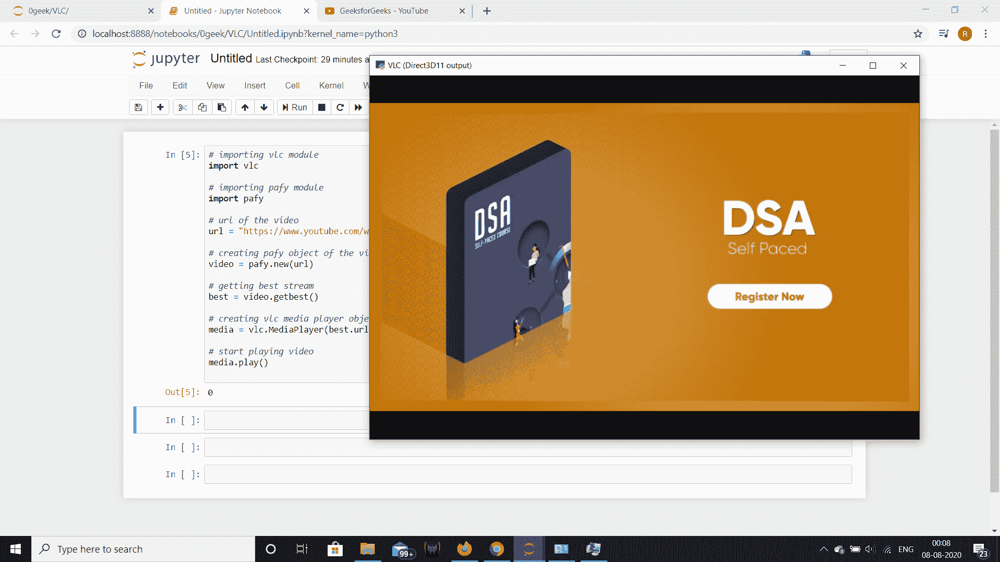
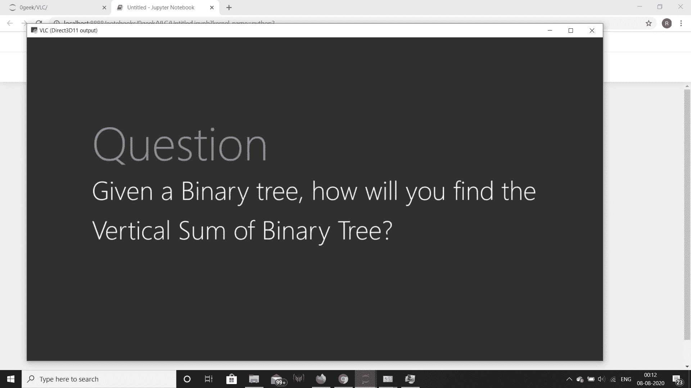

# 使用 Python 播放 Youtube 视频

> 原文:[https://www . geesforgeks . org/playing-YouTube-video-using-python/](https://www.geeksforgeeks.org/playing-youtube-video-using-python/)

在本文中，我们将看到如何用 python 播放 youtube 视频。为了用 python 播放 youtube 视频，我们需要 **pafy** 和 **vlc** 模块。

**Pafy** 是一个下载 YouTube 内容和检索元数据的 Python 库。下面是安装 pafy 的命令

```py
pip install pafy

```

**VLC :** 是一个使用 VLC 媒体播放器功能的 python 库。为了在 python 中使用 vlc 模块，用户系统也应该有一个兼容版本的 VLC 播放器。下面是安装 vlc 模块的命令

```py
pip install python-vlc

```

> **实施步骤:**
> 1。导入 pafy 和 vlc 模块
> 2。创建一个包含视频网址的变量
> 3。使用链接
> 4 创建一个 pafy 对象。获得给定 youtube 链接的最佳质量流
> 5。通过传递最佳流
> 6 创建一个 vlc MediaPlayer 对象。播放视频

下面是实现

```py
# importing vlc module
import vlc

# importing pafy module
import pafy

# url of the video
url = "https://www.youtube.com/watch?v = vG2PNdI8axo"

# creating pafy object of the video
video = pafy.new(url)

# getting best stream
best = video.getbest()

# creating vlc media player object
media = vlc.MediaPlayer(best.url)

# start playing video
media.play()
```

**输出:**


另一个例子

```py
# importing vlc module
import vlc

# importing pafy module
import pafy

# url of the video
url = "https://www.youtube.com/watch?v=il_t1WVLNxk&list=PLqM7alHXFySGqCvcwfqqMrteqWukz9ZoE"

# creating pafy object of the video
video = pafy.new(url)

# getting stream at index 0
best = video.streams[0]

# creating vlc media player object
media = vlc.MediaPlayer(best.url)

# start playing video
media.play()
```

**输出:**
