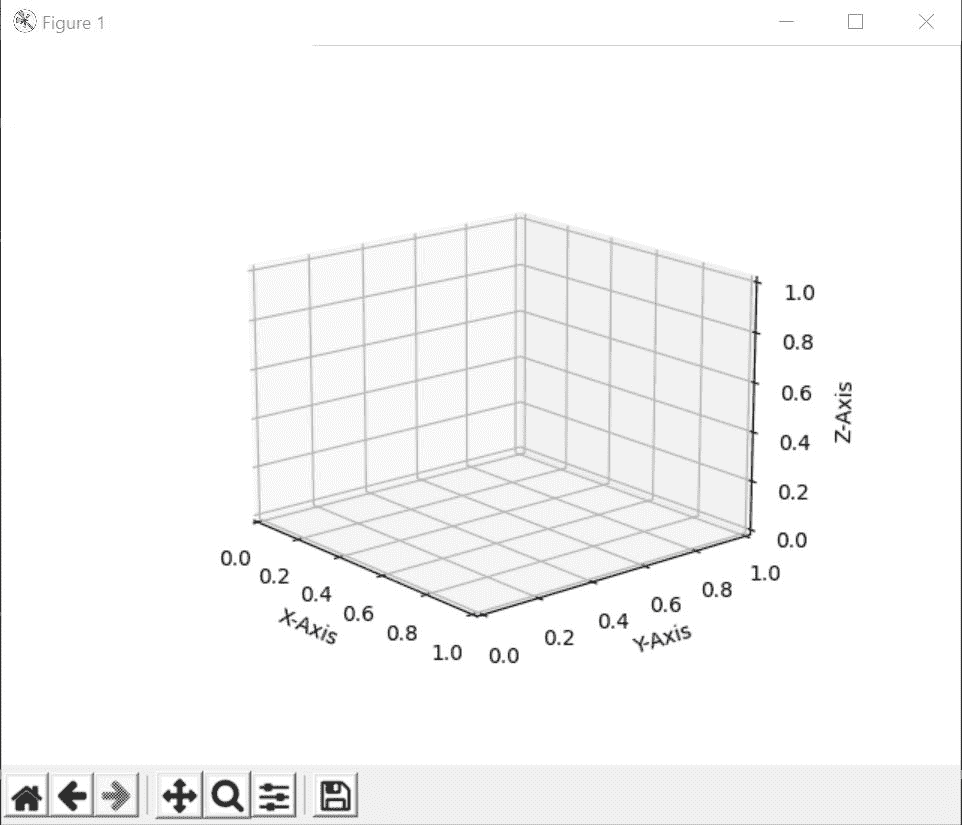
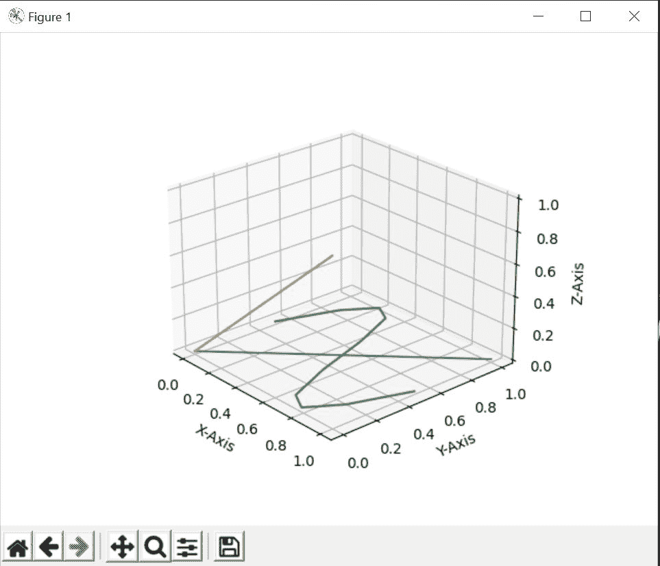
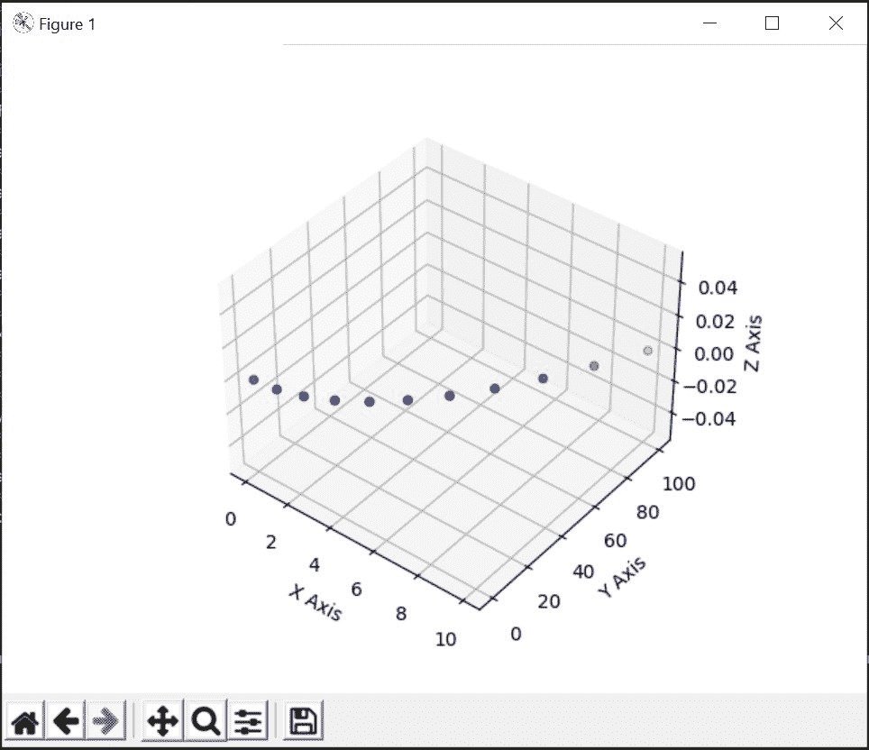

# 用 Python 在 3D 绘图上绘制 2D 数据

> 原文:[https://www . geesforgeks . org/plot-2d-data-on-3d-plot-in-python/](https://www.geeksforgeeks.org/plot-2d-data-on-3d-plot-in-python/)

在本文中，我们将学习如何用 Python 在 3D 绘图上绘制 2D 数据。为了学习这个概念，我们将演示两种方法。第一种方法将使用 **Matplotlib.pyplot.gca()** 函数，该函数是 Matplotlib 库的 pyplot 模块。但是在此之前，我们需要配置我们将在哪里创建我们的项目并学习这个概念。我们可以使用**谷歌 colab** 或者我们也可以使用**崇高文本****木星笔记本**或各种其他代码编辑器在我们的本地机器上完成。

以下是描述如何用 Python 在三维绘图上绘制 2D 数据的各种示例:

**例 1:**

使用 Matplotlib.pyplot.gca()函数。matplotlib.pyplot.gca()函数帮助我们获取当前轴，或者在必要时创建一个轴。在 gca()函数中，我们将投影定义为三维投影。

## 蟒蛇 3

```
# importing numpy package
import numpy as np
# importing matplotlib package
import matplotlib.pyplot as plt

# Creating an empty canvas(figure)
fig = plt.figure()

# Using the gca function, we are defining
# the current axes as a 3D projection
ax = fig.gca(projection='3d')

# Labelling X-Axis
ax.set_xlabel('X-Axis')

# Labelling Y-Axis
ax.set_ylabel('Y-Axis')

# Labelling Z-Axis
ax.set_zlabel('Z-Axis')

# Creating 100 values for X
# in between 0 and 1
x = np.linspace(0, 1, 10)

# Creating 100 values for Y
# in between 0 and 1
y = np.linspace(0, 1, 10)

# Creating a sine curve
z = np.sin(x * 2 * np.pi) / 2 + 0.5

# zdir='z' fixes all the points to zs=0 and
# (x,y) points are ploted in the x-y axis
# of the graph
ax.plot(x, y, zs=0, zdir='z')

# zdir='y' fixes all the points to zs=0 and
# (x,y) points are ploted in the x-z axis of the
# graph
ax.plot(x, y, zs=0, zdir='y')

# zdir='z' fixes all the points to zs=0 and
# (x,z) points are ploted in the x-y axis of
# the  graph
ax.plot(x, z, zs=0, zdir='z')

# Showing the above plot
plt.show()
```

创建一个空图形并将轴定义为 3D 投影后， **plt.show()** 将使输出如下所示。



**说明:**

标记每个轴后，我们创建 3 个不同的变量 x、y 和 z，其中 x 和 y 包含 10 个从 0 到 1 的均匀间隔元素，z 是正弦曲线。借助 ax.plot，我们在三维平面的不同轴上绘制(x，y)，(x，z)[2D 数据]点。最后，我们的输出将如下所示:

**输出:**



**例 2:**

在这个例子中，我们将不会使用 Matplotlib.pyplot.gca()函数，但是我们将创建一组 2D 数据，我们将在 3D 投影中与这些数据一起制作一个 2D 图。上述思想的代码如下:

## 蟒蛇 3

```
# importing numpy package
import numpy as np
# importing matplotlib package
import matplotlib.pyplot as plt

# creating an empty canvas
fig = plt.figure()

# Creating an empty 3D axes of the plot
ax = fig.add_subplot(projection='3d')

# Labeling the X Axis
ax.set_xlabel('X Axis')

# Labeling the Y-Axis
ax.set_ylabel('Y Axis')

# Labeling the Z-Axis
ax.set_zlabel('Z Axis')

# Creating X as an array of numbers
# from 1 to 10
x = np.arange(11)

# Creating Y as an array of numbers
# which are square of the numbers
# in X
y = x**2

# Creating a 2D data Scatter plot for the
# on a 3D axis figure
ax.scatter(x, y, c='b')

# Showing the above 3D plot
plt.show()
```

**说明:**

导入包后，我们创建一个空的画布或图形。然后，我们通过指定它将是三维投影来创建图形的轴。如果我们现在显示写**‘PLT . show()’**并构建我们的代码，那么结果将如下:


之后，我们设置三轴 X，Y 和 z 的标签。之后，我们创建我们的点集(X，Y)，其中是使用 **np.arange()** 函数创建的数字列表，Y 包含 X 中出现的每个数字的平方。使用所有 2D 数据，我们在我们的 3D 图形中绘制散点图，其中点(X，Y)表示为蓝色。之后，我们显示上图。

**输出:**

