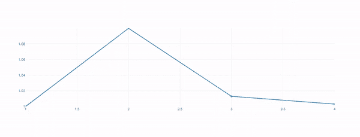

# 使用 Python 破折号绘制实时图表并绘制

> 原文:[https://www . geesforgeks . org/plot-live-graph-use-python-dash-and-plot/](https://www.geeksforgeeks.org/plot-live-graphs-using-python-dash-and-plotly/)

**Dash** 是构建在 ReactJS、Plotly 和 Flask 之上的 Python 框架。它仅使用 python 创建交互式 web 仪表板。实时图表对于某些应用程序尤其必要，例如医疗测试、股票数据，或者基本上对于在很短时间内发生变化的任何类型的数据，因为每次更新数据时都不可能重新加载。这可以使用一个名为“热重装”的功能来完成，不要与“实时重装”混淆。当数据更新时，实时重装会重新加载或刷新整个应用程序，而热重装只会刷新已更新的数据，而不会改变应用程序的状态。Dash 自动包括热重装，使其成为这种可视化的最佳选择。

现在，让我们构建一个仪表板，生成随机数据，定期将其附加到缓冲区中，并使其可视化。

安装仪表板模块和绘图模块。

```py
pip install dash
pip install plotly

```

首先，让我们导入所有必需的模块和依赖项。导入*输出*和*输入*进行回调， *dash_core_components* 进行图形和 dash 提供的其他基本组件。导入 *dash_html_components* 提供基本的 html 组件。另外，导入*破折号*和*绘制*。从图形中导入 *graph_objs* 以获得图形特征。从*集合*导入*队列*(双端队列)。

```py
import dash
from dash.dependencies import Output, Input
import dash_core_components as dcc
import dash_html_components as html
import plotly
import random
import plotly.graph_objs as go
from collections import deque
```

让我们为图的 X 和 Y 分量初始化两个去量化器。向它追加单个数据，这将是我们在图上的第一个点。

```py
X = deque(maxlen = 20)
X.append(1)

Y = deque(maxlen = 20)
Y.append(1)
```

初始化 dash 应用程序。

```py
app = dash.Dash(__name__)
```

现在让我们指定我们想要构建的仪表板的布局。需要注意的是，不需要为布局编写 HTML 页面，我们可以使用 dash 的 HTML 组件来制作简单的布局。让我们用一个图形组件构建一个简单的布局。在下面的代码中，让我们将*动画*设置为真，这将很容易处理图形的滚动动画，这看起来比更新后值的突然变化更好。让我们给图形组件分配一个 *id* 。我们有另一个名为*区间*的组件，它有类似 *id* 的属性，为这个组件指定一个唯一的 id。属性*间隔*指定两次数据更新之间经过的时间。 *n_interval* 是指从服务器启动开始完成的间隔数。

```py
app.layout = html.Div(
    [    
        dcc.Graph(id = 'live-graph',
                  animate = True),
        dcc.Interval(
            id = 'graph-update',
            interval = 1000,
            n_intervals = 0
        ),
    ]
)
```

现在让我们调用回调装饰器

```py
@app.callback(
    Output('live-graph', 'figure'),
    [ Input('graph-update', 'n_intervals') ]
)
```

现在让我们使用 *update_graph* 方法，该方法以 *n_intervals* 为参数。让我们按顺序更新 X 值，即从 1 到 2 到 3，以此类推。让我们将 Y 值更新为随机值。现在让我们创建一个新的*数据*变量，并将其分配给一个图表。默认情况下，绘图需要用列表设置 X 和 Y 值。让我们指定*模式*到*“线条+标记”*，本质上就是 Plotly 先要绘制标记，然后再给它画线。

```py
def update_graph_scatter(n):
    X.append(X[-1]+1)
    Y.append(Y[-1]+Y[-1] * random.uniform(-0.1,0.1))

    data = plotly.graph_objs.Scatter(
            x=list(X),
            y=list(Y),
            name='Scatter',
            mode= 'lines+markers'
    )

    return {'data': [data],
            'layout' : go.Layout(xaxis=dict(
                    range=[min(X),max(X)]),yaxis = 
                    dict(range = [min(Y),max(Y)]),
                    )}
```

最后，运行服务器。

```py
if __name__ == '__main__':
    app.run_server()
```

**完整代码:**

## 蟒蛇 3

```py
import dash
from dash.dependencies import Output, Input
import dash_core_components as dcc
import dash_html_components as html
import plotly
import random
import plotly.graph_objs as go
from collections import deque

X = deque(maxlen = 20)
X.append(1)

Y = deque(maxlen = 20)
Y.append(1)

app = dash.Dash(__name__)

app.layout = html.Div(
    [
        dcc.Graph(id = 'live-graph', animate = True),
        dcc.Interval(
            id = 'graph-update',
            interval = 1000,
            n_intervals = 0
        ),
    ]
)

@app.callback(
    Output('live-graph', 'figure'),
    [ Input('graph-update', 'n_intervals') ]
)

def update_graph_scatter(n):
    X.append(X[-1]+1)
    Y.append(Y[-1]+Y[-1] * random.uniform(-0.1,0.1))

    data = plotly.graph_objs.Scatter(
            x=list(X),
            y=list(Y),
            name='Scatter',
            mode= 'lines+markers'
    )

    return {'data': [data],
            'layout' : go.Layout(xaxis=dict(range=[min(X),max(X)]),yaxis = dict(range = [min(Y),max(Y)]),)}

if __name__ == '__main__':
    app.run_server()
```

打开浏览器，在本地主机和端口 8050 上运行应用程序

```py
http://localhost:8050/
```

**输出:**



这就是 dash 如何用于实时图形可视化。在本文中，我们将它与计算机生成的随机值一起使用。但是，从应用编程接口或数据库中提取的数据也可以做到这一点。