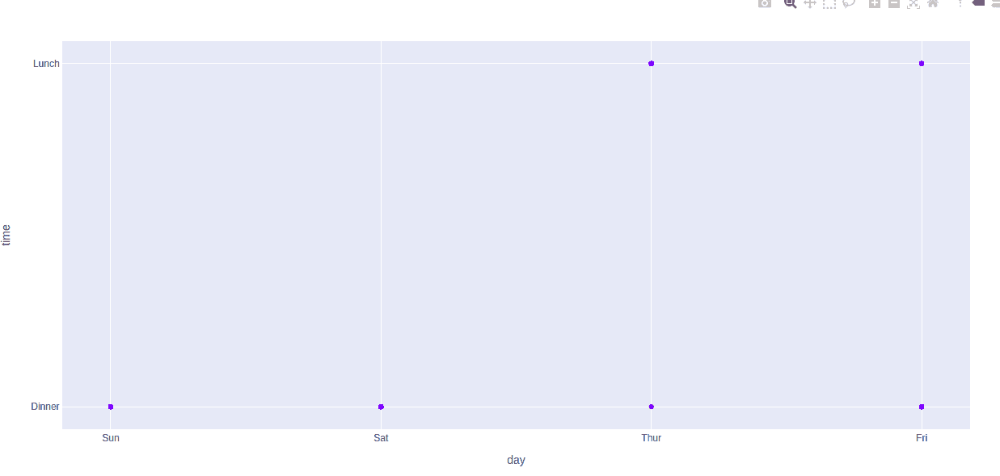
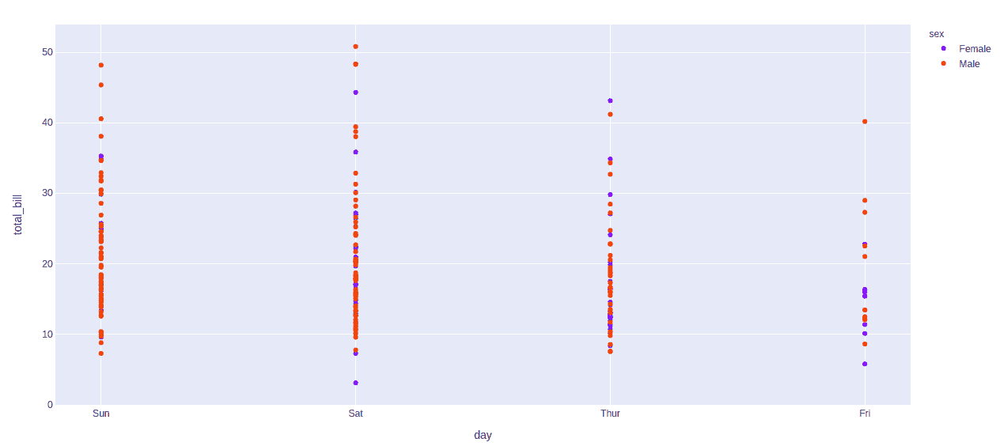
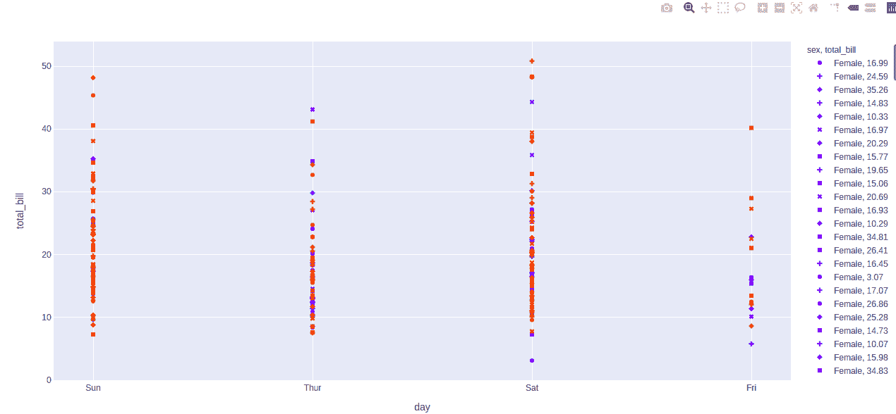

# Python 中的 plot . express . scatter()函数

> 原文:[https://www . geesforgeks . org/plotly-express-spread-function-in-python/](https://www.geeksforgeeks.org/plotly-express-scatter-function-in-python/)

Python 的 Plotly 库对于数据可视化和简单容易地理解数据非常有用。Plotly graph 对象是易于使用的高级绘图界面。

## plotly.express.scatter()函数

该功能用于创建散点图，并可用于熊猫数据帧。在散点图中，每一行数据帧都由 2D 空间中的符号标记表示。

> **语法:**plot . express .散点(data_frame=None，x=None，y=None，color=None，symbol=None，size=None，hover_name=None，hover_data=None，title=None，template=None，width=None，height=None)
> 
> **参数:**
> 
> **data_frame:** 列名需要传递 DataFrame 或类似数组或 dict。
> 
> **x，y:** 该参数或者是 data_frame 中某列的名称，或者是 pandas Series 或 array_like 对象。来自该列或 array_like 的值分别用于在笛卡尔坐标中沿 x 轴和 y 轴定位标记。
> 
> **颜色:**该参数为标记指定颜色。
> 
> **符号:**此参数用于将符号分配给标记。它或者是 data_frame 中某列的名称，或者是 pandas Series 或 array_like 对象。
> 
> **尺寸:**该参数用于分配标记尺寸。它或者是 data_frame 中某列的名称，或者是 pandas Series 或 array_like 对象。
> 
> **悬停 _ 名称:**此列或类似数组的值以粗体显示在悬停工具提示中。
> 
> **悬停 _ 数据:**此参数用于在悬停工具提示或元组中以 bool 或格式字符串作为第一个元素出现，列表状数据作为第二个元素出现在悬停中这些列的值作为额外数据出现在悬停工具提示中。
> 
> **custom_data:** 这个参数或者是 data_frame 中的列名，或者是 pandas Series，或者是 array_like 对象

**例 1:**

## 蟒蛇 3

```
# Python program to demonstrate scatter
# plot

import plotly.express as px

df = px.data.tips()

plot = px.scatter(df, x = 'day', y = 'time')
plot.show()
```

**输出:**



**示例 2:** 根据 tips 数据集中的性别进行着色

## 蟒蛇 3

```
# Python program to demonstrate scatter
# plot

import plotly.express as px

df = px.data.tips()

plot = px.scatter(df, x = 'day',
                  y = 'total_bill', 
                  color='sex')
plot.show()
```

**输出:**



**示例 3:** 使用符号参数

## 蟒蛇 3

```
# Python program to demonstrate scatter
# plot

import plotly.express as px

df = px.data.tips()

plot = px.scatter(df, x = 'day', 
                  y = 'total_bill',
                  color='sex', 
                  symbol = 'total_bill')
plot.show()
```

**输出:**

