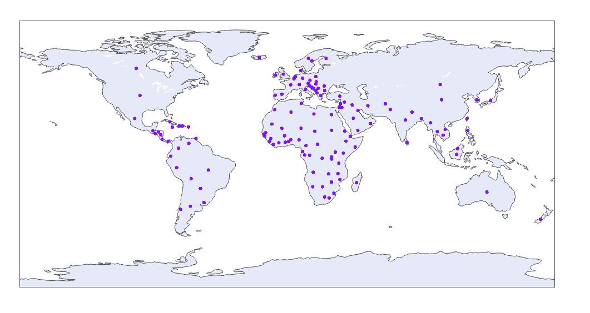
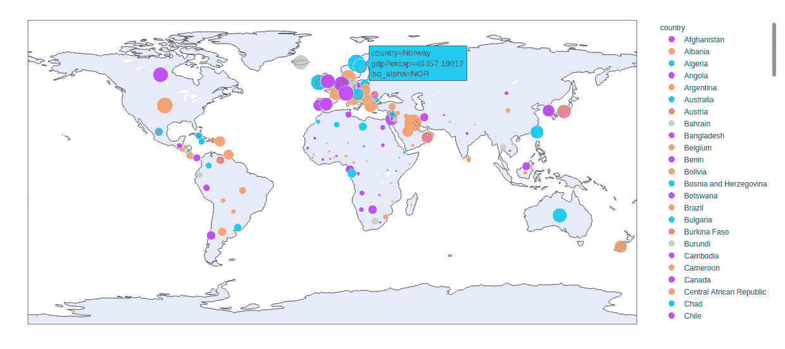

# Python 中的 plotly.express.scatter_geo()函数

> 原文:[https://www . geesforgeks . org/plotly-express-scatter _ geo-function-in-python/](https://www.geeksforgeeks.org/plotly-express-scatter_geo-function-in-python/)

Python 的 Plotly 库对于数据可视化和简单容易地理解数据非常有用。Plotly graph 对象是易于使用的高级绘图界面。

## plotly.express.scatter_geo()函数

该功能用于在地图上绘制地理数据。

> **语法:**plot . express . scatter _ geo(data _ frame =无，lat =无，lon =无，locations =无，locationmode =无，color =无，text =无，hover _ name =无，hover _ data =无，custom _ data =无，size =无，title =无，template =无，width =无，height =无)
> 
> **参数:**
> 
> **data_frame:** 列名需要传递 DataFrame 或类似数组或 dict。
> 
> **lat:** 此参数用于根据地图上的纬度定位标记。
> 
> **lon:** 此参数用于根据地图上的经度定位标记。
> 
> **位置:**此参数根据位置模式进行解释，并映射到经度/纬度。
> 
> **位置模式:**此参数确定用于将位置中的条目与地图上的区域进行匹配的位置集。
> 
> **颜色:**该参数为标记指定颜色。
> 
> **尺寸:**该参数用于分配标记尺寸。它或者是 data_frame 中某列的名称，或者是 pandas Series 或 array_like 对象。
> 
> **标题:**该参数设置图的标题。
> 
> **宽度:**该参数设置图形的宽度
> 
> **高度:**该参数设置图形的高度。

**例 1:**

## 蟒蛇 3

```
import plotly.express as px

df = px.data.gapminder().query("year == 2007")

plot = px.scatter_geo(df, locations="iso_alpha")
plot.show()
```

**输出:**



**示例 2:** 使用大小和颜色参数

## 蟒蛇 3

```
import plotly.express as px

df = px.data.gapminder().query("year == 2007")

plot = px.scatter_geo(df, locations="iso_alpha",
                      size="gdpPercap",
                      color = "country")
plot.show()
```

**输出:**

