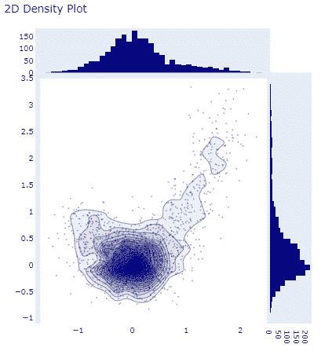
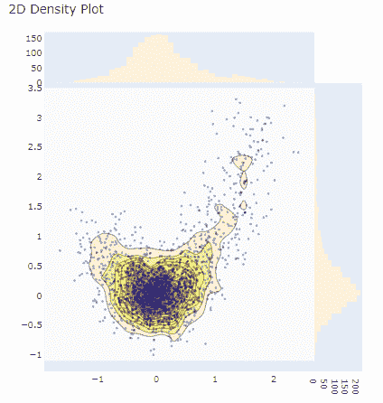

# Python 中的 plot . figure _ factory . create _ 2d _ density()函数

> 原文:[https://www . geesforgeks . org/plotly-figure _ factory-create _ 2d _ density-function-in-python/](https://www.geeksforgeeks.org/plotly-figure_factory-create_2d_density-function-in-python/)

Python 的 Plotly 库对于数据可视化和简单容易地理解数据非常有用。

## plotly . figure _ factory . create _ 2d _ density

该功能用于创建 2d 密度。

> **语法:**Plot . figure _ factory . create _ 2d _ Density(x，y，colorscale='Earth '，ncontours=20，hist_color=(0，0，0.5)，point_color=(0，0，0.5)，point_size=2，title='2D 密度图'，高度=600，宽度=600)
> 
> **参数:**
> 
> **x:** 用于绘图生成的 x 轴数据
> 
> **y:** 用于绘图生成的 y 轴数据
> 
> **色阶:**RGB 或十六进制颜色、颜色元组或颜色列表或元组。
> 
> **hist_color:** 绘制直方图的颜色
> 
> **点 _ 颜色:**分散点的颜色
> 
> **点大小:**分散点的颜色
> 
> **标题:**设置剧情标题
> 
> **高度:**图表的高度
> 
> **宽度:**图表的宽度

**例 1:**

## 蟒蛇 3

```
from plotly.figure_factory import create_2d_density
import numpy as np

t = np.linspace(-1,1.2,2000)
x = (t**3)+(0.3*np.random.randn(2000))
y = (t**6)+(0.3*np.random.randn(2000))

fig = create_2d_density(x, y)
fig.show()
```

**输出:**



2D 密度图

**例 2:**

## 蟒蛇 3

```
from plotly.figure_factory import create_2d_density
import numpy as np

# Make data points
t = np.linspace(-1,1.2,2000)
x = (t**3)+(0.3*np.random.randn(2000))
y = (t**6)+(0.3*np.random.randn(2000))

# Create custom colorscale
colorscale = ['#7A4579', '#D56073', 'rgb(236,158,105)',
             (1, 1, 0.2), (0.98,0.98,0.98)]

# Create a figure
fig = create_2d_density(x, y, colorscale=colorscale,
      hist_color='rgb(255, 237, 222)', point_size=3)

# Plot the data
fig.show()
```

**输出:**



使用参数的 2D 密度图