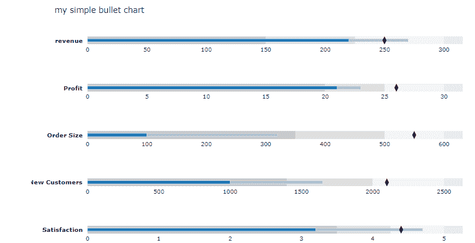
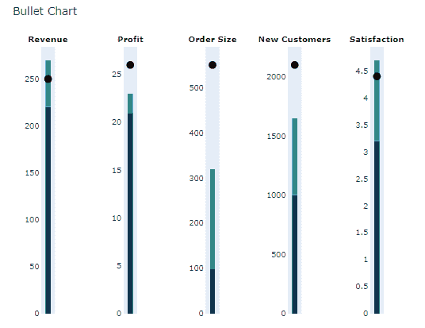

# Python 中的 plot . figure _ factory . create _ bullet()

> 原文:[https://www . geesforgeks . org/plotly-figure _ factory-create _ bullet-in-python/](https://www.geeksforgeeks.org/plotly-figure_factory-create_bullet-in-python/)

Python 的 Plotly 库对于数据可视化和简单容易地理解数据非常有用。

## **plot . figure _ factory . create _ bullet**

此方法用于创建项目符号图表。这个函数既可以接受数据帧，也可以接受字典序列。

> **语法:**plot . figure _ factory . create _ bullet(数据，标记=无，度量=无，范围=无，字幕=无，标题=无，方向='h '，* *布局 _ 选项)
> 
> **参数:**
> 
> **数据:**字典列表/元组或熊猫数据框。
> 
> **标记:**每个子图中标记的列名或字典键。
> 
> **度量:**这个条通常代表性能的量化度量，通常是两个值[a，b]的列表，默认是每个子剧情前台的蓝色条。
> 
> **范围:**该参数通常为 3 项列表【不好，好，好】。它们对应于每个图表背景中的灰色条。
> 
> **字幕:**各子剧情图字幕的列名或字典键。
> 
> **标题**((str))–每个子图主标签的列名或字典键。

**例 1:**

## 蟒蛇 3

```py
import plotly.figure_factory as ff

data = [
  {"label": "revenue", 
   "sublabel": "us$, in thousands",
   "range": [150, 225, 300], 
   "performance": [220,270],
   "point": [250]},

  {"label": "Profit", 
   "sublabel": "%", 
   "range": [20, 25, 30],
   "performance": [21, 23], 
   "point": [26]},

  {"label": "Order Size", 
   "sublabel":"US$, average",
   "range": [350, 500, 600],
   "performance": [100,320],
   "point": [550]},

  {"label": "New Customers", 
   "sublabel": "count",
   "range": [1400, 2000, 2500],
   "performance": [1000, 1650],
   "point": [2100]},

  {"label": "Satisfaction", 
   "sublabel": "out of 5",
   "range": [3.5, 4.25, 5],
   "performance": [3.2, 4.7],
   "point": [4.4]}
]

fig = ff.create_bullet(
    data, titles='label',
    subtitles='sublabel', 
    markers='point',
    measures='performance',
    ranges='range', 
    orientation='h',
    title='my simple bullet chart'
)

fig.show()
```

**输出:**



**示例 2:** 使用带颜色的数据框

## 蟒蛇 3

```py
import plotly.figure_factory as ff
import pandas as pd

data = [
    {"title": "Revenue",
     "subtitle": "US$, in thousands",
     "ranges": [150, 225, 300],
     "measures":[220, 270],
     "markers":[250]},

    {"title": "Profit",
     "subtitle": "%",
     "ranges": [20, 25, 30],
     "measures":[21, 23],
     "markers":[26]},

    {"title": "Order Size",
     "subtitle": "US$, average", 
     "ranges": [350, 500, 600],
     "measures":[100, 320],
     "markers":[550]},

    {"title": "New Customers", 
     "subtitle": "count",
     "ranges": [1400, 2000, 2500],
     "measures":[1000, 1650], 
     "markers":[2100]},

    {"title": "Satisfaction", 
     "subtitle": "out of 5",
     "ranges": [3.5, 4.25, 5], 
     "measures":[3.2, 4.7],
     "markers":[4.4]}
]

fig = ff.create_bullet(
    data, titles='title', 
    markers='markers',
    measures='measures',
    orientation='v',
    measure_colors=['rgb(14, 52, 75)', 'rgb(31, 141, 127)'],
    scatter_options={'marker': {'symbol': 'circle'}},
  width=700)

fig.show()
```

**输出:**

