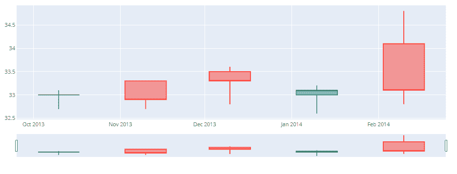
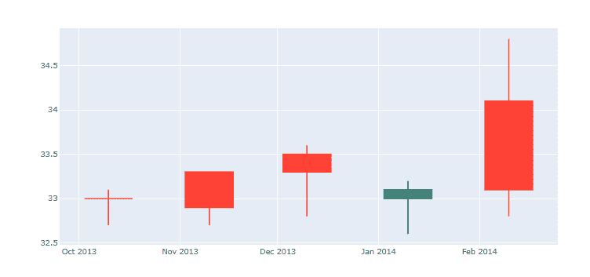

# Python 中 plot . figure _ factory . create _ 烛台()函数

> 原文:[https://www . geesforgeks . org/plotly-figure _ factory-create _ 烛台-python 中的函数/](https://www.geeksforgeeks.org/plotly-figure_factory-create_candlestick-function-in-python/)

Python 的 Plotly 库对于数据可视化和简单容易地理解数据非常有用。

## **plotly . figure _ factory . create _ 烛台**

烛台图是一种描述给定 x 坐标(最有可能是时间)的 o 的金融图表。方框代表开放值和关闭值之间的价差，线条代表低值和高值之间的价差。

> **语法:**plotly . figure _ factory . create _ 烛台(开，高，低，关，日期=无，方向= '两者'，**kwargs)
> 
> **参数**
> 
> **开:**用于开数值
> 
> **高:**用于高值
> 
> **低:**用于低值
> 
> **关闭:**用于关闭值
> 
> **日期:**用于日期时间对象列表。默认值:无
> 
> **方向:**既可增也可减。当方向为“增加”时，返回的数字由收盘值大于对应开盘值的所有烛台组成，当方向为“减少”时，返回的数字由收盘值小于或等于对应开盘值的所有烛台组成。当方向为“两个”时，增加和减少的烛台都会返回。默认值:“两者”
> 
> **kwargs**–它描述了 ohlc 散射轨迹的其他属性，例如颜色或图例名称。有关有效 kwargs 的更多信息，请调用帮助(plotly.graph_objects。分散)

**示例 1** :带日期时间对象

## 蟒蛇 3

```
import plotly.graph_objects as go
from datetime import datetime

open_data = [33.0, 33.3, 33.5, 33.0, 34.1]
high_data = [33.1, 33.3, 33.6, 33.2, 34.8]
low_data = [32.7, 32.7, 32.8, 32.6, 32.8]
close_data = [33.0, 32.9, 33.3, 33.1, 33.1]
dates = [datetime(year=2013, month=10, day=10),
         datetime(year=2013, month=11, day=10),
         datetime(year=2013, month=12, day=10),
         datetime(year=2014, month=1, day=10),
         datetime(year=2014, month=2, day=10)]

fig = go.Figure(data=[go.Candlestick(x=dates,
                       open=open_data, high=high_data,
                       low=low_data, close=close_data)])

fig.show()
```

**输出:**



**示例 2:** 带有日期时间对象的烛台图表

## 蟒蛇 3

```
from plotly.figure_factory import create_candlestick
from datetime import datetime
# Add data
open_data = [33.0, 33.3, 33.5, 33.0, 34.1]
high_data = [33.1, 33.3, 33.6, 33.2, 34.8]
low_data = [32.7, 32.7, 32.8, 32.6, 32.8]
close_data = [33.0, 32.9, 33.3, 33.1, 33.1]
dates = [datetime(year=2013, month=10, day=10),
         datetime(year=2013, month=11, day=10),
         datetime(year=2013, month=12, day=10),
         datetime(year=2014, month=1, day=10),
         datetime(year=2014, month=2, day=10)]
# Create ohlc
fig = create_candlestick(open_data, high_data,
    low_data, close_data, dates=dates)
fig.show()
```

**输出:**

