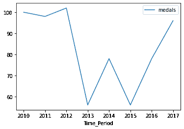
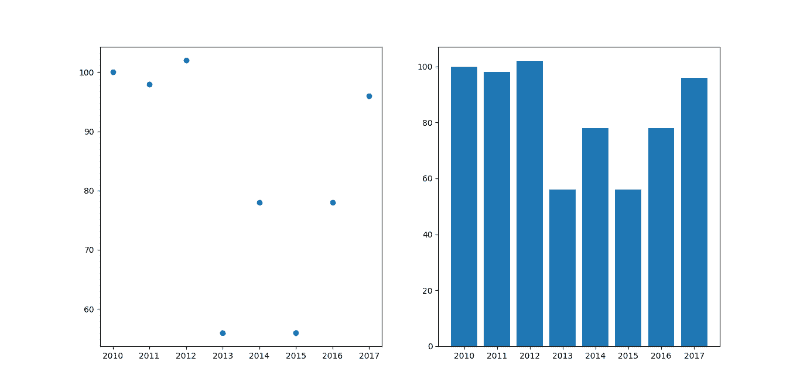
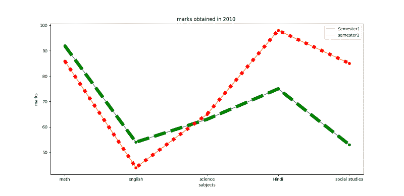

# 用 Python 绘制趋势图

> 原文:[https://www . geeksforgeeks . org/python 中绘制趋势图/](https://www.geeksforgeeks.org/plotting-a-trend-graph-in-python/)

**先决条件** : [马特洛特利](https://www.geeksforgeeks.org/python-introduction-matplotlib/)

一个**趋势图**是一个用来显示一段时间内趋势数据的图。它描述了两个变量(x，y)的函数表示。其中 x 是时间相关变量，而 y 是收集的数据。图表可以通过折线图、直方图、散点图、条形图和饼图以任何形式显示。在 python 中，我们可以使用 [matplotlib.pyplot](https://www.geeksforgeeks.org/pyplot-in-matplotlib/) 库绘制这些趋势图。它用于绘制给定数据的图形。

任务简单明了，为了绘制任何图形，我们必须满足基本的数据要求，然后确定 x 在一段时间内的值和为 y 收集的数据。绘制上述给定数据的图形。

下面给出了描述相同内容的各种实现方式:

**例 1:**

## 蟒蛇 3

```py
# import all the libraries
import numpy as np
import pandas as pd
import matplotlib.pyplot as plt

# create a dataframe
Sports = {
    "medals": [100, 98, 102, 56, 78, 56, 78, 96],
    "Time_Period": [2010, 2011, 2012, 2013, 2014, 2015, 2016, 2017]
}

df = pd.DataFrame(Sports)
print(df)

# to plot the graph
df.plot(x="Time_Period", y="medals", kind="line")
plt.show()
```

**输出:**

```py
   medals  Time_Period
0     100         2010
1      98         2011
2     102         2012
3      56         2013
4      78         2014
5      56         2015
6      78         2016
7      96         2017
```



**示例 2:** 使用上述数据，我们将绘制散点图和条形图。

## 蟒蛇 3

```py
# import all the libraries
import numpy as np
import pandas as pd
import matplotlib.pyplot as plt

# create a dataframe
Sports = {
    "medals": [100, 98, 102, 56, 78, 56,
               78, 96],

    "Time_Period": [2010, 2011, 2012, 2013,
                    2014, 2015, 2016, 2017]
}
df = pd.DataFrame(Sports)
print(df)

# to plot the graph
# subplot (rowno,columno,position) is used
# to plot in a single frame.
# to plot the scatter graph ,write kind= scatter
df.plot(x="Time_Period", y="medals", kind="scatter")
plt.title("scatter chart")
plt.subplot(1, 1, 1)

# to Plot the graph in Bar chart
df.plot(x="Time_Period", y="medals", kind="bar")
plt.title("bar")
plt.subplot(1, 1, 2)

plt.show()
```

**输出:**



**例 3**:2010 年学生拿分。

## 蟒蛇 3

```py
# import the library
import matplotlib.pyplot as plt

# Creation of Data
x1 = ['math', 'english', 'science', 'Hindi', 'social studies']
y1 = [92, 54, 63, 75, 53]
y2 = [86, 44, 65, 98, 85]

# Plotting the Data
plt.plot(x1, y1, label='Semester1')
plt.plot(x1, y2, label='semester2')

plt.xlabel('subjects')
plt.ylabel('marks')
plt.title("marks obtained in 2010")

plt.plot(y1, 'o:g', linestyle='--', linewidth='8')
plt.plot(y2, 'o:g', linestyle=':', linewidth='8')

plt.legend()
```

**输出:**

