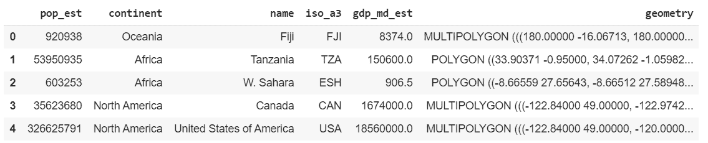
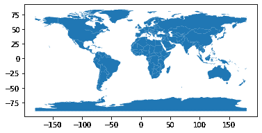
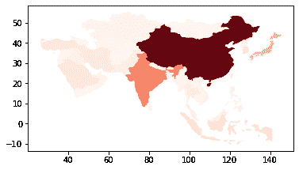
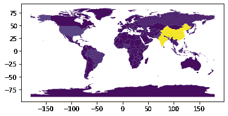
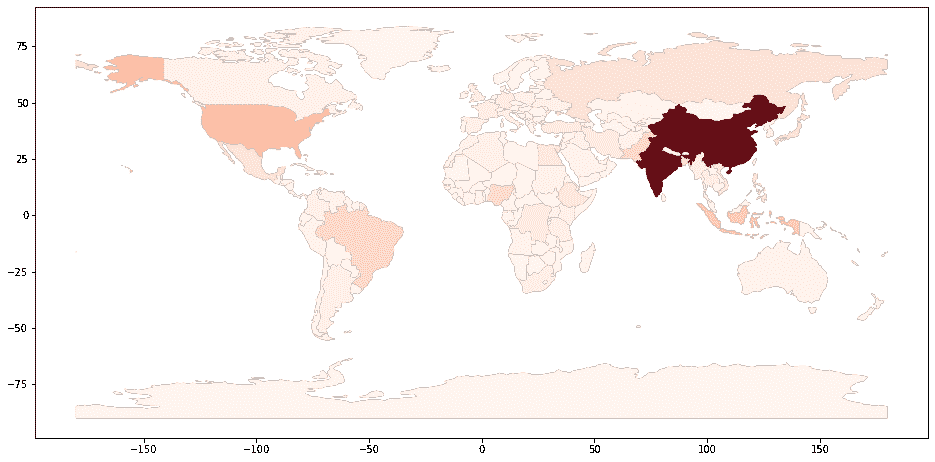
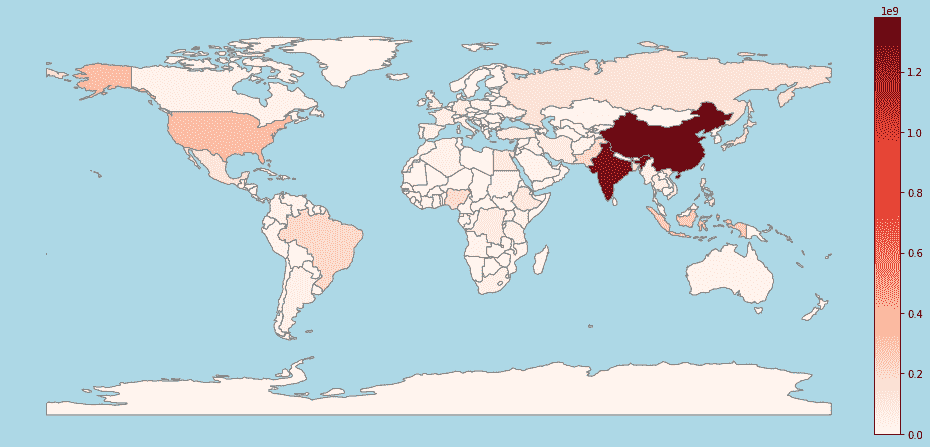

# 使用地理数据库绘制地理空间数据

> 原文:[https://www . geesforgeks . org/绘图-地理空间-数据-使用-geo andas/](https://www.geeksforgeeks.org/plotting-geospatial-data-using-geopandas/)

GeoPandas 是一个开源工具，为 Pandas 对象添加地理数据支持。在本文中，我们将使用 GeoPandas 和 Matplotlib 来绘制地理空间数据。

## 装置

我们将安装地球机器人、马特洛特利、数字机器人和熊猫。

```
pip install geopandas
pip install matplotlib
pip install numpy
pip install pandas

```

**注意:**如果不想在电脑本地安装这些模块，可以使用 Jupyter Notebook 或 Google Colab。

## 入门指南

### 导入模块和数据集

我们将为数据框架数据结构导入 Pandas，为一些数学函数导入 NumPy，为支持和处理地理空间数据导入 GeoPandas，为实际绘制地图导入 Matplotlib。

```
import pandas as pd
import geopandas as gpd
import numpy as np
import matplotlib.pyplot as plt
```

GeoPandas 为我们提供了一些默认的数据集以及它的安装。让我们阅读其中一个数据集。

## 蟒蛇 3

```
import pandas as pd
import geopandas as gpd
import numpy as np
import matplotlib.pyplot as plt

world = gpd.read_file(gpd.datasets.get_path('naturalearth_lowres'))
world.head()
```

**输出:**



world.head()

其他一些可以玩的数据集是*“自然地球城市”*和*“nybb”。*以后可以随意用它们做实验。我们可以使用*世界*并使用 Matplotlib 绘制相同的图。

## 蟒蛇 3

```
world.plot()
```

**输出:**



世界情节

### 分析数据集

现在，如果我们看到*世界*，我们有很多领域。其中之一是国内生产总值估算(或 *gdp_md_est* )。然而，为了展示熊猫体内的数据可以多么容易地被过滤掉，让我们过滤掉除亚洲之外的所有大陆。

## 蟒蛇 3

```
worldfiltered = world[world.continent == "Asia"]
worldfiltered.plot(column ='gdp_md_est', cmap ='Reds')
```



亚洲国家的国内生产总值

*cmap* 属性用于绘制指定色调的数据。较暗的阴影意味着较高的值，而较浅的阴影意味着较低的值。现在，让我们分析一下人口估计的数据。

## 蟒蛇 3

```
world.plot(column ='pop_est')
```

**输出:**



人口估计

上面的图像在传达数据方面不是很好。所以让我们改变一些属性，使它更容易理解。首先，让我们增加图形的大小，然后为它设置一个轴。我们首先在轴上绘制不带任何数据的世界地图，然后用红色阴影覆盖带有数据的地图。这样，地图更加清晰和黑暗，并使数据更容易理解。然而，这张地图仍然有点模糊，不会告诉我们阴影是什么意思。

## 蟒蛇 3

```
fig, ax = plt.subplots(1, figsize =(16, 8))
world.plot(ax = ax, color ='black')
world.plot(ax = ax, column ='pop_est', cmap ='Reds')
```

**输出:**



世界人口

让我们导入允许我们在剧情中制作分隔线的工具包。在此之后，我们将像以前一样绘制图表，但这次我们将添加一个*面颜色。**face color*属性将背景更改为其设置的颜色(在本例中为浅蓝色)。现在我们需要创建一个分隔线来创建图形中的颜色框，很像 HTML 中的分隔线。我们正在创建一个分隔线，并设置其属性，如大小，对齐等。

然后我们需要在我们创建的分隔线中创建颜色框。所以很明显，颜色框中的最高值将是数据集中最高的总体，最低值将是零。

## 蟒蛇 3

```
from mpl_toolkits.axes_grid1 import make_axes_locatable

fig, ax = plt.subplots(1, figsize =(16, 8),
                       facecolor ='lightblue')

world.plot(ax = ax, color ='black')
world.plot(ax = ax, column ='pop_est', cmap ='Reds',
           edgecolors ='grey')

# axis for the color bar
div = make_axes_locatable(ax)
cax = div.append_axes("right", size ="3 %", pad = 0.05)

# color bar
vmax = world.pop_est.max()
mappable = plt.cm.ScalarMappable(cmap ='Reds',
                                 norm = plt.Normalize(vmin = 0, vmax = vmax))
cbar = fig.colorbar(mappable, cax)

ax.axis('off')
plt.show()
```

**输出:**



世界人口

因此，在本文中，我们已经看到了如何使用地理数据库获取地理空间数据，并使用 Matplotlib 绘制它。自定义数据集可用于分析特定数据，也可用于城市数据。此外，地理地图可以与开放街道地图一起使用，后者提供非常具体的地理空间数据(例如，街道、城市中的医院等)。, ).相同的知识可以进一步扩展，并可用于特定的统计和数据分析。