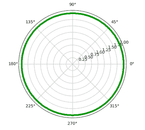
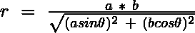
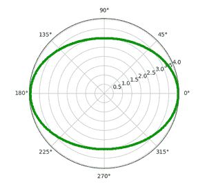
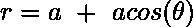
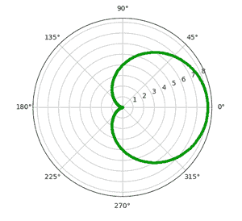
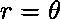
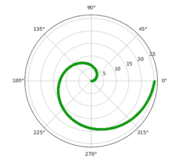
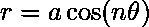
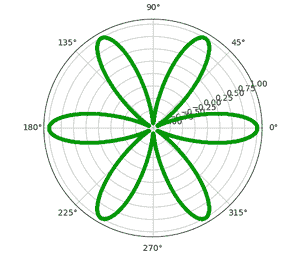

# 用 Python 绘制极坐标曲线

> 原文:[https://www . geesforgeks . org/标绘-极坐标-python 中的曲线/](https://www.geeksforgeeks.org/plotting-polar-curves-in-python/)

极坐标中的点表示为( **r** 、**θ**)。这里， **r** 是其与原点的距离，**θ**是必须从原点测量 r 的角度。笛卡尔坐标系中的任何数学函数也可以使用极坐标绘制。

### **所需模块**

*   **Matplotlib**:*Matplotlib*是一个全面的 Python 库，用于创建静态和交互式的情节和可视化。要安装此模块，请在终端中键入以下命令。

```
pip install matplotlib

```

*   **Numpy** : *Numpy* 是 Python 中数组计算的核心库。要安装此模块，请在终端中键入以下命令。

```
pip install numpy

```

*   **数学:** *数学***T5】是用于执行各种数学任务的内置模块。**

**matplotlib.pyplot** 模块包含一个函数 **polar()** ，可用于在极坐标中绘制曲线。

> **语法**:matplot lib . pyplot . polar(theta，r，**kwargs)
> 
> **参数**:
> 
> *   **θ**–角度
> *   **r**–距离

**进场:**

在下面的每个例子中，

*   创建弧度值列表。这些值涵盖了各自功能的领域。
*   对于每个弧度值θ，根据每个曲线的特定公式计算相应的 r 值。

**1。圆:**圆是由平面上距给定点(中心)给定距离(半径)的所有点组成的形状。因此， **r** 是等于**半径**的**常数**值。

**示例:**

## 蟒蛇 3

```
import numpy as np
import matplotlib.pyplot as plt

# setting the axes projection as polar
plt.axes(projection = 'polar')

# setting the radius
r = 2

# creating an array containing the
# radian values
rads = np.arange(0, (2 * np.pi), 0.01)

# plotting the circle
for rad in rads:
    plt.polar(rad, r, 'g.')

# display the Polar plot
plt.show()
```

**输出:**

[](https://media.geeksforgeeks.org/wp-content/uploads/20200613224103/Screenshot20200613at104034PM-300x269.png)

**2。椭圆:**椭圆是一个点在一个平面内移动的轨迹，使得它与另外两个点(焦点)的距离之和是恒定的。这里， **r** 定义为:



哪里，

*   **a** =半长轴长度
*   **b** =半短轴长度

**示例:**

## 蟒蛇 3

```
import numpy as np
import matplotlib.pyplot as plt
import math

# setting the axes
# projection as polar
plt.axes(projection = 'polar')

# setting the values of
# semi-major and
# semi-minor axes
a = 4
b = 3

# creating an array
# containing the radian values
rads = np.arange(0, (2 * np.pi), 0.01)

# plotting the ellipse
for rad in rads:
    r = (a*b)/math.sqrt((a*np.sin(rad))**2 + (b*np.cos(rad))**2)
    plt.polar(rad, r, 'g.')

# display the polar plot
plt.show()
```

**输出:**

[](https://media.geeksforgeeks.org/wp-content/uploads/20200611233247/Screenshot20200611at113139PM-300x270.png)

**3。心形:**心形是一个圆围绕另一个相同的圆滚动时，该圆圆周上一点的轨迹。这里，r 定义为:



其中， **a** =心形轴的长度

**示例:**

## 蟒蛇 3

```
import numpy as np
import matplotlib.pyplot as plt
import math

# setting the axes
# projection as polar
plt.axes(projection = 'polar')

# setting the length of 
# axis of cardioid
a=4

# creating an array
# containing the radian values
rads = np.arange(0, (2 * np.pi), 0.01)

# plotting the cardioid
for rad in rads:
    r = a + (a*np.cos(rad)) 
    plt.polar(rad,r,'g.') 

# display the polar plot
plt.show()
```

**输出:**

[](https://media.geeksforgeeks.org/wp-content/uploads/20200612114623/Screenshot20200612at125317AM-300x274.png Attachment Display)

**4。阿基米德螺线:**阿基米德螺线是一个点在一条直线上匀速运动的轨迹，该点本身也在围绕它的一个端点匀速转动。这里，r 定义为:



**示例:**

## 蟒蛇 3

```
import numpy as np
import matplotlib.pyplot as plt

# setting the axes
# projection as polar
plt.axes(projection = 'polar')

# creating an array
# containing the radian values
rads = np.arange(0, 2 * np.pi, 0.001) 

# plotting the spiral
for rad in rads:
    r = rad
    plt.polar(rad, r, 'g.')

# display the polar plot
plt.show()
```

**输出:**

[](https://media.geeksforgeeks.org/wp-content/uploads/20200612125739/Screenshot20200612at125423PM-300x280.png)

**5。**一条红藻或玫瑰曲线是在极坐标中绘制的玫瑰形正弦曲线。这里，r 定义为:



哪里，

*   **a** =花瓣长度
*   **n** =花瓣数

**示例:**

## 蟒蛇 3

```
import numpy as np
import matplotlib.pyplot as plt

# setting the axes
# projection as polar
plt.axes(projection='polar')

# setting the length
# and number of petals
a = 1
n = 6

# creating an array
# containing the radian values
rads = np.arange(0, 2 * np.pi, 0.001) 

# plotting the rose
for rad in rads:
    r = a * np.cos(n*rad)
    plt.polar(rad, r, 'g.')

# display the polar plot
plt.show()
```

**输出:**

[](https://media.geeksforgeeks.org/wp-content/uploads/20200612131519/Screenshot20200612at11416PM-300x262.png)