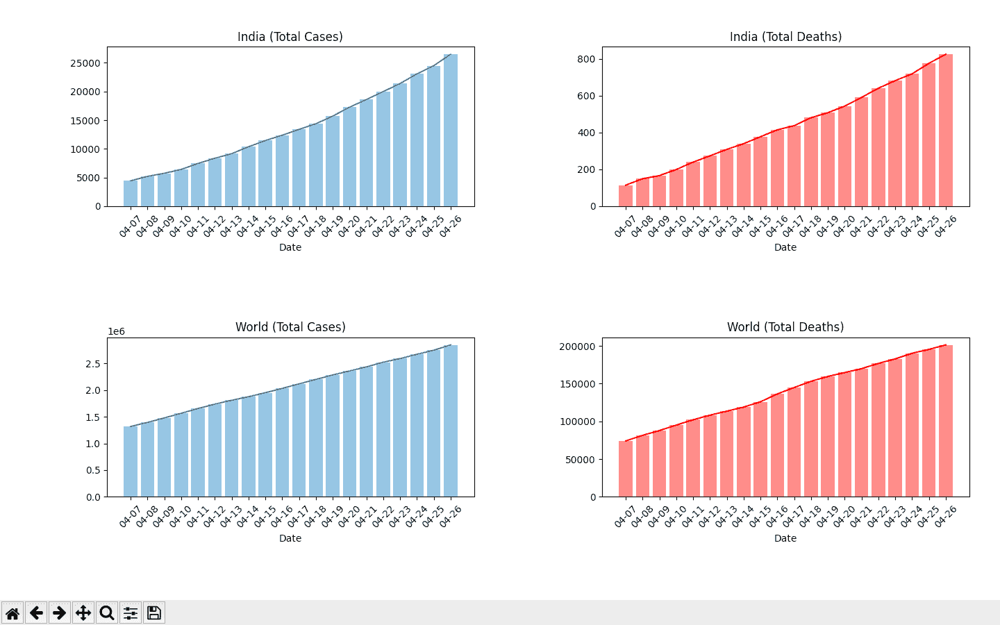
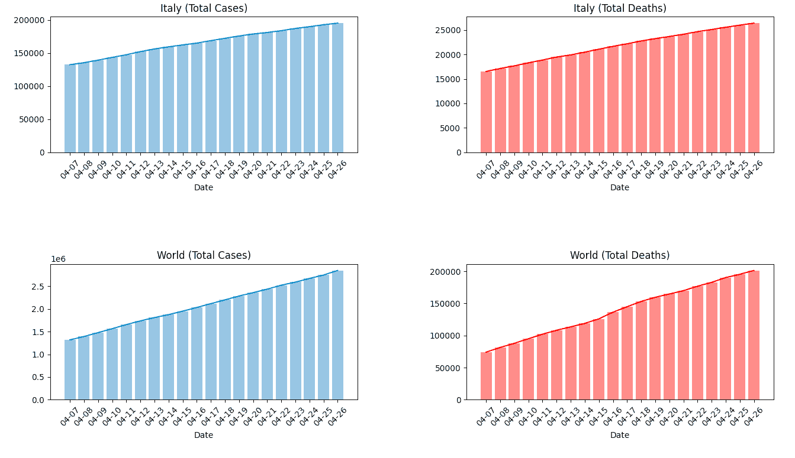

# 用 Python 绘制各国冠状病毒生长曲线

> 原文:[https://www . geeksforgeeks . org/绘制不同国家冠状病毒的增长曲线-使用 python/](https://www.geeksforgeeks.org/plotting-the-growth-curve-of-coronavirus-in-various-countries-using-python/)

在这篇文章中，我们将收集世界各地和特定国家冠状病毒病例的最新信息。我们将绘制图表来显示过去 20 天的病例总数和死亡总数的增长。最新数据来自[我们的数据世界](https://ourworldindata.org/)。

### 需要 Python 模块

*   ***请求:***
    请求库用于在 Python 中进行 HTTP 请求。

    ```py
    pip install requests

    ```

*   ***matplotlib:***
    matplotlib 是一个综合库，用于在 Python 中创建各种类型的图形和交互式可视化。

    ```py
    pip install matplotlib

    ```

**说明:**

从网站上抓取的数据(使用请求)被转换成类似 csv 的格式。然后对这些数据进行过滤，以获得过去 20 天所需的统计数据，并绘制可视化图(使用 matplotlib)。

下面是实现。

```py
from matplotlib import pyplot as plt
import requests

# function to plot data for country 
# and world
def Plot(country):

    # getting request from the url
    req = requests.get('https://covid.ourworldindata.org / data / ecdc / full_data.csv')
    req.raise_for_status()

    # converting to text and splitting 
    # the rows of the csv data
    cf = req.text.split('\n')

    # converting to 2 dimensional list
    for i in range(len(cf)):
        cf[i]= cf[i].split(', ')  

    dates =[]
    total =[]
    total_w =[]
    deaths =[]
    deaths_w =[]
    l =[]
    f = 0

    for i in range(len(cf)-1):
        l = cf[i]
        c = l[1]

        # filtering data for a particular country
        if c == country:
            f = 1

            # getting the dates, total cases and
            # deaths for the particular country
            dates.append(l[0][5:])      
            total.append(int(l[4]))
            deaths.append(int(l[5]))

        # filtering data for the world
        if c =='World':

            # getting total cases and deaths for
            # the world
            total_w.append(int(l[4]))
            deaths_w.append(int(l[5]))

    if f == 0:
        print("Invalid country name.")
        return

    # Plotting country data
    total_ax = plt.subplot(2, 2, 1)
    total_ax.set_title(country+' (Total Cases)')

    # plotting the curve for total cases
    total_ax.plot(dates[-20:], total[-20:])

    # plotting the bars for total cases
    total_ax.bar(dates[-20:], total[-20:], alpha = 0.5)

    total_ax.set_xlabel("Date")
    plt.xticks(rotation = 45)

    death_ax = plt.subplot(2, 2, 2)
    death_ax.set_title(country+' (Total Deaths)')

    # plotting the curve for deaths
    death_ax.plot(dates[-20:], deaths[-20:], color ='red')

    # plotting the bars for deaths
    death_ax.bar(dates[-20:], deaths[-20:], color ='red', alpha = 0.5)

    death_ax.set_xlabel("Date")
    plt.xticks(rotation = 45)

    # Plotting world data
    total_w_ax = plt.subplot(2, 2, 3)
    total_w_ax.set_title('World (Total Cases)')

    # plotting the curve for total cases
    total_w_ax.plot(dates[-20:], total_w[-20:])

    # plotting the bar for total cases
    total_w_ax.bar(dates[-20:], total_w[-20:], alpha = 0.5)

    total_w_ax.set_xlabel("Date")
    plt.xticks(rotation = 45)

    death_w_ax = plt.subplot(2, 2, 4)
    death_w_ax.set_title('World (Total Deaths)')

    # plotting the curve for deaths
    death_w_ax.plot(dates[-20:], deaths_w[-20:], color ='red')

    # plotting the curve for deaths
    death_w_ax.bar(dates[-20:], deaths_w[-20:], color ='red', alpha = 0.5)

    death_w_ax.set_xlabel("Date")
    plt.xticks(rotation = 45)

    plt.tight_layout()

print("Enter country name...")
country = input().title()
Plot(country)
plt.show()
```

**输入:**

```py
Enter country name...
India
```

**输出:**



**输入:**

```py
Enter country name...
Italy
```

**输出:**

