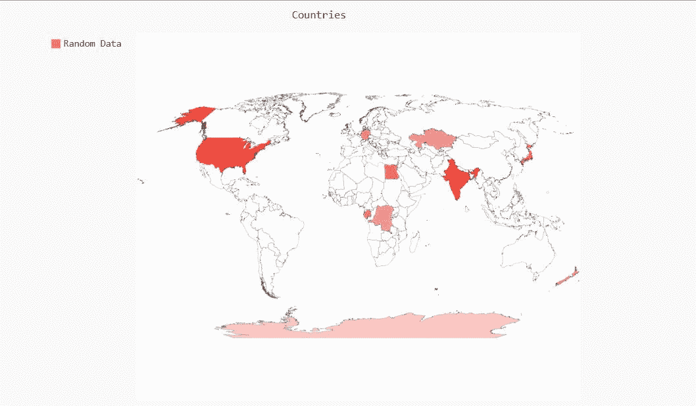
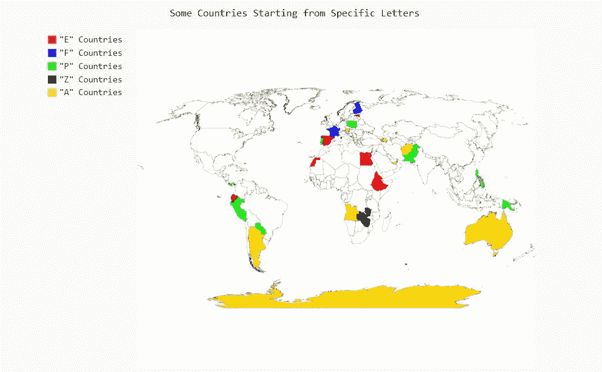

# 使用 Python 中的 Pygal 绘制世界地图

> 原文:[https://www . geeksforgeeks . org/绘图-世界-地图-使用-pygal-in-python/](https://www.geeksforgeeks.org/plotting-world-map-using-pygal-in-python/)

**Pygal** 是一个 Python 模块，主要用于构建 SVG(标量矢量图形)图形和图表。SVG 是一种基于矢量的 XML 格式的图形，可以在任何编辑器中编辑。Pygal 可以用最少的代码行创建图表，这些代码行易于理解和编写。

我们可能希望绘制具有国家边界的世界地图，甚至可能希望在地理基础上或基于我们项目中的一些数据来表示或区分国家。Python 库“Pygal”将帮助我们完成任务。让我们开始吧。

### 装置

```
pip install pygal_maps_world

```

**语法:**

```
worldmap =  pygal.maps.world.World()

```

现在，您可以使用国家代码绘制国家的图表。这是国家代码列表。

<figure class="table">

| 编码 | 国家 |
| --- | --- |
| 广告 | 安道尔 |
| 行政帐户(account executive) | 阿拉伯联合酋长国 |
| 视频（同 audio frequency） | 阿富汗 |
| -艾尔 | 阿尔巴尼亚 |
| 是 | 亚美尼亚 |
| 安哥拉 | 安哥拉 |
| aq | 南极洲 |
| 阿肯色州 | 阿根廷 |
| 在 | 奥地利 |
| 你好 | 澳大利亚 |
| 阿塞拜疆（Azerbaijan 的缩写） | 阿塞拜疆 |
| 文学士 | 波斯尼亚和黑塞哥维那 |
| 弹底引信（base detonating 的缩写） | 孟加拉国 |
| 是 | 比利时 |
| 板英尺(board foot) | 布基纳法索 |
| 锥齿轮 | 保加利亚 |
|  | 巴林 |
| 双性恋的 | 布隆迪 |
| bj | 贝宁 |
| 十亿 | 文莱达鲁萨兰国 |
| 呸 | 多民族玻利维亚国 |
| 英国铁路公司 | 巴西 |
| 英国电信公司 | 不丹 |
| 细菌战 | 博茨瓦纳 |
| 经过 | 白俄罗斯 |
| bz | 伯利兹 |
| 加拿大 | 加拿大 |
| 激光唱片 | 刚果、刚果民主共和国 |
| 随军牧师 | 中非共和国 |
| 厘克 | 刚果 |
| 荣誉勋爵 | 瑞士 |
| 铸铁 | 科特迪瓦文号 |
| 厘升 | 辣椒 |
| 厘米 | 喀麦隆 |
| 通信网络（Communicating Net 的缩写） | 中国 |
| 总裁 | 哥伦比亚 |
| 铬 | 哥斯达黎加 |
| 铜 | 古巴 |
| 简历 | 佛得角 |
| 日历年度(calendar year) | 塞浦路斯 |
| 战区（combat zone 的缩写） | 捷克共和国 |
| (加在动词之前）表示“否定”，“相反”；(加在名词之前构成动词)表示“除去”，“除掉” | 德国 |
| 流行音乐节目主持人 | 吉布提 |
| 男高中生 | 丹麦 |
| 做 | 多米尼加共和国 |
| 阿尔及利亚的域名 | 阿尔及利亚 |
| 欧共体 | 厄瓜多尔 |
| 电子工程师 | 爱沙尼亚 |
| 邪恶的笑（Evil Grin 的缩写） | 埃及 |
| 啊 | 西撒哈拉 |
| 呃 | 厄立特里亚 |
| 是吗 | 西班牙 |
| 还有呢 | 埃塞俄比亚 |
| 船方不负担装货费用 | 芬兰 |
| fr | 法国 |
| 总代理人 | 加蓬 |
| 千兆字节 | 联合王国 |
| 通用电气公司 | 格鲁吉亚 |
| 重力 | 法属圭亚那 |
| 生长激素 | 加纳 |
| 标距长度 | 格陵兰 |
| 克 | 冈比亚 |
| 几尼 | 几内亚 |
| 赤道几内亚 | 赤道几内亚 |
| 希腊 | 希腊 |
| 大型旅行车的 | 危地马拉 |
| 关岛（Guam 的缩写） | 关岛 |
| （同 GuidedWeapon）制导武器 | 几内亚比绍 |
| 灰色 | 圭亚那 |
| 香港 | 香港 |
| hn | 洪都拉斯 |
| 人力资源 | 克罗地亚 |
| 海地 | 海地 |
| 胡（汉语拼音） | 匈牙利 |
| 身份证明（identification） | 印度尼西亚 |
| 爱尔兰共和国 | 爱尔兰 |
| 以色列 | 以色列 |
| 在 | 印度 |
| 智商 | 伊拉克 |
| 红外线 | 伊朗伊斯兰共和国 |
| 是 | 冰岛 |
| 它 | 意大利 |
| 牙买加 | 牙买加 |
| 乔 | 约旦 |
| 治安官 | 日本 |
| 动能(kinetic energy)ˌ键入错误(Key Error) | 肯尼亚 |
| 公斤 | 吉尔吉斯斯坦 |
| kh | 柬埔寨 |
| kp | 朝鲜民主主义人民共和国 |
| 韩国 | 大韩民国 |
| 千瓦 | 科威特 |
| kz | 哈萨克斯坦共和国 |
| 在那里 | 老挝人民民主共和国 |
| 镑 | 黎巴嫩 |
| 里 | 列支敦士登 |
| 斯里兰卡（SriLanka 的缩写） | 斯里兰卡 |
| 实验室反应堆 | 利比里亚 |
| 限位开关（Limit Switch） | 莱索托 |
| 它 | 立陶宛 |
| 镥 | 卢森堡 |
| 低压 | 拉脱维亚 |
| 利比亚（Libya 的缩写） | 利比亚 |
| 妈 | 摩洛哥 |
| 喊麦 | 摩纳哥 |
| 钔 | 摩尔多瓦共和国 |
| 我 | 黑山 |
| 毫克 | 马达加斯加 |
| 马其顿 | 前南斯拉夫的马其顿共和国 |
| 毫升 | 园丁 |
| 毫米 | 缅甸(东南亚国家) |
| 锰 | 蒙古 |
| 卫生干事 | 澳门 |
| 先生 | 毛里塔尼亚 |
| 马太福音 | 马耳他 |
| 希腊字母表中第十二个字母 | 毛里求斯 |
| 平均变化 | 马尔代夫 |
| 兆瓦 | 马拉维 |
| 不愿具体说明自己性别的人士使用的称谓 | 墨西哥 |
| 我的 | 马来西亚 |
| mz | 莫桑比克 |
| 钠 | 纳米比亚 |
| -不知道 | 尼日尔 |
| 尼日利亚 | 尼日利亚 |
| 镍 | 尼加拉瓜 |
| 北纬 | 荷兰 |
| 不 | 挪威 |
| 铭牌 | 尼泊尔 |
| 新西兰 | 新西兰 |
| 功绩勋章 | 阿曼 |
| 和 | 巴拿马 |
| 体育课(physical education) | 秘鲁 |
| 程序制导 | 巴布亚新几内亚 |
| pH 值(溶液或物质的酸碱度) | 菲律宾 |
| 公园 | 巴基斯坦 |
| pl | 波兰 |
| 公共关系 | 波多黎各 |
| 著名图象处理软件 | 巴勒斯坦国 |
| 元素铂的符号 | 葡萄牙 |
| 巴拉圭 | 巴拉圭 |
| 关于 | 重聚 |
| Romania 罗马尼亚 | 罗马尼亚 |
| 同悦 | 塞尔维亚 |
| 钌 | 俄罗斯联邦 |
| 辐射武器（radiation weapon 的缩写） | 卢旺达 |
| 救世军(Salvation Army)ˌ性感(Sex Apple)ˌ需经批准ˌ有待批准(Subject to Approval)ˌ半自动的(Semi-Automatic)ˌ减震(Shock Attenuation)ˌ表面面积(Surface Area) | 沙特阿拉伯 |
| 南卡罗来纳州 | 塞舌尔 |
| 存储卡 | 苏丹 |
| 如果 | 瑞典 |
| 医务主任 | 新加坡 |
| 嘘 | 圣赫勒拿、阿森松岛和特里斯坦-达库尼亚 |
| 大音阶第七音 | 斯洛文尼亚 |
| 沙王 | 斯洛伐克 |
| 海平面 | 塞拉利昂 |
| 钐 | 圣马力诺 |
| 锡 | 塞内加尔 |
| 因此 | 索马里 |
| 立体弧度 | 苏里南 |
| 标准时间 | 圣多美和普林西比 |
| 支援车(Suport Vehicle) | 萨尔瓦多 |
| 叙利亚 | 阿拉伯叙利亚共和国 |
| 尺码（size 的简写） | 斯威士兰 |
| （美）财政部（Treasury Department） | 乍得 |
| 甘油三酯 | 多哥 |
| 泰国(Thailand) | 泰国 |
| 涡轮喷气发动机 | 塔吉克斯坦 |
| 元素铊的符号 | 东帝汶 |
| 铥 | 土库曼斯坦 |
| 长吨 | 突尼斯 |
| tr | 火鸡 |
| tw | 台湾(民国) |
| 坦桑尼亚 | 坦桑尼亚联合共和国 |
| 美国联合航空公司 | 乌克兰 |
| 地下（underground 的缩写） | 乌干达 |
| 我们 | 美国 |
| uy | 乌拉圭 |
| 铀 z | 乌兹别克斯坦 |
| 价值分析 | 教廷(梵蒂冈城国) |
| 拥有 | 委内瑞拉玻利瓦尔共和国 |
| 越南 | 越南 |
| 你 | 也门 |
| 钇 | 马约特岛。亦称 MAHORE |
| 为 | 南非 |
| zm | 赞比亚 |
| zw | 津巴布韦 |

</figure>

**例 1:** 根据数据绘制国家。

## 蟒蛇 3

```
# import pygal library
import pygal

# create a world map
worldmap =  pygal.maps.world.World()

# set the title of the map
worldmap.title = 'Countries'

# adding the countries
worldmap.add('Random Data', {
        'aq' : 10,
        'cd' : 30,
        'de' : 40,
        'eg' : 50,
        'ga' : 45,
        'hk' : 23,
        'in' : 70,
        'jp' : 54,
        'nz' : 41,
        'kz' : 32,
        'us' : 66
})

# save into the file
worldmap.render_to_file('abc.svg')

print("Success")
```

**输出:**



**例 2:** 标注标绘国家。

## 蟒蛇 3

```
# import pygal
import pygal

# import Style class from pygal.style
from pygal.style import Style

# create a Style object
custom_style = Style( colors = ('#FF0000' , '#0000FF' ,
                                '#00FF00' , '#000000',
                                '#FFD700'))

# create a world map,
# Style class is used for using
# the custom colours in the map,
worldmap =  pygal.maps.world.World(style 
                                   = custom_style)

# set the title of the map
worldmap.title = 'Some Countries Starting from Specific Letters'

# hex code of colours are used
# for every .add() called
worldmap.add('"E" Countries', 
             ['ec', 'ee', 'eg', 'eh',
              'er', 'es','et'])

worldmap.add('"F" Countries', 
             ['fr', 'fi'])

worldmap.add('"P" Countries', 
             ['pa', 'pe', 'pg', 'ph', 'pk', 
               'pl','pr', 'ps', 'pt', 'py'])

worldmap.add('"Z" Countries',
             ['zm', 'zw'])

worldmap.add ('"A" Countries' , 
              ['ad','ae', 'af', 'al', 'am', 'ao',
               'aq', 'ar', 'at', 'au', 'az'], 
              color = 'black')

# save into the file
worldmap.render_to_file('abc.svg')

print("Success")
```

**输出**T2】



**示例 3:** 绘制大陆。

## 蟒蛇 3

```
# import pygal library
import pygal

# create a world map
worldmap =  pygal.maps.world.SupranationalWorld()

# set the title of map
worldmap.title = 'Continents'

# adding the continents
worldmap.add('Africa', [('africa')])
worldmap.add('North america', [('north_america')])
worldmap.add('Oceania', [('oceania')])
worldmap.add('South america', [('south_america')])
worldmap.add('Asia', [('asia')])
worldmap.add('Europe', [('europe')])
worldmap.add('Antartica', [('antartica')])

# save into the file
worldmap.render_to_file('abc.svg')

print("Success")
```

**输出:**

