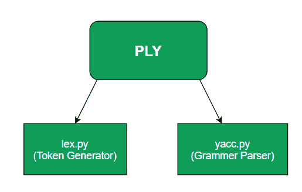

# ply(python lex-yacc)-简介

> 原文:[https://www . geesforgeks . org/ply-python-lex-yacc-an-introduction/](https://www.geeksforgeeks.org/ply-python-lex-yacc-an-introduction/)

我们都听说过 lex 和 yacc，lex 是一个生成词法分析器的工具，词法分析器然后用来标记输入流，yacc 是一个解析器生成器，但是这两个工具在一个名为 PLY 的包中以独立模块的形式有一个 python 实现。

这些模块被命名为 lex.py 和 yacc.py，工作方式类似于最初的 UNIX 工具 lex 和 yacc。

**PLY** 与它的 UNIX 对应物的工作方式不同，它不需要特殊的输入文件，而是直接将 python 程序作为输入。传统的工具还利用解析表，这在编译时是很困难的，而 PLY 缓存生成的结果，保存它们以供使用，并根据需要重新生成它们。



### lex.py

这是这个包中的关键模块之一，因为 yacc.py 的工作也依赖于 lex.py，因为它负责从输入文本生成标记集合，然后使用正则表达式规则来标识该集合。

要在 python 代码中导入该模块，请使用**导入 ply.lex 作为 lex**

**例:**
假设你写了一个简单的表达式:y = a + 2 * b

当它通过 ply.py 传递时，会生成以下标记

```
'y','=', 'a', '+', '2', '*', 'b'
```

这些生成的令牌通常与令牌名称一起使用，而令牌名称总是必需的。

```
#Token list of above tokens will be
tokens = ('ID','EQUAL','ID', 'PLUS', 'NUMBER', 'TIMES','ID' )

#Regular expression rules for the above example 
 t_PLUS    = r'\+'
 t_MINUS   = r'-'
 t_TIMES   = r'\*'
 t_DIVIDE  = r'/'
```

更具体地，这些可以表示为令牌类型和令牌的元组

```
('ID', 'y'), ('EQUALS', '='), ('ID', 'a'), ('PLUS', '+'), 
('NUMBER', '2'), ('TIMES', '*'), ('NUMBER', '3')
```

这个模块也以 token()的形式提供了一个外部接口，它从输入中返回有效的令牌。

### yacc.py

这个包的另一个模块是 yacc.py，其中 yacc 代表**又一个编译器**。这可以用来实现一次通过编译器。它提供了许多在 UNIX yacc 中已经可用的特性，以及一些额外的特性，使 yacc.py 比传统的 yacc 有一些优势

您可以使用以下方法将 yacc 导入您的 python 代码**将 ply.yacc 导入为 yacc** 。

这些功能包括:

1.  LALR(1)解析
2.  语法验证
3.  支持空生产
4.  广泛的错误检查能力
5.  有罪判决

yacc.py 也使用显式令牌生成令牌()来收集令牌和语法规则，yacc . py 会根据用户需求不断调用该令牌。yacc.py 吐出抽象语法树(AST)作为输出。

**优于 UNIX yacc:**
Python 实现 yacc.py 不涉及代码生成过程，而是使用**反射**来制作其 lexers 和 parsers，这节省了空间，因为它不需要任何额外的编译器构造步骤和代码文件生成。
要从您的 lex 文件中导入令牌，请使用 lex_file_name_here 中的**导入令牌**，其中令牌是 lex 文件中指定的令牌列表。
为了指定语法规则，我们必须在 yacc 文件中定义函数。其语法如下:

```
def function_name_here(symbol):
    expression = expression token_name term
```

**参考文献:**T2[https://www.dabeaz.com/ply/ply.html](https://www.dabeaz.com/ply/ply.html)T5】