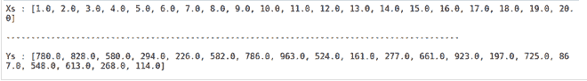
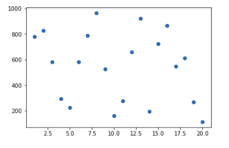
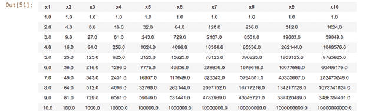
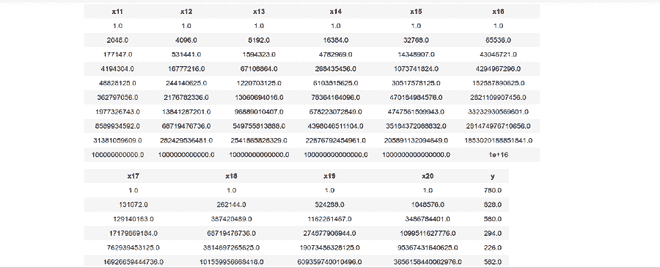
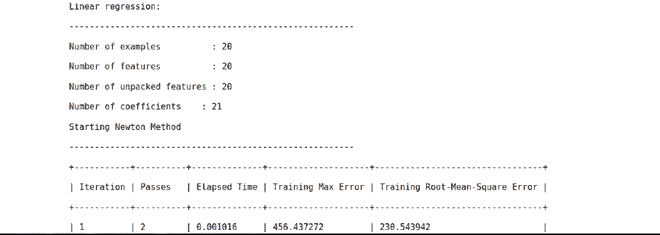
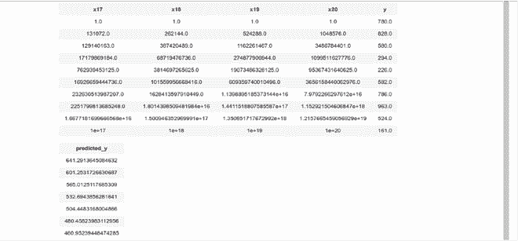
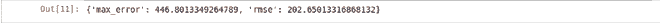
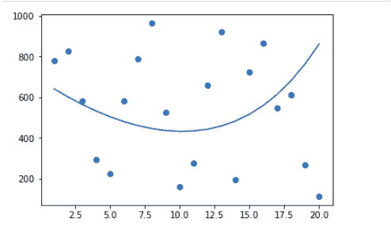

# 使用图创建的多项式回归

> 原文:[https://www . geeksforgeeks . org/多项式-回归-使用-turicreate/](https://www.geeksforgeeks.org/polynomial-regression-using-turicreate/)

在本文中，我们将讨论使用[图创建](https://www.geeksforgeeks.org/turicreate-library-in-python/)实现[多项式回归](https://www.geeksforgeeks.org/python-implementation-of-polynomial-regression/)。**多项式回归:**多项式回归是回归分析的一种形式，将因变量如 **y** 和自变量如 **x** 之间的关系建模为**n 次**多项式。它表示为:

> y= b0+b1x1+ b2x12+ b2x13+…… bnx1n
> 
> [其中 b0、b1、b2、…… bn 是回归系数]

让我们通过实践来学习这个概念。

**步骤 1:** 导入重要的库，并使用图创建中的 [SArray 和 SFrame 生成一个非常小的数据集，我们将使用它来执行多项式回归。](https://www.geeksforgeeks.org/data-visualization-using-turicreate-in-python/)

## 蟒蛇 3

```py
# importing required python libraries
import turicreate
import matplotlib.pyplot as plt
import random

# Generating datapoints
X = [data for data in range(1, 21)]
Y = [random.randrange(100, 1000, 1) for data in range(20)]

# Creating Sarrays from the generated data points
Xs = turicreate.SArray(X, dtype=float)
Ys = turicreate.SArray(Y, dtype=float)

print(f"""Xs : {Xs}
\n-------------------------------------------------------------------------------------------\n
Ys : {Ys}""")
```

**输出:**



**步骤 2:** 绘制生成的数据

## 蟒蛇 3

```py
# plotting the generated data
plt.scatter(Xs, Ys)
plt.show()
```



**第 3 步:**创建一个包含输入、多项式次数和输出的 SFrame，以便拟合我们的回归模型。

## 蟒蛇 3

```py
# Creating an Sframe where all the inputs and the polynomial degree and output
def createSframe(inputs, pol_degree):
    datapoints = turicreate.SFrame({'x1': inputs})
    for degree in range(2, pol_degree+1):
        datapoints[f'x{degree}'] = datapoints[f'x{degree-1}']*datapoints['x1']
    return datapoints

# Creating a SFrame with polynomial degree 20
data_points = createSframe(Xs, 20)
data_points['y'] = Ys

# showing the first 10 entries in the SFrame
data_points.head()
```

 

**步骤 4:** 将多项式回归拟合到生成的数据集。

## 蟒蛇 3

```py
# Polynomial Regression
features = [f'x{i}' for i in range(1, 21)]
poly_model = turicreate.linear_regression.create(
    data_points, features=features, target='y')
```



**步骤 5:** 使用拟合的模型预测结果，并将结果存储在 SFrame 中。

## 蟒蛇 3

```py
# predicting the some data
# Generating test datapoints
test_X = [random.randrange(1, 60, 1) for data in range(20)]
test_Xs = turicreate.SArray(X, dtype=float)
test_data = createSframe(test_Xs, 5)
data_points['predicted_y'] = poly_model.predict(test_data)

data_points.head()
```



**步骤 6:** 测量我们预测结果的准确性

## 计算机编程语言

```py
# Measuring the accuracy
# Generating test datapoints
test_X = [random.randrange(1, 60, 1) for data in range(20)]
test_Xs = turicreate.SArray(X, dtype=float)
test_data = createSframe(test_Xs, 20)
poly_model.evaluate(data_points)
```



**步骤 7:** 使用输入数据和预测结果的散点图和线图可视化多项式回归结果。

## 蟒蛇 3

```py
plt.scatter(data_points['x1'], data_points['y'])
plt.plot(data_points['x1'], data_points['predicted_y'])
plt.show()
```

