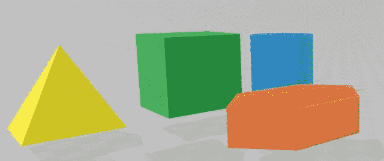
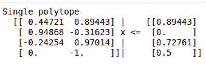
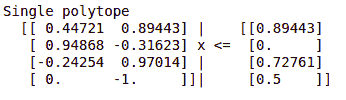
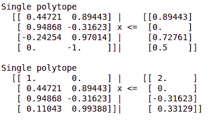

# Python 中的多面体

> 原文:[https://www.geeksforgeeks.org/polytopes-in-python/](https://www.geeksforgeeks.org/polytopes-in-python/)

[Python](https://www.geeksforgeeks.org/python-programming-language/) 为我们提供了一个第三方模块来操作多面体。对于一个不知道多面体是什么的人来说，多面体是 n 维几何中对应于多边形或多面体的一种几何形式。像其他几何图形如正方形或立方体一样，多面体不限于一维。它可以是二维、三维或三维



n 维多面体通常表示为**n-多面体**。例如，二维多面体将表示为二维多面体，三维多面体表示为三维多面体，等等。使用半空间表示法或 [H 表示法](https://en.wikipedia.org/wiki/Convex_polytope#Intersection_of_half-spaces)将多面体存储在 Python 中。这意味着多面体表示为两个矩阵和一个向量的向量矩阵乘法:

```
Ax <= B
```

这里，A 是 m*n 矩阵，x 是一组坐标乘以 A，B 是 m*1 列矩阵。多面体模块将允许我们在这些多面体上执行一些几何操作。让我们开始安装:

多面体是第三方模块，所以我们需要在机器上安装它，然后才能使用它。要安装该模块，只需在终端中键入以下内容:

```
pip install polytope
```

安装后，我们将模块导入到我们的 IDE 中，如下所示:

```
import polytope as pc
```

我们现在将使用多面体模块创建一个多面体:

```
# Python program to demonstrate
# polytopes

# Using numpy to create matrices
import numpy as np 
import polytope as pc

# Declaring numpy arrays
A = np.array([[1.0, 2.0],
              [3.0, -1.0],
              [-1.0, 4.0],
              [0.0, -2.0]])

b = np.array([2.0, 0.0, 3.0, 1.0])

p = pc.Polytope(A, b)

print(p)
```

**输出:**



这里，我们使用 numpy 数组创建了矩阵 A 和矩阵 b。然后，我们使用`.Polytope()`函数，使用这些矩阵创建一个多面体。这里，我们没有指定“x”的任何值。

#### 多面体的方法和操作:

现在我们已经创建了一个简单的多面体，我们可以对它们执行一些基本操作。例如，多面体模块为我们提供了比较两个多面体的能力。
考虑两个多面体， **p1** 和 **p2** ，然后:

*   **p1 == p2:** 这意味着 **p1** 的每个元素都在 **p2** 中， **p2** 的每个元素都在 **p1** 中。因此， **p1** 和 **p2** 完全相同。
*   **p1 < = p2:** 这意味着 **p1** 是 **p2** 的子集。因此 **p1** 的每一个元素都在 **p2** 中，但 **p2** 可能不一样。
*   **p2 < = p1:** 这意味着 **p2** 是 **p1** 的子集。因此 **p2** 的每一个元素都在 **p1** 中，但 **p1** 可能不一样。

我们还可以使用以下方法检查元素是否在多面体中:

```
[4.0, 5.0] in p1
```

多面体可用的一些基本数学运算包括:

*   **p1.diff(p2)**
*   **p1.union(p2)**
*   **p1.intersect(p2)**

**例如:**

```
# Python program to demonstrate
# polytopes

# Using numpy to create matrices
import numpy as np 
import polytope as pc 

# Declaring numpy arrays
A = np.array([[1.0,  2.0],
              [3.0, -1.0],
              [-1.0, 4.0],
              [0.0, -2.0]])

b = np.array([2.0, 0.0, 3.0, 1.0])

C = np.array([[1.0,  0.0],
              [2.0,  4.0],
              [3.0, -1.0],
              [1.0,  9.0]]) 

d = np.array([2.0, 0.0, -1.0, 3.0])

p1 = pc.Polytope(A, b)
p2 = pc.Polytope(C, d)

# Using diff method
p1.diff(p2)
```

**输出:**



我们可以迭代一个多面体区域。一个区域可以理解为包含两个多面体的容器，其中一个是起点，另一个是终点。考虑下面的代码。

```
# Python program to demonstrate
# polytopes

import numpy as np 
import polytope as pc 

# Declaring numpy arrays
A = np.array([[1.0,  2.0],
              [3.0, -1.0],
              [-1.0, 4.0],
              [0.0, -2.0]])

b = np.array([2.0, 0.0, 3.0, 1.0])

C = np.array([[1.0,  0.0],
              [2.0,  4.0],
              [3.0, -1.0],
              [1.0,  9.0]]) 

d = np.array([2.0, 0.0, -1.0, 3.0])

p1 = pc.Polytope(A, b)
p2 = pc.Polytope(C, d)
r = pc.Region([p1, p2])
```

上面的代码将创建一个由两个多面体组成的区域。这可以用作迭代器:

```
for polytope in r:
    print(polytope)
```

**输出:**

