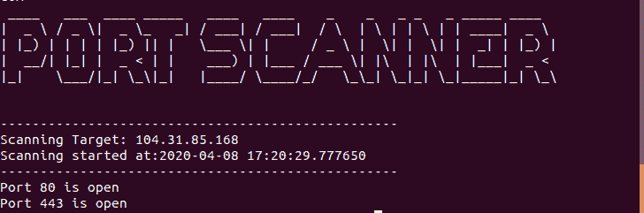

# 使用 Python 的端口扫描器

> 原文:[https://www.geeksforgeeks.org/port-scanner-using-python/](https://www.geeksforgeeks.org/port-scanner-using-python/)

**先决条件:**[Python 中的 Socket 编程](http://geeksforgeeks.org/socket-programming-python/)

本文只是提供一个生成端口扫描器的示例代码。这个端口扫描程序既适用于网络应用程序，也适用于远程主机。该工具旨在提供端口扫描器的基本功能。套接字的一般概念被用来提供功能。Port Scanner 建立在 Python 3 之上，使用了一些额外的库，比如 [socket](http://geeksforgeeks.org/socket-programming-python/) 和 pyfiglet(为了一个花哨的横幅)。

请找到以下端口扫描器的源代码:

**源代码**

## 蟒蛇 3

```py
import pyfiglet
import sys
import socket
from datetime import datetime

ascii_banner = pyfiglet.figlet_format("PORT SCANNER")
print(ascii_banner)

# Defining a target
if len(sys.argv) == 2:

    # translate hostname to IPv4
    target = socket.gethostbyname(sys.argv[1])
else:
    print("Invalid amount of Argument")

# Add Banner
print("-" * 50)
print("Scanning Target: " + target)
print("Scanning started at:" + str(datetime.now()))
print("-" * 50)

try:

    # will scan ports between 1 to 65,535
    for port in range(1,65535):
        s = socket.socket(socket.AF_INET, socket.SOCK_STREAM)
        socket.setdefaulttimeout(1)

        # returns an error indicator
        result = s.connect_ex((target,port))
        if result ==0:
            print("Port {} is open".format(port))
        s.close()

except KeyboardInterrupt:
        print("\n Exiting Program !!!!")
        sys.exit()
except socket.gaierror:
        print("\n Hostname Could Not Be Resolved !!!!")
        sys.exit()
except socket.error:
        print("\ Server not responding !!!!")
        sys.exit()
```

**输出:**



**注意:**在上面第 27 行的代码中，即范围(1，65535)内的端口:您可以自定义定义您必须扫描的范围内的端口。这种端口扫描仪通常需要最长 2 分钟的时间来产生输出格式，这样某某端口是打开或关闭的。