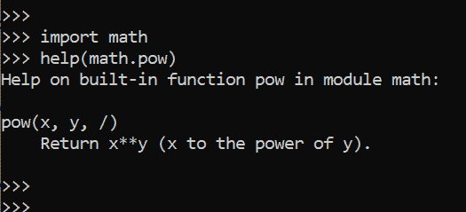
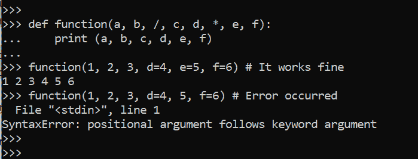
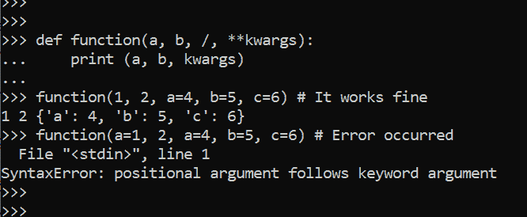

# python 3.8 中仅位置参数

> 原文:[https://www . geesforgeks . org/positional-only-parameter-in-python 3-8/](https://www.geeksforgeeks.org/positional-only-parameter-in-python3-8/)

Python 在 **Python3.8.2** 版本中引入了新的函数语法，在这里我们可以引入`/`正斜杠来比较`/`斜杠之前的位置唯一参数和`*`之后的参数是关键字唯一参数。其余介于`/`和`*`之间的参数可以是位置型或关键词型参数。
这意味着我们可以将位置参数和常规参数结合起来，这样所有非位置参数都在`/`斜线之后。

**语法:**

```py
def function(a, b, /, c, d, *, e, f):
     # Function Body
     pass 

```

其中 a 和 b 是位置参数，c 和 d 可以是位置或关键字，或者 e 和 f 是严格的关键字类型参数。

在下面给出的图像中，我们可以看到幂函数是 Python 数学库中的一个内置函数，这个函数使用`/`斜杠来启用仅位置参数，现在我们可以在这个版本的帮助下实现相同的功能。



**示例#1 :**
在这个示例中，我们可以看到，通过使用仅位置参数，我们可以实现具有固定位置的函数，因为在这个 python 版本之前，我们只能在内置函数中实现该函数。在此帮助下，我们能够使我们的程序更加健壮。

```py
# Positional-Only argument 
def function(a, b, /, c, d, *, e, f):
    print (a, b, c, d, e, f)

function(1, 2, 3, d = 4, e = 5, f = 6) # It works fine
function(1, 2, 3, d = 4, 5, f = 6) # Error occurred
```

**输出:**



**例 2 :**

```py
# Positional-Only argument 
def function(a, b, /, **kwargs):
    print (a, b, kwargs)

function(1, 2, a = 4, b = 5, c = 6) # It works fine
function(a = 1, 2, a = 4, b = 5, c = 6) # Error occurred
```

**输出:**

