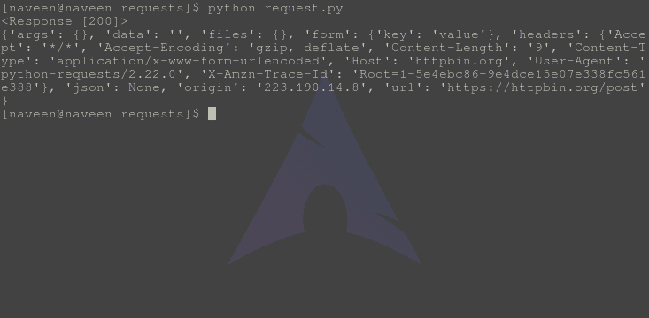

# 开机自检方法–Python 请求

> 原文:[https://www.geeksforgeeks.org/post-method-python-requests/](https://www.geeksforgeeks.org/post-method-python-requests/)

请求库是 Python 向指定网址发出 HTTP 请求的重要方面之一。本文围绕如何使用 **requests.post()** 方法向指定的网址发出 POST 请求展开。在检查开机自检方法之前，让我们弄清楚什么是开机自检请求–

#### POST Http 方法

POST 是万维网使用的 HTTP 支持的一种请求方法。根据设计，POST 请求方法请求 web 服务器接受包含在请求消息正文中的数据，很可能是为了存储它。它通常在上传文件或提交完整的 web 表单时使用。

#### 如何通过 Python 请求发出 POST 请求

Python 的请求模块提供了一个名为 **post()** 的内置方法，用于向指定的 URI 发出 post 请求。
**语法–**

```py
requests.post(url, params={key: value}, args)
```

**示例–**
为了示例目的，让我们尝试向 httpbin 的 API 发出请求。

## 蟒蛇 3

```py
import requests

# Making a POST request
r = requests.post('https://httpbin.org / post', data ={'key':'value'})

# check status code for response received
# success code - 200
print(r)

# print content of request
print(r.json())
```

将此文件保存为 request.py 并通过终端运行，

```py
python request.py
```

**输出–**



#### 使用开机自检方法的优势

*   它比 GET 更安全，因为用户输入的信息在 URL 查询字符串或服务器日志中永远不可见。
*   可以传递的数据量有一个更大的限制，人们可以使用 POST 发送文本数据和二进制数据(上传文件)。

#### 使用开机自检方法的缺点

*   由于 POST 方法发送的数据在 URL 中不可见，因此无法用特定的查询将页面书签化。
*   从不缓存开机自检请求
*   开机自检请求不会保留在浏览器历史记录中。