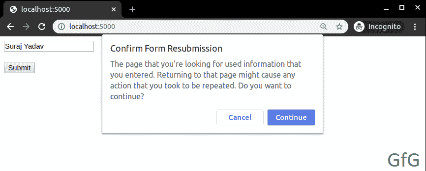
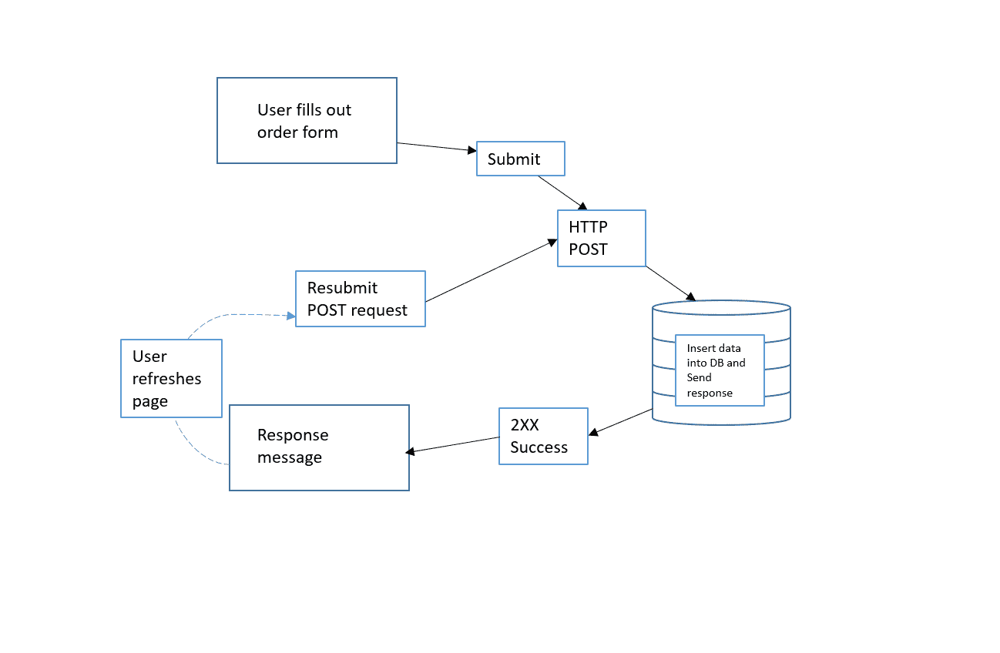
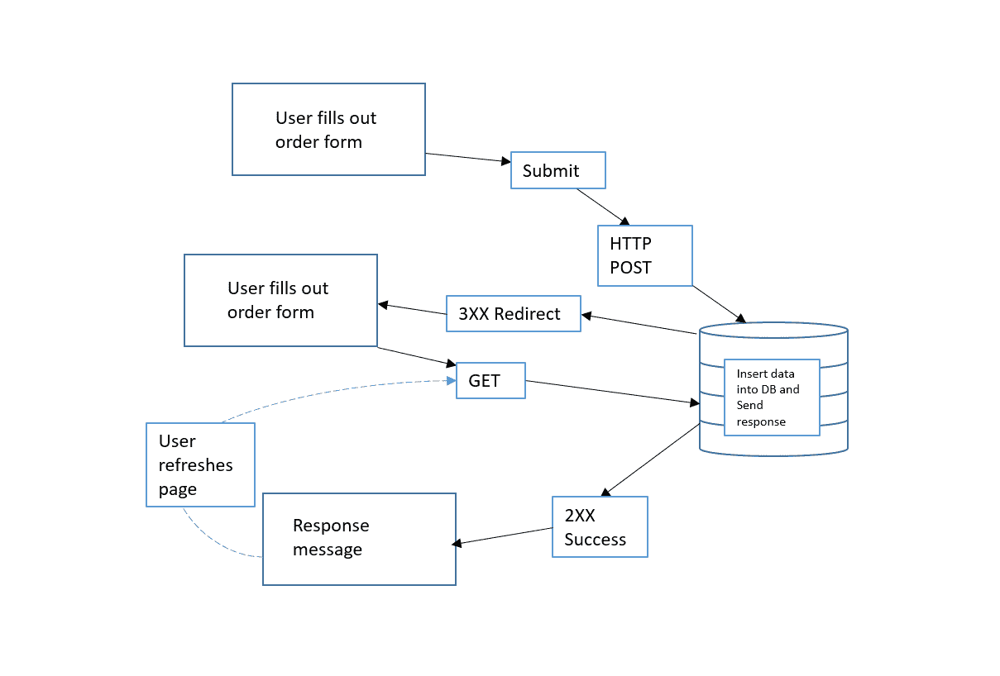
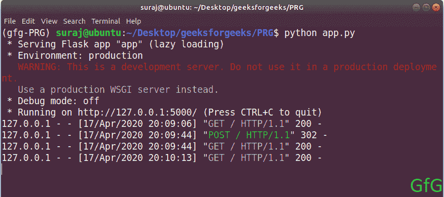

# 发布/重定向/获取(PRG)设计模式

> 原文:[https://www . geesforgeks . org/post-redirect-get-PRG-design-pattern/](https://www.geeksforgeeks.org/post-redirect-get-prg-design-pattern/)

先决条件- [使用 Python 的 HTTP 协议](https://www.geeksforgeeks.org/http-non-persistent-persistent-connection/)、 [GET 和 POST 请求](https://www.geeksforgeeks.org/get-post-requests-using-python/)

**简介:**

*PRG* 是 web 开发中使用的众多设计模式之一。它用于防止提交表单后重新加载同一网页而导致的表单重新提交。它消除了内容的冗余，以加强搜索引擎优化，并使网站用户友好。
大型、值得信赖的网上商店和其他旨在方便用户的强大网站都使用它。

**问题:**

当我们试图提交一个网页表单时，一个 HTTP POST 请求被发送到服务器。服务器处理请求并将响应代码为 2XX 的响应发送给客户端。当客户端尝试刷新/重新加载网页时，他/她无意中向服务器发送了另一个 HTTP POST 请求，其中包含与之前相同的数据。这可能会导致不希望的结果，例如重复的网络购买。

*重新加载后浏览器弹出警告消息框，如下图:*



**内部工作:**

下面是上述问题的内部工作框图。



**解决方案:**

为了避免这个问题，许多 web 开发人员使用 *POST/REDIRECT/GET* 模式，而不是直接返回一个网页， *POST* 根据需求返回一个重定向到另一个网页或相同的网页。

**内部工作:**

以下是上述解决方案的内部工作框图。



**一个极简的 python 和 HTML 代码使用 flask 框架来演示上面的概念。**

*   在项目根目录下创建一个名为 *app.py* 的文件，并在其中写入下面的代码。然后用-

    ```
    $pip install flask

    ```

    ```
    from flask import Flask, render_template, redirect, request, url_for

    # Initiate flask app
    app = Flask(__name__)

    # Declare routes and methods
    @app.route('/', methods =['GET', 'POST'])
    def home():
        # If it is POST request the redirect
        if request.method =='POST':
            return redirect(url_for('home'))

        return render_template('home.html', title ='Home')

    if __name__=='__main__':
        app.run()
    ```

*   在项目根目录下创建一个文件夹*模板*，在模板目录下创建一个文件*home.html*，并在里面写下下面的代码。

    ```
    <!-- Create a form -->
    <form action="" method="post">
        <!-- Create a input box -->
        <input type="text", value="Suraj Yadav"><br><br>
        <!-- Create a submit button -->
        <input type="submit" value="Submit">
    </form>
    ```

*   **在控制台中运行网络服务器类型:**

    ```
    $python app.py
    Output:
    Running on http://127.0.0.1:5000/

    ```

*   进入网络浏览器，输入 *localhost:5000* ，点击回车。

**控制台输出:**
在下图中，第一个 GET 请求是在我们使用 localhost:5000 时发出的，然后我们将数据发布到服务器。现在，在处理完数据之后，服务器通过发出一个 GET 请求来重定向我们，所以第三个 GET 请求是由服务器发出的，最后第四个 GET 请求是在我们尝试刷新页面时发出的。



**注意:尽量不重定向玩代码。**