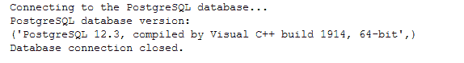

# PostgreSQL–使用 Python 连接到数据库

> 原文:[https://www . geesforgeks . org/PostgreSQL-使用 python 连接到数据库/](https://www.geeksforgeeks.org/postgresql-connecting-to-the-database-using-python/)

Python 的 PostgreSQL API 允许用户使用 **psycopg2 模块与 PostgreSQL 数据库进行交互。**在本文中，我们将研究使用 Python 连接到 PostgreSQL 数据库的过程。

### 先决条件:

首先，我们需要在命令提示符下使用下面的命令安装 psycopg2 模块:

```
pip install psycopg2

```

### 创建数据库:

出于示例的目的，我们需要一个示例数据库。为此，请遵循以下步骤:

*   首先打开一个 PostgreSQL 客户端工具，如 pgadmin4 或 psql。
*   使用您的凭据第二次登录数据库。
*   最后使用下面的命令创建一个数据库(比如学校)

```
CREATE DATABASE school;

```

### 连接到数据库:

要连接到上面创建的数据库(即学校)，我们使用 **connect()函数。**connect()函数用于创建一个新的数据库会话，并返回一个新的连接类实例。

为此，请使用以下语法:

```
Syntax: conn = psycopg2.connect("dbname=suppliers user=postgres password=postgres")

```

为了方便使用，您可以使用以下方法:

1.首先用如下所示的凭证创建一个 ***数据库文件*** :

```
[postgresql]
host=localhost
database=school
user=postgres
password=5555

```

现在，下面的 **config()函数**读取 *database.ini* 文件并返回连接参数。在**配置文件**中增加了相同的配置()功能

## 蟒蛇 3

```
#!/usr/bin/python
from configparser import ConfigParser

def config(filename='database.ini', section='postgresql'):
    # create a parser
    parser = ConfigParser()
    # read config file
    parser.read(filename)

    # get section, default to postgresql
    db = {}
    if parser.has_section(section):
        params = parser.items(section)
        for param in params:
            db[param[0]] = param[1]
    else:
        raise Exception('Section {0} not found in the {1} file'.format(section, filename))

    return db
```

**示例:**

下面的 connect()函数连接到我们之前创建的学校数据库，并返回 PostgreSQL 数据库版本。

## 蟒蛇 3

```
#!/usr/bin/python
import psycopg2
from config import config

def connect():
    """ Connect to the PostgreSQL database server """
    conn = None
    try:
        # read connection parameters
        params = config()

        # connect to the PostgreSQL server
        print('Connecting to the PostgreSQL database...')
        conn = psycopg2.connect(**params)

        # create a cursor
        cur = conn.cursor()

    # execute a statement
        print('PostgreSQL database version:')
        cur.execute('SELECT version()')

        # display the PostgreSQL database server version
        db_version = cur.fetchone()
        print(db_version)

    # close the communication with the PostgreSQL
        cur.close()
    except (Exception, psycopg2.DatabaseError) as error:
        print(error)
    finally:
        if conn is not None:
            conn.close()
            print('Database connection closed.')

if __name__ == '__main__':
    connect()
```

**输出:**

