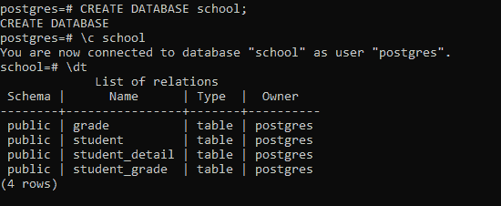

# PostgreSQL–使用 Python 创建表格

> 原文:[https://www . geesforgeks . org/PostgreSQL-create-table-using-python/](https://www.geeksforgeeks.org/postgresql-create-table-using-python/)

本文探讨了使用 Python 在 PostgreSQL 数据库中创建表的过程。

### 先决条件:

*   psycopg2 模块
*   样本数据库

### 创建表格:

要在数据库中创建表，请执行以下步骤:

*   首先创建一个 CREATE TABLE 语句
*   其次，使用 connect()函数建立与数据库的连接
*   第三，使用 cursor()方法构造一个 cursor 对象。
*   现在使用 execute 函数执行上面创建的 CREATE TABLE 语句。

**示例:**

在这个例子中，我们已经创建了一个名为*学校*的数据库。我们将向其中添加表格。为此，我们创建了一个名为 ***create_table.py*** 的文件，并定义了一个 **create_table()函数**，如下所示:

## 蟒蛇 3

```
import psycopg2
from config import config

def create_tables():
    """ create tables in the PostgreSQL database"""
    commands = (
        """
        CREATE TABLE student (
            student_id SERIAL PRIMARY KEY,
            student_name VARCHAR(255) NOT NULL
        )
        """,
        """ CREATE TABLE grade (
                grade_id SERIAL PRIMARY KEY,
                grade_name VARCHAR(255) NOT NULL
                )
        """,
        """
        CREATE TABLE student_grade (
                grade_id INTEGER PRIMARY KEY,
                file_extension VARCHAR(5) NOT NULL,
                drawing_data BYTEA NOT NULL,
                FOREIGN KEY (grade_id)
                REFERENCES grade (grade_id)
                ON UPDATE CASCADE ON DELETE CASCADE
        )
        """,
        """
        CREATE TABLE student_detail (
                student_id INTEGER NOT NULL,
                grade_id INTEGER NOT NULL,
                PRIMARY KEY (student_id , grade_id),
                FOREIGN KEY (student_id)
                    REFERENCES student (student_id)
                    ON UPDATE CASCADE ON DELETE CASCADE,
                FOREIGN KEY (grade_id)
                    REFERENCES grade (grade_id)
                    ON UPDATE CASCADE ON DELETE CASCADE
        )
        """)
    conn = None
    try:
        # read the connection parameters
        params = config()
        # connect to the PostgreSQL server
        conn = psycopg2.connect(**params)
        cur = conn.cursor()
        # create table one by one
        for command in commands:
            cur.execute(command)
        # close communication with the PostgreSQL database server
        cur.close()
        # commit the changes
        conn.commit()
    except (Exception, psycopg2.DatabaseError) as error:
        print(error)
    finally:
        if conn is not None:
            conn.close()

if __name__ == '__main__':
    create_tables()
```

这将成功创建表:

*   学生
*   等级
*   学生等级
*   学生详细信息

要验证这一点，请通过同一数据库(即学校)的客户端工具使用以下命令:

```
\dt

```

**输出:**

