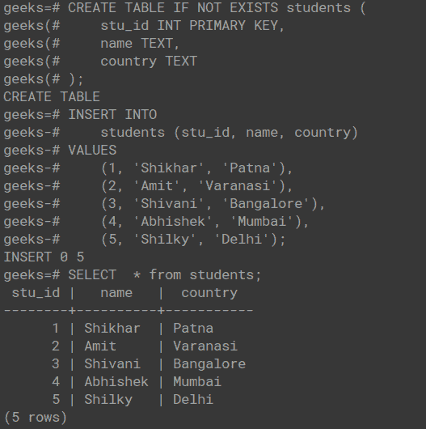
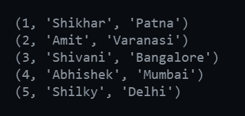
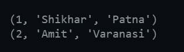
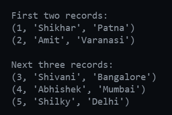

# PostgreSQL Python–查询数据

> 原文:[https://www . geesforgeks . org/PostgreSQL-python-query-data/](https://www.geeksforgeeks.org/postgresql-python-querying-data/)

在本文中，我们将看到如何使用 Python 中的 pyscopg2 来执行查询数据。

## 使用 Python 建立到 PostgreSQL 服务器的连接:

为了建立到 PostgreSQL 服务器的连接，我们将使用 python 中的 pscopg2 库。您可以使用以下命令安装 psycopg2:

```py
pip install psycopg2
```

如果上述命令导致错误，请使用以下命令:

```py
pip uninstall psycopg2
pip install psycopg2-binary
```

安装库后，可以使用以下代码创建到数据库服务器的连接:

## 计算机编程语言

```py
import psycopg2

def get_connection():
    try:
        return psycopg2.connect(
            database="postgres",
            user="postgres",
            password="password",
            host="127.0.0.1",
            port=5432,
        )
    except:
        return False

conn = get_connection()

if conn:
    print("Connection to the PostgreSQL established successfully.")
else:
    print("Connection to the PostgreSQL encountered and error.")
```

**输出:**

```py
Connection to the PostgreSQL established successfully.
```

如果提供的数据库凭据正确并且连接成功建立，运行上述代码将产生以下结果:

## 使用 psycopg2 查询数据

让我们看看如何使用 psycopg2 库查询数据。

### 执行原始 SQL 查询

执行下面的 SQL 查询，准备好表中的数据，以便从以下位置查询数据:



在上面的输出中，我们可以看到**学生**表中有 5 条记录。我们将利用这些记录来了解如何从数据库表中查询数据。

### 示例 1:使用 fetchall()查询数据

## 计算机编程语言

```py
# This program uses fetchall()
# to query all the records from a table

# GET THE CONNECTION OBJECT
conn = get_connection()

# CREATE A CURSOR USING THE CONNECTION OBJECT
curr = conn.cursor()

# EXECUTE THE SQL QUERY
curr.execute("SELECT * FROM students;")

# FETCH ALL THE ROWS FROM THE CURSOR
data = curr.fetchall()

# PRINT THE RECORDS
for row in data:
    print(row)

# CLOSE THE CONNECTION
conn.close()
```

**输出:**



fetchall 的输出()

在上面的代码中，我们使用 **SELECT * FROM students** 创建了一个连接和查询，它获取学生表的整个转储。为了查询 python 代码中的数据，我们可以使用 **fetchall()。****fetchall()**方法获取我们从 SQL 查询(本例中为 SELECT 查询)中获得的所有记录，并以列表形式提供它们。该列表由元组组成，其中每个元组由特定记录或行中存在的所有列值组成。

### 示例 2:使用 fetchone()查询数据

## 计算机编程语言

```py
# This program uses fetchone() to
# query one by one record from a table

# GET THE CONNECTION OBJECT
conn = get_connection()

# CREATE A CURSOR USING THE CONNECTION OBJECT
curr = conn.cursor()

# EXECUTE THE SQL QUERY
curr.execute("SELECT * FROM students;")

# FETCH THE FIRST ROW FROM THE CURSOR
data1 = curr.fetchone()
print(data1)

# FETCH THE SECOND ROW FROM THE CURSOR
data2 = curr.fetchone()
print(data2)

# CLOSE THE CONNECTION
conn.close()
```

**输出:**



fetchone 的输出()

**fetchone()** 方法不要与只查询第一行的想法混淆。 **fetchone()** 方法返回转储中的第一条记录，该记录是从 **curr.execute()** 方法中的 SQL 查询中获得的。它的行为就像一个队列，我们查询第一条记录，然后从游标对象中删除它。现在，如果我们再次尝试使用 **fetchone()** 方法，它将返回下一条记录。上面的代码演示了我们获取第一条记录，然后再次使用 **fetchone()** 方法获取队列中的下一条记录。我们可以一直这样做，直到到达游标对象中的最后一条记录。

### 示例 3:使用 fetchmany()查询数据

## 计算机编程语言

```py
# This program uses fetchmany() 
# to query specified number of records from a table

# GET THE CONNECTION OBJECT
conn = get_connection()

# CREATE A CURSOR USING THE CONNECTION OBJECT
curr = conn.cursor()

# EXECUTE THE SQL QUERY
curr.execute("SELECT * FROM students;")

print("First two records:")

# GET FIRST TWO RECORDS FROM DATABASE TABLE
data1 = curr.fetchmany(2)
for row in data1:
    print(row)

print("Next three records:")

# GET NEXT THREE RECORDS FROM DATABASE TABLE
data2 = curr.fetchmany(3)
for row in data2:
    print(row)

# CLOSE THE CONNECTION
conn.close()
```

**输出:**



fetchmany 的输出()

我们已经看到了如何查询所有记录以及如何逐个查询记录。 **fetchmany()** 方法获取我们想要从整个转储中获取的记录数量。它还表现得像一个队列，就像我们在 **fetchone()** 方法中看到的一样，只是它一次可以获取多个记录。然而，使用**羊乳酪(1)** 相当于使用**羊乳酪()**方法。在上面的代码中，我们使用 **fetchmany(2)** 查询前两条记录，然后使用 **fetchmany(3)** 查询后面的 3 条记录。在下面的输出中可以注意到同样的情况。