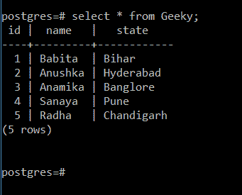
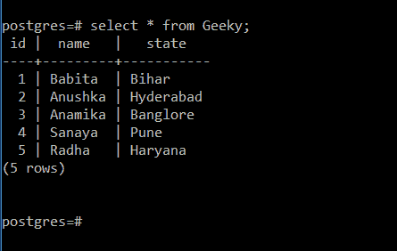

# PostgreSQL Python–更新表

中的数据

> 原文:[https://www . geesforgeks . org/PostgreSQL-python-update-data-in-table/](https://www.geeksforgeeks.org/postgresql-python-update-data-in-table/)

在本文中，我们将看到如何使用 Python 中的 pyscopg2 模块更新 PostgreSQL 表中的现有数据。

在 PostgreSQL 中，UPDATE TABLE with where 子句用于从数据库中更新现有表中的数据。

> **语法:**更新<表名>设置列 1 =值 1，列 2 =值 2，…..哪里[条件]

要执行任何 SQL 查询，请使用要作为参数执行的 SQL 命令调用 execute()函数。

> **语法:**执行(SQL 命令)

**演示表:**



**下面是实现:**

## 蟒蛇 3

```py
# importing psycopg2 module
import psycopg2

# establishing the connection
conn = psycopg2.connect(
    database="postgres",
    user='postgres',
    password='password',
    host='localhost',
    port='5432'
)

# creating cursor object
cursor = conn.cursor()

# creating table
sql = '''CREATE TABLE Geeky(
 id  SERIAL NOT NULL,
 name varchar(20) not null,
 state varchar(20) not null
)'''
cursor.execute(sql)

# inserting values in it
cursor.execute('''INSERT INTO Geeky(name , state)\
    VALUES ('Babita','Bihar')''')
cursor.execute(
    '''INSERT INTO Geeky(name , state)\
    VALUES ('Anushka','Hyderabad')''')
cursor.execute(
    '''INSERT INTO Geeky(name , state)\
    VALUES ('Anamika','Banglore')''')
cursor.execute('''INSERT INTO Geeky(name , state)\
    VALUES ('Sanaya','Pune')''')
cursor.execute(
    '''INSERT INTO Geeky(name , state)\
    VALUES ('Radha','Chandigarh')''')

# query to update the existing record
# update state as Haryana where name is Radha
sql1 = "UPDATE Geeky SET state = 'Haryana' WHERE name = 'Radha'"
cursor.execute(sql1)

# Commit your changes in the database
conn.commit()

# Closing the connection
conn.close()
```

**更新记录后的表:**

正如我们所看到的，州名已经更新为**哈里亚纳邦**，这里的名字是**拉达。**表示操作已成功完成。

