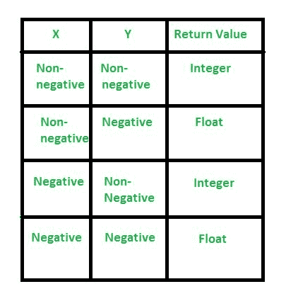

# Python 中的 pow()

> 原文:[https://www.geeksforgeeks.org/pow-in-python/](https://www.geeksforgeeks.org/pow-in-python/)

**Python pow()函数**返回给定数字的幂。此功能**计算 x**y** 。这个函数首先将其参数转换成浮点数，然后计算幂。

> **语法:**幂(x，y)
> 
> **参数:**
> 
> *   **x :** 必须计算其幂的数。
> *   **y :** 提升到计算能力的值。
> 
> **返回值:**以浮点形式返回 x**y 值。

## Python pow()示例

### **实施例 1:功率的工作()**

## 蟒蛇 3

```
# Python code to demonstrate pow()
# version 1

print("The value of 3**4 is : ", end="")

# Returns 81
print(pow(3, 4))
```

**输出:**

```
The value of 3**4 is : 81.0
```

### **示例 2: Python pow()带有**三个参数

**浮点幂(x，y，mod)** 函数**计算(x**y) % mod** 。这个函数首先将其参数转换成浮点数，然后计算幂。

> **语法:**浮点幂(x，y，mod)
> 
> **参数:**
> 
> *   **x :** 必须计算其幂的数。
> *   **y :** 提升到计算能力的值。
> *   **mod :** 必须计算模数的值。
> 
> **返回值:**以浮点形式返回值(x**y) % mod。

## 蟒蛇 3

```
# Python code to demonstrate pow()
# version 2

print("The value of (3**4) % 10 is : ", end="")

# Returns 81%10
# Returns 1
print(pow(3, 4, 10))
```

**输出:**

```
The value of (3**4) % 10 is : 1
```

### **power()中的实现案例:**



## 蟒蛇 3

```
# Python code to discuss negative
# and non-negative cases

# positive x, positive y (x**y)
print("Positive x and positive y : ", end="")
print(pow(4, 3))

print("Negative x and positive y : ", end="")
# negative x, positive y (-x**y)
print(pow(-4, 3))

print("Positive x and negative y : ", end="")
# positive x, negative y (x**-y)
print(pow(4, -3))

print("Negative x and negative y : ", end="")
# negative x, negative y (-x**-y)
print(pow(-4, -3))
```

**输出:**

```
Positive x and positive y : 64
Negative x and positive y : -64
Positive x and negative y : 0.015625
Negative x and negative y : -0.015625
```

本文由 [**【曼吉特·辛格】**](https://auth.geeksforgeeks.org/profile.php?user=manjeet_04&list=practice) 供稿。如果你喜欢 GeeksforGeeks 并想投稿，你也可以使用[write.geeksforgeeks.org](https://write.geeksforgeeks.org)写一篇文章或者把你的文章邮寄到 review-team@geeksforgeeks.org。看到你的文章出现在极客博客主页上，帮助其他极客。

如果你发现任何不正确的地方，或者你想分享更多关于上面讨论的话题的信息，请写评论。