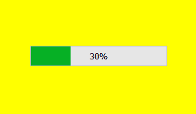
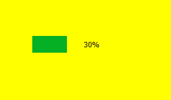
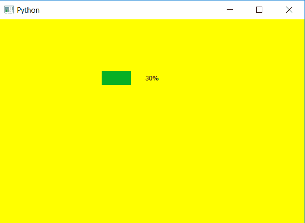

# PQt5–透明背景进度条

> 原文:[https://www . geesforgeks . org/pqt5-透明-背景-进度条/](https://www.geeksforgeeks.org/pqt5-transparent-background-progress-bar/)

在这篇文章中，我们将看到如何使进度条的背景透明，即只有进度条将是可见的，背景将是完全透明的。为了做到这一点，我们必须改变阿尔法水平，即透明度水平为零，这是最小的，使背景完全不可见。

下图是普通进度条 vs 透明背景进度条的样子
 

要改变 alpha 级别，我们必须改变进度条的 CSS 样式表，下面是样式表。

```
QProgressBar
{
background-color : rgba(0, 0, 0, 0);
border : 1px;
}

```

这个样式表代码是和`setStyleSheet`方法一起使用的，下面是实现。

```
# importing libraries
from PyQt5.QtWidgets import * 
from PyQt5 import QtCore, QtGui
from PyQt5.QtGui import * 
from PyQt5.QtCore import * 
import sys

class Window(QMainWindow):

    def __init__(self):
        super().__init__()

        # setting title
        self.setWindowTitle("Python ")

        # setting background color to window
        self.setStyleSheet("background-color : yellow")

        # setting geometry
        self.setGeometry(100, 100, 600, 400)

        # calling method
        self.UiComponents()

        # showing all the widgets
        self.show()

    # method for widgets
    def UiComponents(self):
        # creating progress bar
        bar = QProgressBar(self)

        # setting geometry to progress bar
        bar.setGeometry(200, 100, 200, 30)

        # setting the value
        bar.setValue(30)

        # setting alignment to center
        bar.setAlignment(Qt.AlignCenter)

        # setting background to invisible
        bar.setStyleSheet("QProgressBar"
                          "{"
                          "background-color : rgba(0, 0, 0, 0);"
                          "border : 1px"
                          "}")

App = QApplication(sys.argv)

# create the instance of our Window
window = Window()

# start the app
sys.exit(App.exec())
```

**输出:**
